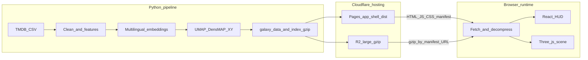

# The Movie Cosmos

The Movie Cosmos weaves roughly sixty thousand TMDB films into a walkable starfield: alike in plot, genres, and languages gather on the plane; release history stacks along depth.

> Roam a starfield of ~60,000 films—meet what's alike, travel through time.

**Live experience:** [themoviecosmos.com](https://themoviecosmos.com/)

**中文 readme:** [README.md](README.md) · **Repository:** [github.com/XYBuilds/chronicle_v3_3d_galaxy](https://github.com/XYBuilds/chronicle_v3_3d_galaxy.git)

---

## Table of contents

- [Visual Showcase](#visual-showcase)
- [Concept & Inspiration](#concept--inspiration)
  - [Creative background](#creative-background)
  - [Artistic experience](#artistic-experience)
- [Interaction guide](#interaction-guide)
  - [First visit](#first-visit)
  - [Browse](#browse)
  - [Focus](#focus)
  - [Search](#search)
  - [Share](#share)
- [Browser and environment](#browser-and-environment)
- [Privacy and analytics (brief)](#privacy-and-analytics-brief)
- [Support and community](#support-and-community)
- [Tech Stack](#tech-stack)
  - [Creative coding & rendering](#creative-coding--rendering)
  - [Core framework & tooling](#core-framework--tooling)
- [Behind the Scenes](#behind-the-scenes)
  - [Performance & frame rate](#performance--frame-rate)
  - [Mathematics & coordinates: from CSV to star map](#mathematics--coordinates-from-csv-to-star-map)
- [For developers](#for-developers)
  - [Stack and data flow](#stack-and-data-flow)
  - [Repository layout](#repository-layout)
  - [Clone and run locally (frontend)](#clone-and-run-locally-frontend)
  - [Local data (Python pipeline)](#local-data-python-pipeline)
  - [Environment variables](#environment-variables)
  - [CI and static deployment](#ci-and-static-deployment)
  - [Documentation index (implementation SSOT)](#documentation-index-implementation-ssot)
- [Data & credits](#data--credits)
- [License & reuse](#license--reuse)

## Visual Showcase

> Demo screenshots / GIF — coming soon

For the full interaction, visit [themoviecosmos.com](https://themoviecosmos.com/).

---

## Concept & Inspiration

### Creative background

The Movie Cosmos breaks away from chart-style “movie analytics”: TMDB records become a 2.5D space-time cube—content similarity on a plane you can roam, release date as depth you can travel through. Data comes from [TMDB Movies Daily Updates (Kaggle)](https://www.kaggle.com/datasets/alanvourch/tmdb-movies-daily-updates). The pipeline uses multilingual sentence embeddings and UMAP (`random_state=42`) to shape clusters, while year, ratings, and vote counts stay on separate GPU/HUD channels (see the [feature → render mapping table](docs/project_docs/TMDB%20数据特征工程与%203D%20映射总表.md)).

### Artistic experience

Treat the work as three layered journeys (aligned with [PRD](docs/project_docs/TMDB%20电影宇宙%20PRD.md) §2):

- Macro time travel: Scroll or use the timeline along the Z axis (release year)—from sparse early cinema into dense modern clusters.
- Deep-space discovery: Within an era or genre nebula, read size, brightness, and hue to hunt—blockbusters that blaze, small but bright gems, or huge yet dim “cautionary” stars.
- Artifact inspection: Hover for a one-line radar ping; click to dock on a star and open the archive—from cosmic scale down to poster, tagline, and credits.

## Interaction guide

### First visit

1. Open [themoviecosmos.com](https://themoviecosmos.com/) and wait until loading finishes (including the search-index step).
2. On the cover, drag to look around, then click the central “today” star (or press Enter / Space) to enter The Movie Today.
3. In macro roam, use the wheel to move along release years and the top search to find films; press ESC to step out of search or focus (ESC does nothing on the cover). Gestures are grouped under Browse, Focus, Search, and Share below.

### Browse

In macro view you move through a near-planar starfield along release year (Z). Each star reads as follows; gestures are in the second table.

| Visual | Meaning |
| --- | --- |
| **Plane position** | Multilingual overview + tagline semantics, genres (default golden-ratio \(1/\varphi\) rank weights), and `original_language` after dimensionality reduction: culturally similar films sit closer. |
| **Depth position** | Release date as decimal year; never fed to UMAP, so the map is not stretched into a timeline. |
| **Size** | Mostly vote_count (log-scaled): more raters → larger particles, with head compression so giants do not blot out the field. |
| **Brightness** | Mostly vote_average (0–10): higher score → brighter look, decoupled from size. |
| **Hue** | Primary genre `genres[0]`; the pipeline may emit `genre_hue` for GPU tinting. |

Field-level detail: [TMDB feature engineering & 3D mapping table](docs/project_docs/TMDB%20数据特征工程与%203D%20映射总表.md).

| Input / action | Feedback | Notes |
| --- | --- | --- |
| **Load complete (standard home)** | Cover stage: light brand overlay (~1s entry animation; respects reduced motion); WebGL is mounted and you can drag to orbit the highlighted The Movie Today planet. Search, timeline, and detail drawer stay hidden. | Deep link `/movie/:id` with a valid id skips cover and opens focus directly (see Focus). |
| **On cover: click the center planet / Perlin sphere, or press Enter / Space** | Leave cover and focus today’s film (detail drawer, orbit camera); URL becomes `/movie/:id`. Keyboard users can Tab to a transparent center control (visible focus ring). | The Movie Today picks from `today.json` by UTC calendar day; stale feed, fetch failure, or missing id falls back to a random title from the top 1,000 by vote count (no blocking error). See [P23.1 acceptance guide](docs/guides/P23.1%20The%20Movie%20Today%20验收指南.md). |
| **Visit `/today` in the address bar** | Same as home: resolve today’s film, show Cover, then enter focus as above. | Share previews for “today” links are handled by the OG Worker (see Share). |
| **Canvas drag** (primary button) | Macro: truck / pedestal pan (locked orientation). Focus orbit: yaw / pitch around the current pivot. | Small movement counts as a click pick; larger motion is treated as camera navigation. |
| **Mouse wheel** (Space not held) | Move `zCurrent` along the time axis (clamped to dataset `z_range`); camera follows `zCurrent - zCamDistance`. | Wheel is inactive for timeline Z in focus orbit and Cover “today” orbit; Ctrl+wheel is left to the browser zoom. |
| **Timeline** (left vertical rail / bottom horizontal bar) | Drag, tick click, or arrow / Home / End keys update `zCurrent` and the on-screen era window. | When a film is selected (`selectedMovieId`), the track shows bridge Z only and cannot change `zCurrent`. |
| **Space + wheel** | Dolly toward the cursor on the plane `z = zCurrent` (adjusts `zCamDistance` and XY). | Releasing Space restores the default standoff; Space in a text field types normally and does not arm dolly. |
| **Hover a star** | Tooltip: title + primary genre (`genres[0]`), anchored at the planet’s screen projection; camera unchanged. | Ray hit on the visible active sphere; focus mode adds neighborhood and Perlin treatment (see Focus). |
| **F** | Toggle browser fullscreen | Same as the top-right fullscreen control; ignored while typing in search or other inputs |
| **`?lang=` / language menu** | Seven HUD UI locales; URL param → localStorage → browser language → default English | TMDB record fields (titles, overviews, credits) stay in source language |

### Focus

Click a film planet in the timeline band or from search; the camera flies in and the archive drawer opens on the right. In focus, a Perlin high-detail sphere replaces that instance’s macro particle.

| Input / action | Feedback | Notes |
| -------------- | -------- | ----- |
| **Click** a film planet in the timeline band | Enter focus: camera flies in; archive drawer opens (poster, overview, cast/crew, TMDB/IMDb links) | That instance’s scale goes to zero on both `InstancedMesh` layers; a Perlin high-detail sphere is the main visual. See [planet state machine spec](docs/project_docs/星球状态机%20spec.md). |
| **Drag** the canvas while in focus | Orbit camera around the focus and its spherical neighborhood | Different from macro roam pan/rotate semantics. |
| **Click** another **active** planet in the neighborhood | Switch focus to that film (drawer updates) | Neighborhood is a spherical mask (`uSelectionMode = 2`), not the vis-window strip alone. |
| **Clickable cast/crew names** in the drawer (search index loaded) | Highlight all films that person worked on | Same effect as top-bar Person search; plain text if the index is unavailable. |
| **Exit focus**, **ESC** (stack order) | Return to macro roam; closing the drawer clears `selectedMovieId` | HUD exit focus control also works. Clicking empty canvas does not exit. |

Macro field mapping lives in the [feature → render table](docs/project_docs/TMDB%20数据特征工程与%203D%20映射总表.md) and Browse above. In focus, the sphere reads as follows.

| Visual | Meaning |
| ------ | ------- |
| **Perlin band boundaries** | Simplex noise partitions the sphere; up to 8 declared genre bands |
| **Band order and width** | Genres ordered by TMDB vote counts; earlier genres get wider bands, then 1/φ geometric taper (same rhythm as macro genre weights) |
| **Hue** | Each band uses its genre palette color; primary genre prefers exported `genre_hue` |
| **Lightness** | Still driven mainly by TMDB average rating (same L mapping as macro) |
| **Terraced relief** | Slight stepped ridges between bands for readable silhouettes |
| **Concentric reference rings** | World-space rings mark vote_count tiers—how “large” this film is in the cosmos |
| **Side lightness bar** | `FocusLReference`: vertical spectrum + pointer for this film’s rating on the brightness scale |

Tunable parameters and shader contracts: [visual parameters table](docs/project_docs/视觉参数总表.md), [Tech Spec §1.1](docs/project_docs/TMDB%20电影宇宙%20Tech%20Spec.md) (focus Perlin sphere).

### Search

Top search works in macro roam and in focus; picking a film enters focus (see Focus).

| Input / action | Feedback | Notes |
| --- | --- | --- |
| **Top search · Movie** | Match titles from the index; choosing a row enters focus on that film (`selectedMovieId`). | Requires loaded `search_index`; Cmd/Ctrl+K focuses the search field. |
| **Top search · Person** | Highlight the person’s film set (`selectionIds`); constellation lines (cast / crew / producers); timeline eases to the earliest release year in the set. | Cast/crew names in the drawer can start the same session (P27.3). |
| **Top search · Genre** | AND multiple genre badges; intersection writes `selectionIds` and highlights matches. | No text field; clearing all badges ends the genre session. |
| **ESC** | Stack unwind: blur search → exit focus if any (keep person/genre highlight) → clear search session. | Search × clears search and focus in one action. Cover / info dialog have their own ESC handling (see Browse). |

### Share

| Input / action | Feedback | Notes |
| -------------- | -------- | ----- |
| Drawer header **share icon row** | Copy a link to this film; or open X, Reddit, Discord, email, Telegram, Facebook, and similar share flows | Requires focus on a film first; controls live in the drawer header, not the cover menu |

After you focus on a film, use the icon row in the archive drawer header to copy a dedicated link or post to X, Reddit, Discord, email, Telegram, Facebook, and similar services. Anyone who opens the link lands on the same film in the cosmos with its archive panel.

The home page and “today’s star” also have shareable URLs: the site root is the main entry, and `/today` opens the same cover experience as the daily highlight on the home page. Link previews are generated automatically when you paste into chat or social apps.

## Browser and environment

Use a recent desktop or mobile browser with hardware acceleration enabled.

| Capability | Requirement |
| --- | --- |
| **WebGL 2** | The galaxy renderer requires WebGL2 (dual `InstancedMesh`, `gl_InstanceID`, etc.); older browsers cannot mount the canvas |
| **Streaming gzip** | Bundles are decompressed with `DecompressionStream`; unsupported browsers fail load with an upgrade hint (typical floor: Safari 16.4+, Chrome 80+, Firefox 113+ — see [MDN: DecompressionStream](https://developer.mozilla.org/en-US/docs/Web/API/DecompressionStream)) |
| **Fullscreen API** | Standard or WebKit-prefixed fullscreen must be available; otherwise the fullscreen control is hidden |

**Loading and errors:** On entry, a full-screen overlay tracks download → decompress → parse JSON → search index (search may be skipped or fail while the cosmos still loads). If galaxy data cannot be fetched, a “Could not load galaxy data” screen offers Retry, Reload page, and optional raw error / developer hints (local dev: run the Python pipeline to generate `galaxy_data` first).

**Interface language:** The HUD ships seven UI locales (English, 简体中文, 繁體中文, 日本語, Español, Français, العربية). Initial resolution order: URL `?lang=` → localStorage → browser language → default English; Arabic uses RTL layout. The top-right language menu persists choice via `?lang=` and storage. TMDB record fields (titles, overviews, credits, etc.) stay in their source language and are not translated by the HUD.

**Fullscreen:** Use the top-right fullscreen control or press F (ignored while focus is in search or other text inputs).

**TMDB attribution:** A persistent TMDB mark and mandatory notice sit in the bottom-right corner; the Info panel repeats a larger TMDB block ([`TmdbAttribution`](frontend/src/hud/TmdbAttribution.tsx)).

---

## Privacy and analytics (brief)

- The Movie Cosmos does not ship login accounts or an end-user “profile” database.
- **Optional — Cloudflare Web Analytics:** Only when `VITE_CF_BEACON_TOKEN` is set at build time (GitHub Actions secret `CF_WEB_ANALYTICS_BEACON_TOKEN` mapped to that variable), [`frontend/vite.config.ts`](frontend/vite.config.ts) `cfWebAnalyticsPlugin()` injects Cloudflare’s lightweight beacon (`static.cloudflareinsights.com/beacon.min.js`) into `index.html` for aggregated traffic, coarse geography, Core Web Vitals, and similar RUM metrics; Cloudflare describes this path as typically cookie-free (whether you need an extra consent banner depends on your jurisdiction and Cloudflare’s terms).
- With no token configured, no analytics script is injected.
- Setup and verification: [P20.5 Cloudflare Web Analytics runbook](docs/guides/P20.5%20Cloudflare%20Web%20Analytics%20%E6%8E%A5%E5%85%A5%E6%93%8D%E4%BD%9C%E6%8C%87%E5%8D%97.md). Ad blockers / privacy extensions may block beacon requests; they do not break galaxy or HUD functionality.

---

## Support and community

| Entry | What it does |
| --- | --- |
| **Feedback (Tally)** | HUD Feedback opens a hosted form modal (`data-tally-open` + Tally `embed.js`). When env is unset, default form id `pbRpey`; set `VITE_TALLY_FEEDBACK_FORM_ID` to `''` / `0` / `false` to hide the button. Submissions are processed by Tally; do not submit passwords or highly sensitive data. |
| **Support (Ko-fi)** | Support opens Ko-fi or a deployer-configured support URL in a new tab. Unset `VITE_KOFI_URL` → default `https://ko-fi.com/xybuilds`; empty / `0` / `false` or invalid URL hides the button. |
| **Discord** | Primary path: invite link on the Tally thank-you page (update in Tally / Discord; usually no redeploy). Optional: build var `VITE_DISCORD_INVITE_URL` points the `DrawerMovieShare` Discord composer in the focus drawer at your invite; otherwise falls back to generic [discord.com](https://discord.com/). The community is not an official TMDB channel. |
| **GitHub** | Features, bugs, and contributions: [Issues](https://github.com/XYBuilds/chronicle_v3_3d_galaxy/issues) on this repo. |

See [Tech Spec §5.3](docs/project_docs/TMDB%20电影宇宙%20Tech%20Spec.md) and [`.env.example`](.env.example) for env semantics.

## Tech Stack

### Creative coding & rendering

- **Three.js (WebGL 2)** — Roughly 60,000 films each get a matched pair of instances: a low-detail icosahedron shell for macro browse (`idle`) and a higher-subdivision shell for focus neighborhoods (`active`), sharing the same per-instance buffer (primary-genre hue, normalized `vote_average`, exported `size`).
- **Custom GLSL** — `galaxyIdle` / `galaxyActive` vertex shaders work in OKLab for hue, rating→lightness (L), and camera-distance compensation; fragments apply near-distance and Z-slab fades. The focus-state planet uses separate Perlin band shaders (`perlin.vert` / `perlin.frag`) while reusing Hunt-curve and related uniforms with the galaxy.
- **Instance mask atlas** — Timeline visibility, search highlights, and focus neighborhoods write into one R8 selection mask texture (packed within `MAX_TEXTURE_SIZE`) instead of spawning separate geometry per mode.

### Core framework & tooling

- **React 19 + Vite 8** — HUD, drawer, search, and timeline are DOM; the canvas is a raw Three.js scene (not React Three Fiber).
- **Zustand** — Bridges camera state, `zCurrent`, focus sessions, and load progress into the Three layer.
- **Tailwind CSS 4** — HUD layout and theming; the starfield itself is not drawn by the UI framework.
- **TypeScript + vite-plugin-glsl** — Shaders import as `.glsl` modules and ship with the production `tsc -b` + Vite build.

---

## Behind the Scenes

### Performance & frame rate

Driving tens of thousands of GPU instances in one scene favors batching over per-star logic:

- **Dual `InstancedMesh`, shared uniforms** — Each frame updates only camera pose, temporal depth `uZCurrent`, focus/search masks, and a small uniform set—not per-movie materials.
- **Macro bloom off by default** — `UnrealBloomPass` remains available for debugging; production renders directly. Brightness comes from OKLab L and chroma in shaders, not full-screen bloom (see Phase 10.3 decision).
- **One-shot static payload** — The browser `fetch`es a gzip bundle, decompresses with `DecompressionStream`, then `JSON.parse`s. Production often pulls large objects from Cloudflare R2 URLs (app shell on Pages). The loading overlay reports download → decompress → parse.
- **Fades instead of heavy culling** — Instance meshes disable frustum culling (global starfield); Z-slab, near-alpha, and focus dimming live in shaders to keep CPU work low.

On recent desktop browsers with hardware acceleration, the goal is smooth roam under these constraints; very weak GPUs may still struggle with memory and fill rate—see the browser requirements section above.

### Mathematics & coordinates: from CSV to star map

#### #### Plane (X/Y) — content similarity, not time

1. **Text** — A multilingual sentence-transformer (production: `paraphrase-multilingual-MiniLM-L12-v2`) encodes `Tagline` + `Overview`; only semantics enter UMAP.
2. **Genres** — TMDB genres sorted by vote count are weighted in 1/φ ≈ 0.618 geometric steps (earlier rank = stronger weight)—the same rhythm as focus-state band widths on the planet.
3. **Language** — `original_language` one-hot.
4. **Fusion** — Each block is L2-normalized, scaled by `1/√d` and modal weights, then concatenated; UMAP (production uses DensMAP, `n_neighbors=300`, `min_dist=0.4`, `metric=cosine`, `random_state=42` fixed) projects to 2D. cuML can accelerate plain UMAP on GPU; DensMAP still uses CPU `umap-learn`.

#### Depth (Z) — release date, excluded from embedding

- `release_date` becomes a decimal year; YYYY-01-01 placeholders get deterministic jitter seeded by TMDB `id` so same-calendar-year films do not collapse to a line.
- Z keeps the raw ~1874–2026 scale (no normalization); wheel and timeline only move the observer’s `zCurrent` slice.

#### Size & brightness — popularity vs. score (precomputed at export)

- `vote_count` → `log10(vote_count + 1)` then linearly mapped to instance size (~2–25), tempering blockbuster dominance.
- `vote_average` → exported emissive and shader L tiers; decoupled from size, so a large star is not necessarily a bright one.

One-liner to rebuild the universe offline (clean → embed → UMAP → export gzip):

```bash
python scripts/run_pipeline.py --through-phase-2
```

CLI flags, environments, CI, and R2 upload live in the [For developers](#for-developers) appendix (slice `07`); field→rendering mapping is in the [feature engineering & 3D mapping table](docs/project_docs/TMDB%20数据特征工程与%203D%20映射总表.md); pipeline SSOT is [Data Pipeline](docs/project_docs/TMDB%20电影宇宙%20Data%20Pipeline.md).

## For developers

### Stack and data flow

- **Data (Python)**: clean TMDB export → multilingual sentence embeddings → fuse with genre / language features → UMAP / DensMAP (`random_state=42` fixed) → export static `galaxy_data` and search index (gzip). Decimal release year on Z is not fed to UMAP; it is depth only.
- **Frontend**: Vite 8 + React 19 (HUD / DOM) + raw Three.js dual `InstancedMesh` + Zustand; English HUD SSOT is [`frontend/src/lib/locales/en.json`](frontend/src/lib/locales/en.json), exposed via [`frontend/src/lib/strings.ts`](frontend/src/lib/strings.ts) as `STRINGS`.
- **Runtime data (production)**: Cloudflare Pages serves the `frontend/dist` app shell (HTML / JS / CSS, `galaxy_assets_manifest.json`, etc.). `galaxy_data.json.gz`, `galaxy_search_index.json.gz`, and other large objects live on Cloudflare R2 under a public prefix; the browser fetches absolute URLs from the manifest and decompresses with `DecompressionStream`. Ops guides: [P18.6 Cloudflare Pages cutover](docs/guides/P18.6%20Cloudflare%20Pages%20%E5%88%87%E6%8D%A2%E6%93%8D%E4%BD%9C%E6%8C%87%E5%8D%97.md), [P18.6b Cloudflare R2](docs/guides/P18.6b%20Cloudflare%20R2%20%E4%B8%8A%E7%BA%BF%E6%93%8D%E4%BD%9C%E6%89%8B%E5%86%8C.md).

> **Deployment note**: this repo does not use Vercel for production. Releases go through GitHub Actions → R2 + Cloudflare Pages (wrangler Direct Upload).



> `Export → R2 / Pages` is where artifacts land. CI order: `upload_galaxy_r2.py` first (large gzip + manifest), Vite build (manifest embeds R2 URLs), then `wrangler pages deploy` for `dist`.

### Repository layout

Conceptual tree (omits `node_modules/`, `.venv/`, `data/raw/`, `data/output/`, etc.; data conventions in [`data/README.md`](data/README.md)).

```text
.
├── .cursor/
│   └── rules/                 # project overview, data protection, branding
├── .github/
│   └── workflows/             # deploy-pages, monthly_refit, nightly_vote_refresh
├── assets/
│   └── fonts/                 # Inter, Butler (see assets/fonts/README.md)
├── data/                      # subsample/; raw|output|runs — see data/README.md
├── docs/
│   ├── LICENSE                # docs Markdown: CC BY 4.0
│   ├── project_docs/          # spec SSOT: PRD, Tech Spec, Data Pipeline…
│   ├── reports/               # phase implementation reports
│   ├── guides/                # ops, R2, DNS, acceptance
│   └── workflows/             # CI / Pages notes
├── frontend/
│   ├── public/                # static assets, data/manifest, optional local gzip
│   ├── functions/             # Cloudflare Pages Functions (middleware)
│   ├── src/                   # hud/, three/, components/, lib/ …
│   └── dist/                  # Vite output (usually not committed)
├── scripts/
│   ├── run_pipeline.py        # pipeline entry
│   ├── feature_engineering/
│   ├── export/
│   ├── cron/                  # nightly refresh, monthly refit, R2 upload
│   ├── tools/                 # monthly embedding bundle zip, etc.
│   └── _archive/
├── supabase/
├── LICENSE                    # Apache-2.0
├── NOTICE                     # TMDB / IMDb / fonts attribution
├── package.json               # npm workspaces; scripts proxy to frontend
├── requirements.cpu.txt
├── .env.example
└── README.md / README.en.md
```

**App**: [`frontend/`](frontend/). Pipeline: [`scripts/run_pipeline.py`](scripts/run_pipeline.py).

### Clone and run locally (frontend)

```bash
git clone https://github.com/XYBuilds/chronicle_v3_3d_galaxy.git
cd chronicle_v3_3d_galaxy
npm install
npm run dev
```

Same as `npm run dev -w frontend`. Root [`package.json`](package.json) also exposes `build`, `lint`, `preview`, `test` (all workspace-scoped). See [`frontend/package.json`](frontend/package.json) for Storybook and icon export scripts.

Production build (CI and local):

```bash
npm run build -w frontend
```

The `build` script runs dist size checks and SPA fallback verification.

### Local data (Python pipeline)

A full offline experience needs your own TMDB CSV and pipeline output under `frontend/public/data/`. Do not open the full `data/raw/TMDB_all_movies.csv` in chat or the editor; use [`data/subsample/TMDB_all_movies_random20.csv`](data/subsample/TMDB_all_movies_random20.csv) for schema and [`data/README.md`](data/README.md) for commands.

| Scenario | Command (repo root, Python 3.11+ venv active) |
|----------|-----------------------------------------------|
| **Smoke (20-row subsample, auto Phase 1+2)** | `python scripts/run_pipeline.py --input data/subsample/TMDB_all_movies_random20.csv` |
| **Clean only (Phase 1)** | `python scripts/run_pipeline.py --input <your.csv> --phase-1-only` |
| **Full Phase 1+2 (monthly refit alignment: add `--densmap`)** | GPU/CPU examples in [`data/README.md`](data/README.md) |

Install CPU dependencies (CI parity):

```bash
python -m pip install -r requirements.cpu.txt
```

Monthly CI embedding bundle (four files) packaging and `GALAXY_EMBED_BUNDLE_URL`: [`data/README.md`](data/README.md) and `scripts/tools/pack_monthly_embedding_bundle.py`.

### Environment variables

Copy [`.env.example`](.env.example) to `.env` at the repo root (gitignored). Never commit `service_role` keys or paste them in issues/PRs.

Backend / CI (GitHub Secrets or local cron)

| Variable | Role |
|----------|------|
| `SUPABASE_URL` / `SUPABASE_SERVICE_ROLE_KEY` | P18+ import and nightly/monthly cron |
| `KAGGLE_USERNAME` / `KAGGLE_KEY` | Nightly vote refresh |
| `R2_ACCOUNT_ID`, `R2_ACCESS_KEY_ID`, `R2_SECRET_ACCESS_KEY`, `R2_BUCKET`, `R2_PUBLIC_BASE_URL` | All five required to upload; otherwise `upload_galaxy_r2.py` skips (exit 0) |
| `R2_KEY_PREFIX` | Object key prefix, default `galaxy` |
| `R2_GALAXY_PRUNE_AFTER_UPLOAD` | `1` removes large gzip from `frontend/public/data/` after upload, keeps manifest |
| `CLOUDFLARE_ACCOUNT_ID` / `CLOUDFLARE_API_TOKEN` | wrangler `pages deploy` |
| `CLOUDFLARE_PAGES_PROJECT_NAME` | Pages project (Secret) |
| `CF_WEB_ANALYTICS_BEACON_TOKEN` | Injected at build as `VITE_CF_BEACON_TOKEN` (optional) |
| `OG_INDEX_KV_*` | P34.3 OG index KV sync (optional in cron) |
| `GALAXY_EMBED_BUNDLE_URL` | HTTPS zip URL for monthly embedding bundle (Secret) |

Frontend (Vite, build-time) — types in [`frontend/src/vite-env.d.ts`](frontend/src/vite-env.d.ts); resolution in [`frontend/src/lib/galaxyAssetUrls.ts`](frontend/src/lib/galaxyAssetUrls.ts).

| Variable | Role |
|----------|------|
| `VITE_GALAXY_DATA_GZIP_URL` | Optional override for galaxy gzip URL |
| `VITE_GALAXY_SEARCH_INDEX_GZIP_URL` | Optional override for search index gzip URL |
| `VITE_TODAY_JSON_URL` | Optional override for The Movie Today `today.json` |
| `VITE_KOFI_URL` | Ko-fi support link; empty / `0` / `false` hides the button |
| `VITE_TALLY_FEEDBACK_FORM_ID` | Tally feedback form; empty hides the button |
| `VITE_DISCORD_INVITE_URL` | Optional Discord invite for share links |

Without `VITE_*` data URLs: use `galaxy_assets_manifest.json` R2 URLs first, then bundled `public/data/` paths.

### CI and static deployment

Production path: GitHub Actions → Cloudflare R2 + Cloudflare Pages

| Workflow | Trigger | Summary |
|----------|---------|---------|
| [`nightly_vote_refresh.yml`](.github/workflows/nightly_vote_refresh.yml) | Daily 20:00 UTC; `workflow_dispatch` | `nightly_vote_refresh.py` → `upload_galaxy_r2.py` → `npm run build -w frontend` → `wrangler pages deploy` (`workingDirectory: frontend`) |
| [`monthly_refit.yml`](.github/workflows/monthly_refit.yml) | 1st of month 20:00 UTC; manual `anchor_mode` | Restore/download embedding bundle → `monthly_refit.py` → same R2 + Pages chain; 210 min timeout |
| [`deploy-pages.yml`](.github/workflows/deploy-pages.yml) | `main` push or manual | Gray release: GitHub Pages of `frontend/dist` (with `404.html` SPA fallback); not long-term prod, retire after CF validation |

Shared rules:

- `galaxy_data.json.gz` and `galaxy_search_index.json.gz` are not in Git; CI uploads to R2; Pages ships a small `galaxy_assets_manifest.json`.
- Do not rely on Cloudflare’s Git-connected Pages auto-build for production; use this repo’s workspace build + wrangler Direct Upload.
- CI uses Node 24; Linux jobs often `rm package-lock.json && npm install --include=optional` so platform-specific optional deps resolve.

Gray fallback: GitHub Pages

[`deploy-pages.yml`](.github/workflows/deploy-pages.yml) notes a 1–2 week parallel compare after P18.6 Cloudflare cutover; disable after validation.

### Documentation index (implementation SSOT)

| Document | Contents |
|----------|----------|
| [TMDB 电影宇宙 PRD.md](docs/project_docs/TMDB%20电影宇宙%20PRD.md) | Vision, journeys, scope |
| [TMDB 电影宇宙 Tech Spec.md](docs/project_docs/TMDB%20电影宇宙%20Tech%20Spec.md) | Architecture, load stages, rendering & camera |
| [TMDB 电影宇宙 Design Spec.md](docs/project_docs/TMDB%20电影宇宙%20Design%20Spec.md) | Visual and interaction rules |
| [TMDB 电影宇宙 Data Pipeline.md](docs/project_docs/TMDB%20电影宇宙%20Data%20Pipeline.md) | Data flow, features, export & automation SSOT |
| [TMDB 数据特征工程与 3D 映射总表.md](docs/project_docs/TMDB%20数据特征工程与%203D%20映射总表.md) | Feature → rendering mapping |
| [星球状态机 spec.md](docs/project_docs/星球状态机%20spec.md) | Selection / focus state machine |
| [视觉参数总表.md](docs/project_docs/视觉参数总表.md) | Shader and visual parameters |

## Data & credits

Film metadata comes from [The Movie Database (TMDB)](https://www.themoviedb.org/). The Movie Cosmos is not affiliated with, endorsed by, or certified by TMDB. This site uses TMDB and TMDB APIs. When you display or redistribute TMDB data, follow [TMDB logo and attribution rules](https://www.themoviedb.org/about/logos-attribution) and the [API terms of use](https://www.themoviedb.org/documentation/api/terms-of-use).

A common bulk snapshot for the pipeline is [TMDB Movies Daily Updates](https://www.kaggle.com/datasets/alanvourch/tmdb-movies-daily-updates) on Kaggle (maintainer: alanvourch). TMDB’s own pipelines may merge or cross-reference fields from [IMDb non-commercial datasets](https://developer.imdb.com/non-commercial-datasets/). If you hold, merge, or redistribute IMDb source files or large extracts—especially for commercial use—read IMDb’s terms and assess whether you need a separate license.

Full third-party data, font, and redistribution notes live in the repository root [NOTICE](NOTICE). For how offline pipelines turn CSV into galaxy assets, see the developer appendix data-flow section and [Data Pipeline](docs/project_docs/TMDB%20%E7%94%B5%E5%BD%B1%E5%AE%87%E5%AE%99%20Data%20Pipeline.md) (commands are not duplicated in this slice).

## License & reuse

| Scope | License | Notes |
| --- | --- | --- |
| **This repository’s source code** (`frontend/src/`, `scripts/`, etc.) | [Apache License 2.0](LICENSE) | Commercial use and modification allowed; redistribution must preserve copyright notices and the [NOTICE](NOTICE) file. Apache-2.0 already requires NOTICE; maintainers prefer visible credit to The Movie Cosmos linking [themoviecosmos.com](https://themoviecosmos.com/) (wording in NOTICE). |
| **Markdown under `docs/`** (`project_docs/`, `reports/`, `guides/`, etc.) | [CC BY 4.0](docs/LICENSE) | Share and adapt documentation text with attribution, a license link, and indication of changes. Code blocks embedded in those files, when used as software, remain under Apache-2.0. |
| **TMDB / IMDb data and trademarks** | Their respective terms | Not granted by Apache-2.0; you remain responsible for TMDB and IMDb compliance when processing or republishing datasets (see above and NOTICE). |
| **Bundled fonts** (`assets/fonts/`) | Per-font licenses | Inter (`Inter.ttf`): © Rasmus Andersson and the Inter Project Authors, [SIL Open Font License 1.1](assets/fonts/Inter-OFL.txt); used for OG card body text, among other uses. Butler (`Butler-Medium.ttf`, `Butler-Bold.ttf`): © Fabian De Smet; [official site](https://www.fabiandesmet.com/portfolio/butler-font/) states free personal and commercial use (confirm current terms). HUD WOFFs are built from these TTFs—see [assets/fonts/README.md](assets/fonts/README.md). |
