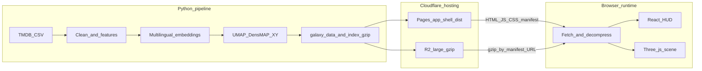

# The Movie Cosmos

**The Movie Cosmos** turns a large slice of the TMDB catalog into a walkable starfield: films that are closer in content tend to cluster together, release time maps to depth along Z; larger stars usually mean more ratings, brighter often means a higher score, and color loosely follows genre. For algorithms, field names, and the data pipeline, see **[For developers](#for-developers)** and the [feature → rendering mapping table](docs/project_docs/TMDB%20数据特征工程与%203D%20映射总表.md).

**Live site:** [themoviecosmos.com](https://themoviecosmos.com/)

**Chinese readme:** [README.md](README.md)

---

## User guide

For loading phases, search, keyboard behavior, and other **product-level** details, see the [Tech Spec](docs/project_docs/TMDB%20电影宇宙%20Tech%20Spec.md) and [Design Spec](docs/project_docs/TMDB%20电影宇宙%20Design%20Spec.md); field-by-field rendering mapping is in the [mapping table](docs/project_docs/TMDB%20数据特征工程与%203D%20映射总表.md).

### First run: cover → full galaxy

1. **Loading**: Wait until the progress bar finishes, then you reach the cover screen.
2. **Cover**: Click the globe at the center of the screen to open **The Movie Today**.

**The Movie Today**: the highlighted film in the middle of the cover is a **daily pick** for “**today**” (day rolls at **UTC**). Rules and failure fallbacks are in [P23.1 The Movie Today acceptance guide](docs/guides/P23.1%20The%20Movie%20Today%20验收指南.md).

---

### Browse: roaming the galaxy

**Interaction**

- **Pan / rotate the view**: click-drag on the canvas to pan or rotate the viewing direction (exact mapping follows the current implementation).
- **Move in time (timeline)**: when **Space is not held**, use the mouse wheel or the timeline so the view moves along **release-year depth**, i.e. the era band represented by `zCurrent`.
- **Local dolly (Space + wheel)**: in **macro roam** (wheel drives time, and you are **not** in a focus session), **hold Space** and scroll to temporarily magnify the starfield near the current era while keeping the world point under the cursor on the current `zCurrent` plane; **release Space** to reset viewing distance to the default. Product definition: [Design Spec](docs/project_docs/TMDB%20电影宇宙%20Design%20Spec.md) (dual wheel modes, Phase 17) and [Tech Spec §1.4.3](docs/project_docs/TMDB%20电影宇宙%20Tech%20Spec.md).
- **Quick preview**: hover a film instance for a tooltip (title, primary genre, etc.) without stopping camera motion.
- **Search (titles / people / genres)**: use the top bar; **ESC** walks back along the focus stack (search, drawer, focus, etc.). See [Design Spec](docs/project_docs/TMDB%20电影宇宙%20Design%20Spec.md) §4.

**Macro visuals**


| Visual              | Meaning                                                                                                                                 |
| ------------------- | --------------------------------------------------------------------------------------------------------------------------------------- |
| **Plane position**  | Coordinates from plot, marketing, genres, language, culture, etc.: **semantically and culturally closer films sit closer on the plane**. |
| **Depth position**  | **Release date**.                                                                                                                       |
| **Size**            | Scales mainly with **vote count** (log-scaled): **more voters → larger body**, with scaling that limits extreme heads dominating the view. |
| **Brightness**      | Scales mainly with **TMDB average** (0–10): **higher score → brighter**; size and brightness are decoupled, so **large is not always bright**. |
| **Hue**             | Driven by **primary genre (`genres[0]`)**; multi-genre nuance reads more clearly on the **focus** high-detail sphere.                   |


Field-level mapping: [TMDB 数据特征工程与 3D 映射总表](docs/project_docs/TMDB%20数据特征工程与%203D%20映射总表.md); pipeline and algorithms: **[For developers](#for-developers)**.

---

### Focus: inspecting one film

**Interaction**

- **Select**: in browse mode, **click** a film instance; the camera animates into **focus** and opens the side **detail sheet** (poster, overview, spoken languages, cast & crew, etc.).
- **Orbit and switch**: in focus, **drag** to orbit the focused body and its **neighborhood**; **click** another neighbor sphere to switch focus (state machine: [planet state machine spec](docs/project_docs/星球状态机%20spec.md)).
- **Reading aids**: the UI exposes references tied to **vote_count tiers** and **score → lightness (L)** mapping; definitions in the [visual parameters table](docs/project_docs/视觉参数总表.md).
- **Exit**: use **exit focus** or **ESC** as specified in the product docs to return to browse; see [Design Spec](docs/project_docs/TMDB%20电影宇宙%20Design%20Spec.md).

**Focus visuals**


| Visual                       | Meaning                                                                                                                                           |
| ---------------------------- | ------------------------------------------------------------------------------------------------------------------------------------------------- |
| **Stripe boundaries**      | The sphere is partitioned with **Perlin noise** into rings, then colored; up to 8 declared genres.                                          |
| **Stripe order and width**   | Genre order follows TMDB genre vote counts; **earlier genres get wider stripes**, then taper by a fixed ratio (same 1/φ rhythm as macro genre weights). |
| **Hue**                      | Each ring uses that genre’s **primary palette color**; **primary genre** prefers `genre_hue` from the export.                                          |
| **Brightness**               | Still rises mainly with TMDB average: **higher score → brighter**, consistent with the macro galaxy.                                          |
| **Relief**                   | Slight **stepped relief** on stripes to read layers in 3D.                                                                                        |
| **Concentric rings**         | Rings mark **vote count** tiers as a “how big is this star in the universe?” gauge.                                                               |
| **Sidebar brightness strip** | Vertical strip + pointer show **score** on the same lightness scale as the sphere.                                                              |


Implementation and tunables: [视觉参数总表](docs/project_docs/视觉参数总表.md), [Tech Spec §1.1](docs/project_docs/TMDB%20电影宇宙%20Tech%20Spec.md) (focus Perlin sphere).

---

### Browser and environment

Use a **recent** desktop or mobile browser with hardware acceleration enabled. The site requires **WebGL 2**; payloads are **compressed** for transfer—very old browsers without decompression support may fail to load. On errors the UI shows hints; see [MDN: DecompressionStream](https://developer.mozilla.org/en-US/docs/Web/API/DecompressionStream) (roughly Safari 16.4+, Chrome 80+, Firefox 113+).

### Privacy and analytics (brief)

- The site **does not** implement sign-in accounts or a per-user “profile database” for visitors.
- **Optional:** production builds can enable **Cloudflare Web Analytics**. If GitHub Actions defines the **`CF_WEB_ANALYTICS_BEACON_TOKEN`** secret (mapped at build time to **`VITE_CF_BEACON_TOKEN`**), [`frontend/vite.config.ts`](frontend/vite.config.ts) injects Cloudflare’s lightweight beacon (`static.cloudflareinsights.com/beacon.min.js`) into `index.html` for **aggregated** traffic, coarse geography, Core Web Vitals, and similar **RUM** metrics; Cloudflare describes this path as **typically cookie-free** (whether you need an extra consent banner depends on your jurisdiction and Cloudflare’s terms).
- With the secret **unset**, **no** analytics script is injected—behavior matches “no third-party analytics.”
- Setup and verification: [P20.5 Cloudflare Web Analytics runbook](docs/guides/P20.5%20Cloudflare%20Web%20Analytics%20%E6%8E%A5%E5%85%A5%E6%93%8D%E4%BD%9C%E6%8C%87%E5%8D%97.md). **Ad blockers / privacy extensions** may block beacons; **the galaxy and HUD keep working**.

### Data sources

Film metadata comes from the [TMDB](https://www.themoviedb.org/) ecosystem; full snapshots are often ingested via Kaggle **[TMDB Movies Daily Updates](https://www.kaggle.com/datasets/alanvourch/tmdb-movies-daily-updates)**. TMDB may also merge fields from the [IMDb non-commercial datasets](https://developer.imdb.com/non-commercial-datasets/)—if you **commercialize or redistribute** raw tables, read TMDB and IMDb terms yourself. On-screen TMDB data must follow [TMDB logos & attribution](https://www.themoviedb.org/about/logos-attribution); legal and third-party notices live in [NOTICE](NOTICE). **Where data comes from and how offline galaxy files are built** is covered under **[For developers](#for-developers)** (“Stack and data flow”) and the [Data Pipeline](docs/project_docs/TMDB%20电影宇宙%20Data%20Pipeline.md).

> **Optional media:** add a screenshot or GIF here for richer social previews.

---

## For developers

### Stack and data flow

- **Data (Python)**: clean TMDB exports → multilingual sentence embeddings → fuse genre / language features → **UMAP (`random_state=42` fixed)** → export static `galaxy_data` and a search index (gzip). **Z (decimal release year) is not fed to UMAP**; it is depth only.
- **Frontend**: **Vite** + **React 19** (HUD / DOM) + **vanilla Three.js** (not R3F) dual-`InstancedMesh` scene + **Zustand** bridge; English HUD copy is SSOT in [`frontend/src/lib/locales/en.json`](frontend/src/lib/locales/en.json), exposed via [`frontend/src/lib/strings.ts`](frontend/src/lib/strings.ts) as `STRINGS`.
- **Runtime data (production topology)**: **Cloudflare Pages** hosts the built **`frontend/dist` app shell** (HTML / JS / CSS, small `galaxy_assets_manifest.json`, etc.). **`galaxy_data.json.gz`**, **`galaxy_search_index.json.gz`**, and other large objects live on **Cloudflare R2** under a public prefix; the manifest carries **absolute URLs** for the browser to fetch and decompress. Optional overrides: Vite env vars (below). Runbooks: [P18.6 Cloudflare Pages cutover](docs/guides/P18.6%20Cloudflare%20Pages%20%E5%88%87%E6%8D%A2%E6%93%8D%E4%BD%9C%E6%8C%87%E5%8D%97.md), [P18.6b Cloudflare R2 operations](docs/guides/P18.6b%20Cloudflare%20R2%20%E4%B8%8A%E7%BA%BF%E6%93%8D%E4%BD%9C%E6%89%8B%E5%86%8C.md).



> **Diagram note:** edges from `Export` to `Pages` / `R2` show where artifacts **land**. **Actual order** in GitHub Actions: **upload large gzip to R2 first**, then **Vite build** (manifest points at public R2 URLs), then **`wrangler pages deploy`** for `dist`. The CI box is omitted for brevity.

### Repository structure and layout

Conceptual layout (tree-style). Omitted: `node_modules/`, `.venv/`, `data/raw/`, `data/output/`, `logs/`, and other **gitignored / generated** trees; data directory conventions: [`data/README.md`](data/README.md).

```text
.
├── .cursor/
│   └── rules/                 # Cursor: overview, data protection, naming …
├── .github/
│   └── workflows/             # deploy-pages, monthly_refit, nightly_vote_refresh …
├── assets/
│   └── fonts/                 # Inter, Butler (see assets/fonts/README.md)
├── data/                      # subsample/; raw|output|runs → data/README.md
├── docs/
│   ├── LICENSE                # Markdown under docs/: CC BY 4.0
│   ├── project_docs/          # SSOT: PRD, Tech Spec, Data Pipeline …
│   ├── reports/               # Phase reports & decisions
│   ├── guides/                # Ops, R2, domain, acceptance …
│   └── workflows/             # CI / Pages notes
├── frontend/
│   ├── public/                # Static entry, data/manifest, optional local gzip
│   ├── src/                   # hud/, three/, components/, lib/ …
│   ├── README.md              # Placeholder; points to root README
│   └── dist/                  # Vite output (usually not committed)
├── scripts/
│   ├── run_pipeline.py        # Pipeline entrypoint
│   ├── feature_engineering/   # Embeddings, UMAP, …
│   ├── export/                # galaxy_data export
│   ├── cron/                  # Nightly refresh, monthly refit, R2 upload …
│   ├── tools/                 # Packaging & validation scripts
│   ├── pipeline/
│   ├── tests/
│   ├── experiments/
│   ├── env/
│   └── _archive/
├── supabase/                  # DB migrations (Phase 18+ direction)
├── LICENSE                    # Apache-2.0
├── NOTICE                     # TMDB / IMDb / fonts / third-party chain
├── package.json               # npm workspaces; scripts proxy to frontend
├── package-lock.json
├── requirements.txt
├── requirements.cpu.txt
├── requirements.gpu.txt
├── .env.example               # Env sample; optional VITE_* data URL overrides
├── README.en.md               # English (kept in sync with README.md)
└── README.md                  # Chinese (primary narrative entry)
```

**Main app**: [`frontend/`](frontend/) — Vite + React + vanilla Three.js. **Pipeline**: [`scripts/run_pipeline.py`](scripts/run_pipeline.py) — Python full pipeline entry.

### Run locally (frontend)

From the **repository root** (npm workspaces):

```bash
npm install
npm run dev
```

Same as `npm run dev -w frontend`. More scripts: root [`package.json`](package.json).

### Local data (pipeline)

For offline or full-data debugging, supply your own TMDB CSV (e.g. from Kaggle) and run the Python pipeline to generate galaxy JSON (and gzip / search index) under `frontend/public/data/`. **Do not** open the huge `data/raw/TMDB_all_movies.csv` in an editor; use [`data/subsample/`](data/subsample/) for schema samples and [`data/README.md`](data/README.md) for commands and layout.

### Optional asset URL overrides

Resolution order: [`frontend/src/lib/galaxyAssetUrls.ts`](frontend/src/lib/galaxyAssetUrls.ts). For dev or custom deploys you can set:

- `VITE_GALAXY_DATA_GZIP_URL`
- `VITE_GALAXY_SEARCH_INDEX_GZIP_URL`
- `VITE_TODAY_JSON_URL`

If unset, the build prefers absolute URLs inside `galaxy_assets_manifest.json`, then falls back to bundled relative paths.

### CI and static hosting

**Production path: GitHub Actions → Cloudflare R2 + Cloudflare Pages**

- Nightly refresh, monthly refit, and similar workflows (e.g. [`nightly_vote_refresh.yml`](.github/workflows/nightly_vote_refresh.yml), [`monthly_refit.yml`](.github/workflows/monthly_refit.yml)) **upload large galaxy gzip assets to R2** (`scripts/cron/upload_galaxy_r2.py`, etc.), then in the same job run **`npm run build -w frontend`** and use **`cloudflare/wrangler-action@v3`** from the **`frontend`** working directory with **`pages deploy dist`** to publish **`frontend/dist`** to **Cloudflare Pages** via **Direct Upload**. The Pages bundle therefore avoids oversized static files (no “single file 25 MiB” failures); big payloads are served from **R2**, with entry URLs written into **`galaxy_assets_manifest.json`** shipped in `dist`.
- **`galaxy_data.json.gz` and `galaxy_search_index.json.gz` are not committed to Git** (see repo-root `[.gitignore](.gitignore)` and the [P24.1 rollout report](docs/reports/Phase%2024.1%20P24.1%20Cloudflare%20R2%20发布链路清理%20实施报告.md)); the repo keeps only small static assets such as **`galaxy_assets_manifest.json`** that Pages can host—large objects always go to **R2** via CI.
- **Do not** rely on Cloudflare Pages **Git-connected auto builds** as the production entry: without this repo’s workspace build, huge `public/data/*.gz` on the wrong path can be picked up and fail validation. Production is **GitHub Actions + wrangler `pages deploy`**.

**Gray standby: GitHub Pages (short-term; to be retired)**

- [`deploy-pages.yml`](.github/workflows/deploy-pages.yml): on `push` to `main` or manual dispatch, installs **Node 24**, runs `npm run build -w frontend`, and deploys **`frontend/dist`** to **GitHub Pages**. This exists for **parallel gray validation after the P18.6 Cloudflare cutover**; **plan to disable or remove it after validation**—not a long-term production front door. The workflow header comment states the same intent.

### Documentation index (implementation SSOT)


| Doc | Contents |
| --- | --- |
| [TMDB 电影宇宙 PRD.md](docs/project_docs/TMDB%20电影宇宙%20PRD.md) | Vision, journeys, scope |
| [TMDB 电影宇宙 Tech Spec.md](docs/project_docs/TMDB%20电影宇宙%20Tech%20Spec.md) | Architecture, loading, rendering & camera contracts |
| [TMDB 电影宇宙 Design Spec.md](docs/project_docs/TMDB%20电影宇宙%20Design%20Spec.md) | Visual & interaction rules |
| [TMDB 电影宇宙 Data Pipeline.md](docs/project_docs/TMDB%20电影宇宙%20Data%20Pipeline.md) | Data flow, features, export & automation SSOT |
| [TMDB 数据特征工程与 3D 映射总表.md](docs/project_docs/TMDB%20数据特征工程与%203D%20映射总表.md) | Feature → rendering mapping |
| [星球状态机 spec.md](docs/project_docs/星球状态机%20spec.md) | Selection / focus state machine |
| [视觉参数总表.md](docs/project_docs/视觉参数总表.md) | Shader & visual parameters |


---

## Data and acknowledgements

This project uses data from [The Movie Database (TMDB)](https://www.themoviedb.org/) and is **not an official TMDB product**. When displaying or redistributing TMDB data, follow [TMDB’s logo and attribution policy](https://www.themoviedb.org/about/logos-attribution). If the pipeline or upstream CSV includes IMDb-derived fields, also comply with the [IMDb non-commercial datasets](https://developer.imdb.com/non-commercial-datasets/) terms. Full third-party statements: **[NOTICE](NOTICE)**.

---

## License and reuse


| Scope | License | Notes |
| --- | --- | --- |
| **This repository’s source code** (including `frontend/src`, `scripts/`, …) | **[Apache License 2.0](LICENSE)** | Commercial use and modifications allowed; redistribution must retain notices and the [`NOTICE`](NOTICE) file; **prefer** crediting **The Movie Cosmos** with a link to [themoviecosmos.com](https://themoviecosmos.com/) in UI or docs (see NOTICE for preferred wording). |
| **Markdown under `docs/`** | **[CC BY 4.0](docs/LICENSE)** | Share and adapt prose with attribution and change indication; **code blocks** remain software under Apache-2.0. |
| **TMDB / IMDb data and marks** | Their respective terms | **Not** licensed under Apache-2.0; see “Data sources” above and [`NOTICE`](NOTICE). |
| **Bundled fonts** | Per-font licenses | **Butler**: Fabian De Smet — [personal & commercial free use](https://www.fabiandesmet.com/portfolio/butler-font/) (verify current terms on the author site). **Inter**: SIL OFL 1.1 — [`assets/fonts/Inter-OFL.txt`](assets/fonts/Inter-OFL.txt). Summary: [`assets/fonts/README.md`](assets/fonts/README.md). |


