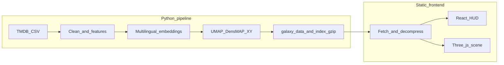

# The Movie Cosmos

**The Movie Cosmos** 把大量 TMDB 影片做成一片可以走进去的星空：**内容上相像的电影更容易聚在一块**，**时间**像一条可以前后走的深轴；星星**越大**通常表示越多人评过分，**越亮**往往表示评分越高，**颜色**大致跟类型有关。界面上的品牌字是 **the movie cosmos**（全小写）。算法、字段名与数据管线说明见下文 **[面向开发者](#面向开发者)** 与 [TMDB 数据特征工程与 3D 映射总表](docs/project_docs/TMDB%20数据特征工程与%203D%20映射总表.md)。

**在线体验：** [themoviecosmos.com](https://themoviecosmos.com/)

---

## 使用指南

需要加载阶段、搜索与键盘等**产品级细则**时，可查 [Tech Spec](docs/project_docs/TMDB%20电影宇宙%20Tech%20Spec.md)、[Design Spec](docs/project_docs/TMDB%20电影宇宙%20Design%20Spec.md)；字段与渲染的一一对应见 [映射总表](docs/project_docs/TMDB%20数据特征工程与%203D%20映射总表.md)。

### 初次上手：封面 → 完整宇宙

1. **加载**：等待加载进度条走完，完成后进入封面。
2. **封面**：点击屏幕中心星球进入今日电影（The Movie Today）。

**The Movie Today**：封面正中间高亮的那一部电影，是站点为「**今天**」准备的一部**每日推荐**（按世界协调时换日，每天一换）。规则与故障兜底见 [P23.1 The Movie Today 验收指南](docs/guides/P23.1%20The%20Movie%20Today%20验收指南.md)。

---

### 浏览态：在星系里漫游

**交互**

- **平移观察方向**：在画布上按住并拖拽，以平移或旋转观察方向（具体映射以当前实现为准）。
- **调整当前年代（时间轴）**：**未按住空格**时，使用滚轮或拖动时间轴，使视点沿 **上映时间纵深** 移动，即调节 `zCurrent` 所代表的年代区间。
- **局部推近（Space + 滚轮）**：在**宏观漫游**（时间轴滚轮生效、且未处于聚焦会话）时，**按住空格**并旋转滚轮，在保持光标下世界点落在当前 `zCurrent` 平面的前提下临时放大当前年代附近的局部星野；**松开空格** 后观察距离复位为默认值。产品定义见 [Design Spec](docs/project_docs/TMDB%20电影宇宙%20Design%20Spec.md)（滚轮双模式，Phase 17）及 [Tech Spec §1.4.3](docs/project_docs/TMDB%20电影宇宙%20Tech%20Spec.md)。
- **快速预览电影**：指针悬停于某一影片实例时，显示 Tooltip（标题、主类型等），不中断相机运动。
- **搜索影片/人物/流派**：使用顶部搜索栏，支持按影片、人物、流派等模式检索；按 **ESC** 按焦点栈逐级退出搜索、抽屉与聚焦等状态，详见 [Design Spec](docs/project_docs/TMDB%20电影宇宙%20Design%20Spec.md) §4。

**星球视觉**


| 视觉       | 含义                                                            |
| -------- | ------------------------------------------------------------- |
| **平面位置** | 由剧情与宣传、流派及语言、文化等经降维得到的坐标：**语义与文化上相近的影片，在平面上更接近**。             |
| **纵深位置** | 对应 **上映日期**；                                                  |
| **大小**   | 主要随 **评价人数**（对数缩放）增大：**参与评分的人数越多，天体越大**，且缩放抑制极端头部对可视性的占用。     |
| **明度**   | 主要随 **TMDB 均分**（0–10）升高：**评分越高，观感越亮**；尺度与人数解耦，故 **尺度大未必明度高**。 |
| **色相**   | 由 **主类型（`genres[0]`）** 决定主色；多类型差异在 **聚焦态** 的高模球体上更可分辨。        |


字段级与渲染实现对照见 [TMDB 数据特征工程与 3D 映射总表](docs/project_docs/TMDB%20数据特征工程与%203D%20映射总表.md)；管线与算法见下文 **[面向开发者](#面向开发者)**。

---

### 聚焦态：选定影片后的星球检视

**交互**

- **选取**：在浏览态 **单击** 目标影片实例，相机动画进入 **focus**，并打开侧栏 **档案详情**（海报、剧情简介、对白语言、演职员等）。
- **视点与切换**：在 focus 下可 **拖拽** 以环绕焦点天体及其 **邻域** 内的其他电影；**单击** 邻域内其他电影星球，将焦点切换至该片（状态转换见 [星球状态机 spec](docs/project_docs/星球状态机%20spec.md)）。
- **读数辅助**：界面提供与 `**vote_count` 分档**、**评分—明度（L）映射** 相关的参照控件，定义见 [视觉参数总表](docs/project_docs/视觉参数总表.md)。
- **退出**：使用 **退出聚焦** 或 **ESC** 等操作，按产品约定顺序退回浏览态，详见 [Design Spec](docs/project_docs/TMDB%20电影宇宙%20Design%20Spec.md)。

**星球视觉**


| 视觉          | 含义                                                                          |
| ----------- | --------------------------------------------------------------------------- |
| **色带形状分界**  | 球面 **Perlin Noise** 划成多圈，再上色；至多对应 **8** 个已声明流派。                             |
| **色带顺序与宽窄** | **流派顺序**由 TMDB **流派投票数**决定；**越靠前的流派，条带越宽**，向后按固定比例递减（与宏观流派权重同一 **1/φ** 节奏）。 |
| **色相**      | 每一圈颜色对应该流派在调色盘里的 **主色**；**主类型** 优先用导出里的 `**genre_hue`**。                    |
| **明度**      | 仍主要随 **TMDB 均分** 升高：**分高更亮**，规则与宏观星系一致。                                     |
| **球面起伏**    | 各圈条带略有 **台阶式隆起**，便于用立体轮廓区分圈层。                                               |
| **同心星环**    | 若干环对应 **评价人数** 的档位刻度，用来对照「这颗球在当前宇宙里算大还是小」。                                  |
| **侧栏亮条**    | 竖条 + 指针标示 **评分** 在亮暗标尺上的位置，与球体明暗 **同一套读数**。                                 |


实现与可调参数见 [视觉参数总表](docs/project_docs/视觉参数总表.md)、[Tech Spec §1.1](docs/project_docs/TMDB%20电影宇宙%20Tech%20Spec.md)（焦点 Perlin 球）。

---

### 浏览器与环境

请使用**较新**的桌面或移动浏览器，并开启硬件加速。本站需要 **WebGL 2**，数据包会压缩传输；若浏览器太旧、不支持解压，可能打不开。出错时页面上会有说明，也可对照 [MDN：DecompressionStream](https://developer.mozilla.org/en-US/docs/Web/API/DecompressionStream) 里的环境要求（常见为 Safari 16.4+、Chrome 80+、Firefox 113+ 一类）。

### 数据来源

影片信息来自 [TMDB](https://www.themoviedb.org/) 生态；全量快照常见入口是 Kaggle 上的 **[TMDB Movies Daily Updates](https://www.kaggle.com/datasets/alanvourch/tmdb-movies-daily-updates)**。TMDB 背后还可能合并 [IMDb 公开数据集](https://developer.imdb.com/non-commercial-datasets/) 里的部分字段——若你要**商用或再分发**原始表，请自己读完 TMDB / IMDb 的条款。本站展示 TMDB 数据需遵守 [TMDB 署名说明](https://www.themoviedb.org/about/logos-attribution)；仓库里的法律与第三方清单见 `[NOTICE](NOTICE)`。**数据从哪来、怎么离线打成星系文件**，见下文 **[面向开发者](#面向开发者)** 里的「技术栈与数据流」与 [Data Pipeline](docs/project_docs/TMDB%20电影宇宙%20Data%20Pipeline.md)。

> **视觉素材（可选）：** 若你为仓库添加演示图或录屏，可在此处插入一张静态图或 GIF，便于 README 在社交平台预览。

---

## 面向开发者

### 技术栈与数据流

- **数据处理（Python）**：清洗 TMDB 导出 → 多语言句向量 → 与流派 / 语言特征融合 → **UMAP（`random_state=42` 固定）** → 导出静态 `galaxy_data` 与搜索索引（gzip）。**Z 轴（小数年份）不参与 UMAP**，仅作纵深坐标。
- **前端**：**Vite** + **React 19**（HUD / DOM）+ **原生 Three.js**（非 R3F）双 `InstancedMesh` 场景 + **Zustand** 状态桥接；英文 HUD 文案以 `[frontend/src/lib/locales/en.json](frontend/src/lib/locales/en.json)` 为 SSOT，经 `[frontend/src/lib/strings.ts](frontend/src/lib/strings.ts)` 暴露为 `STRINGS`。
- **运行时数据**：生产环境通过 `[frontend/public/data/galaxy_assets_manifest.json](frontend/public/data/galaxy_assets_manifest.json)` 指向托管的 gzip 资源；也可用 Vite 环境变量覆盖（见下文）。




### 仓库结构与布局

以下为**概念布局**（与 `tree` 命令风格一致）。未画出 `node_modules/`、`.venv/`、`data/raw/`、`data/output/`、`logs/` 等常见 **gitignore / 本地生成** 目录；需要数据目录约定时见 `[data/README.md](data/README.md)`。

```text
.
├── .cursor/
│   └── rules/                 # Cursor：项目概览、数据保护、品牌命名等
├── .github/
│   └── workflows/             # deploy-pages、monthly_refit、nightly_vote_refresh …
├── assets/
│   └── fonts/                 # Inter、Butler（见 assets/fonts/README.md）
├── data/                      # subsample/；raw|output|runs 见 data/README.md
├── docs/
│   ├── LICENSE                # docs 下 Markdown：CC BY 4.0
│   ├── project_docs/          # 规格 SSOT：PRD、Tech Spec、Data Pipeline…
│   ├── reports/               # Phase 实施与决策报告
│   ├── guides/                # 运维、R2、域名、验收等
│   └── workflows/             # CI / Pages 相关流程说明
├── frontend/
│   ├── public/                # 入口静态资源、data/manifest、可选本地 gzip
│   ├── src/                   # hud/、three/、components/、lib/ …
│   ├── README.md              # 占位，指向根 README
│   └── dist/                  # Vite 构建输出（通常不提交）
├── scripts/
│   ├── run_pipeline.py        # 管线主入口
│   ├── feature_engineering/   # 嵌入、UMAP 等
│   ├── export/                # galaxy_data 导出
│   ├── cron/                  # 夜间刷新、月度 refit、R2 上传等
│   ├── tools/                 # 打包、校验脚本
│   ├── pipeline/
│   ├── tests/
│   ├── experiments/
│   ├── env/
│   └── _archive/
├── supabase/                  # 数据库迁移（Phase 18+ 方向）
├── LICENSE                    # Apache-2.0
├── NOTICE                     # 署名与 TMDB / IMDb / 字体等第三方说明
├── package.json               # npm workspaces；脚本代理到 frontend
├── package-lock.json
├── requirements.txt
├── requirements.cpu.txt
├── requirements.gpu.txt
├── .env.example               # 环境变量示例；可选 VITE_* 覆盖数据 URL
└── README.md                  # 本文档（唯一维护的说明入口）
```

**主应用**：`[frontend/](frontend/)` 内为 Vite + React + 原生 Three.js；**管线**：`[scripts/run_pipeline.py](scripts/run_pipeline.py)` 为 Python 全量入口。

### 本地运行（前端）

在**仓库根目录**（npm workspaces）：

```bash
npm install
npm run dev
```

等价于 `npm run dev -w frontend`。更多脚本见根目录 `[package.json](package.json)`。

### 本地数据（管线）

离线或调试完整体验时，需要自备 Kaggle 等来源的 TMDB 全量 CSV，并由 Python 管线生成 `frontend/public/data/` 下的星系 JSON（及 gzip / 搜索索引）。**勿**在编辑器中直接打开巨型 `data/raw/TMDB_all_movies.csv`；请用 `[data/subsample/](data/subsample/)` 了解列结构，并阅读 `[data/README.md](data/README.md)` 中的命令与目录约定。

### 资源 URL 覆盖（可选）

解析顺序见 `[frontend/src/lib/galaxyAssetUrls.ts](frontend/src/lib/galaxyAssetUrls.ts)`。开发或部署时可设置：

- `VITE_GALAXY_DATA_GZIP_URL`
- `VITE_GALAXY_SEARCH_INDEX_GZIP_URL`
- `VITE_TODAY_JSON_URL`

未设置时优先使用构建内 `galaxy_assets_manifest.json` 中的绝对 URL，再回退到相对路径下的打包资源。

### CI 与静态部署

- `[/.github/workflows/deploy-pages.yml](.github/workflows/deploy-pages.yml)`：在 `push` 至 `main` 或手动触发时，使用 **Node 24** 安装依赖、执行 `npm run build -w frontend`，并将 `frontend/dist` 部署到 **GitHub Pages**。
- 工作流文件内注释说明：曾与 **Cloudflare Pages** 并行灰度；对象存储上的星系资源与 manifest 由管线 / 上传脚本维护（见 `scripts/cron/` 等相关文档）。

### 文档索引（实现 SSOT）


| 文档                                                                               | 内容                 |
| -------------------------------------------------------------------------------- | ------------------ |
| [TMDB 电影宇宙 PRD.md](docs/project_docs/TMDB%20电影宇宙%20PRD.md)                       | 产品愿景、用户旅程、功能范围     |
| [TMDB 电影宇宙 Tech Spec.md](docs/project_docs/TMDB%20电影宇宙%20Tech%20Spec.md)         | 架构、加载阶段、渲染与相机契约    |
| [TMDB 电影宇宙 Design Spec.md](docs/project_docs/TMDB%20电影宇宙%20Design%20Spec.md)     | 视觉与交互细则            |
| [TMDB 电影宇宙 Data Pipeline.md](docs/project_docs/TMDB%20电影宇宙%20Data%20Pipeline.md) | 数据流、特征、导出与自动化 SSOT |
| [TMDB 数据特征工程与 3D 映射总表.md](docs/project_docs/TMDB%20数据特征工程与%203D%20映射总表.md)       | 特征到渲染映射            |
| [星球状态机 spec.md](docs/project_docs/星球状态机%20spec.md)                               | 选择 / 聚焦等行为状态机      |
| [视觉参数总表.md](docs/project_docs/视觉参数总表.md)                                         | Shader 与视觉参数       |


---

## 数据与致谢

本项目使用 [The Movie Database (TMDB)](https://www.themoviedb.org/) 提供的数据，**并非 TMDB 官方产品**。展示或再分发 TMDB 数据时，请遵循 [TMDB 的 logo 与署名政策](https://www.themoviedb.org/about/logos-attribution)。若管线或上游 CSV 含 IMDb 衍生字段，请同时遵守 [IMDb 非商业数据集](https://developer.imdb.com/non-commercial-datasets/) 的条款。完整第三方声明见 `**[NOTICE](NOTICE)`**。

---

## 许可证与再利用


| 范围                                        | 许可                                | 说明                                                                                                                                                                                                                                                          |
| ----------------------------------------- | --------------------------------- | ----------------------------------------------------------------------------------------------------------------------------------------------------------------------------------------------------------------------------------------------------------- |
| **本仓库源代码**（含 `frontend/src`、`scripts/` 等） | **[Apache License 2.0](LICENSE)** | 可商用、可修改；再分发须保留版权声明与 `[NOTICE](NOTICE)` 文件；**建议**在界面或文档中署名 **The Movie Cosmos** 并链接 [themoviecosmos.com](https://themoviecosmos.com/)（详见 NOTICE 首选表述）。                                                                                                       |
| `**docs/` 下 Markdown 文档**                 | **[CC BY 4.0](docs/LICENSE)**     | 可分享与改编文字说明；需适当署名并注明是否修改；文中**代码块**作为软件部分仍适用 Apache-2.0。                                                                                                                                                                                                      |
| **TMDB / IMDb 数据与商标**                     | 各自条款                              | **不由** Apache-2.0 授权；见上文「数据来源」与 `[NOTICE](NOTICE)`。                                                                                                                                                                                                         |
| **捆绑字体**                                  | 字体作者许可                            | **Butler**：Fabian De Smet，官方说明为 [个人与商业免费使用](https://www.fabiandesmet.com/portfolio/butler-font/)（请以作者页面当前条款为准）。**Inter**：SIL OFL 1.1，见 `[assets/fonts/Inter-OFL.txt](assets/fonts/Inter-OFL.txt)`。说明汇总见 `[assets/fonts/README.md](assets/fonts/README.md)`。 |


为何选 **Apache-2.0**（而非仅 MIT）：与常见开源实践一致，且 `**NOTICE`** 文件便于固定 **TMDB / IMDb / Kaggle / 字体** 的致谢与数据合规提示链；**MIT** 同样可行，但项目维护者需在 README 中自行维持同等长度的法律与致谢段落。