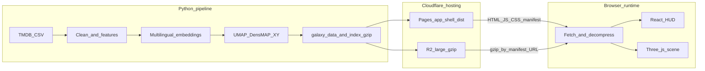

<p align="center">
  
</p>

---

The Movie Cosmos 把近六万部 TMDB 影片织成一片可走进的星海：在平面上按剧情、类型与语言相近而聚拢，沿纵深按上映年代排列。

> 在电影的时空中里穿梭

**在线体验：** [themoviecosmos.com](https://themoviecosmos.com/)

**English readme:** [README.en.md](README.en.md)

<p align="center">
  <a href="https://discord.gg/SkhMZ34CvC" title="加入 Discord 社区"></a>
  &nbsp;
  <a href="https://github.com/XYBuilds/chronicle_v3_3d_galaxy/issues" title="在 GitHub 提交问题与建议"></a>
  &nbsp;
</p>

<p align="center">Discord · Issues</p>

---

## 目录

- [目录](#目录)
- [视觉呈现](#视觉呈现)
- [概念与灵感](#概念与灵感)
  - [创作背景](#创作背景)
  - [艺术体验](#艺术体验)
  - [AI 透明度说明](#ai-透明度说明)
- [交互指南](#交互指南)
  - [初次上手](#初次上手)
  - [浏览](#浏览)
  - [聚焦](#聚焦)
  - [搜索](#搜索)
  - [分享](#分享)
- [浏览器与环境](#浏览器与环境)
- [隐私与统计（简述）](#隐私与统计简述)
- [技术视界](#技术视界)
  - [创意编程与视觉渲染](#创意编程与视觉渲染)
  - [基础框架与构建工具](#基础框架与构建工具)
- [幕后故事](#幕后故事)
  - [性能与帧率](#性能与帧率)
  - [数学与坐标：从 CSV 到星图](#数学与坐标从-csv-到星图)
    - [平面（X/Y）——内容相似度，而非时间](#平面xy内容相似度而非时间)
    - [纵深（Z）——上映时间，不参与降维](#纵深z上映时间不参与降维)
    - [大小与明暗——热度与评分（导出时算好）](#大小与明暗热度与评分导出时算好)
- [面向开发者](#面向开发者)
  - [技术栈与数据流](#技术栈与数据流)
  - [仓库结构与布局](#仓库结构与布局)
  - [克隆与本地运行（前端）](#克隆与本地运行前端)
  - [本地数据（Python 管线）](#本地数据python-管线)
  - [环境变量](#环境变量)
  - [CI 与静态部署](#ci-与静态部署)
  - [文档索引（实现 SSOT）](#文档索引实现-ssot)
- [数据与致谢](#数据与致谢)
- [许可证与再利用](#许可证与再利用)

## 视觉呈现


浏览态漫游星团，并切换到聚焦态


聚焦态高清示例：《2001 太空漫游》

完整交互请访问 [themoviecosmos.com](https://themoviecosmos.com/)。

---

## 概念与灵感

### 创作背景

The Movie Cosmos 想打破传统图表式的「看电影数据」：把 TMDB 档案变成一座 2.5D 时空立方体——内容相似度落在可漫游的平面上，上映时间成为可以穿梭的物理纵深。数据来自 [TMDB Movies Daily Updates (Kaggle)](https://www.kaggle.com/datasets/alanvourch/tmdb-movies-daily-updates)；管线用多语言句向量与 UMAP（`random_state=42`）塑造星团，同时把年份、评分与人数留给 GPU 与 HUD 单独表达（详见 [映射总表](docs/project_docs/TMDB%20数据特征工程与%203D%20映射总表.md)）。

以嵌入地图漫游馆藏的体验，部分灵感来自 [Google Arts & Culture — t-SNE Map 实验](https://artsandculture.google.com/experiment/t-sne-map)。

### 艺术体验

观赏者可以把它当作三条叠合的旅程（对齐 [PRD](docs/project_docs/TMDB%20电影宇宙%20PRD.md) §2）：

- **宏观时空漫游**：滚轮或时间轴沿 Z 轴（上映年份） 穿梭，从稀疏的早期星空进入密集的现代星团。
- **沉浸式星空寻宝**：在某一年代或流派星云里，用 大小、亮度、色相 直觉筛选——巨而耀眼的神作、细小却高亮的冷门、巨大却黯淡的「惨案」都会留下不同印象。
- **档案馆文物检视**：悬停得一行雷达，点选则拉近一颗星并展开档案——从宇宙尺度回到单片的海报、标语与演职员。

### AI 透明度说明

本节公开人机分工：The Movie Cosmos 由作者与 AI 共同创作——作者负责方向构思、项目管理、交互设计与业务逻辑；AI 参与具体代码实现与技术方案讨论。

## 交互指南

### 初次上手

1. 打开 [themoviecosmos.com](https://themoviecosmos.com/)，等待进度走完。
2. 点击正中今日电影星球进入 The Movie Today。
3. 点击“回到宇宙”进入宏观浏览。
4. 进入宏观漫游后，用滚轮沿年代纵深移动、顶部搜索定位影片。

### 浏览

在宏观星野里，你在近似平面的星团中沿上映年份（Z 轴）穿行；每颗星的可读维度如下，操作见第二张表。


| 视觉         | 含义                                                                                                                                           |
| ------------ | ---------------------------------------------------------------------------------------------------------------------------------------------- |
| **平面位置** | 剧情与 tagline 的多语语义、流派（含默认黄金比 1/\varphi 顺位权重）与 `original_language` 经降维后的坐标：文化/内容上相近的片，在平面上更接近。 |
| **纵深位置** | 上映日期 映射为小数年份；不参与 UMAP，避免宇宙被拉成时间轴。                                                                                   |
| **大小**     | 主要随 评价人数 `vote_count`（对数缩放）：参与评分的人越多，粒子越大，并抑制极端头部遮挡。                                                     |
| **明度**     | 主要随 TMDB 均分 `vote_average`（0–10）：分越高越亮，与人数尺度解耦。                                                                          |
| **色相**     | 主类型 `genres[0]` 决定主色；管线可写出 `genre_hue` 供 GPU 着色。                                                                              |


字段级对照见 [TMDB 数据特征工程与 3D 映射总表](docs/project_docs/TMDB%20数据特征工程与%203D%20映射总表.md)。


| 输入 / 动作                                           | 反馈                                                                                                                                                             | 备注                                                                                                                                                                                                                     |
| ----------------------------------------------------- | ---------------------------------------------------------------------------------------------------------------------------------------------------------------- | ------------------------------------------------------------------------------------------------------------------------------------------------------------------------------------------------------------------------ |
| **加载完成（标准首页）**                              | 进入 Cover 封面态：浅色品牌叠层（约 1s 入场动画，尊重「减少动态效果」）；WebGL 已挂载，可拖拽观察中央的 The Movie Today 高亮星球。搜索、时间轴与详情抽屉暂隐藏。 | 深链 `/movie/:id` 且影片在库内时跳过封面，直接进入聚焦态（见聚焦）。                                                                                                                                                     |
| **封面：点击中央星球 / Perlin 球，或按 Enter、Space** | 退出封面，聚焦今日影片（侧栏档案、轨道相机）；URL 同步为 `/movie/:id`。键盘焦点也可落在画布中央透明按钮（Tab 可见焦点环）。                                      | The Movie Today 按 UTC 日历日 从 `today.json` 换片；_feed 过期、拉取失败或 id 不在库时，从评价人数 Top-1000 中随机兜底（无报错打断）。规则详见 [P23.1 验收指南](docs/guides/P23.1%20The%20Movie%20Today%20验收指南.md)。 |
| **地址栏 `/today`**                                   | 与首页相同：解析今日片后进入 Cover，再按上表进入聚焦。                                                                                                           | 分享「今日」链路由 OG Worker 处理预览图，见分享。                                                                                                                                                                        |
| **画布拖拽**（左键）                                  | 宏观：平移观察（truck / pedestal，锁定朝向）。聚焦 orbit：绕当前 pivot 旋转（yaw / pitch）。                                                                     | 小幅移动才算点击选星；大幅拖拽视为运镜。                                                                                                                                                                                 |
| **滚轮**（未按 Space）                                | 沿 年代纵深 移动 `zCurrent`（在数据集 `z_range` 内钳制）；相机跟随 `zCurrent - zCamDistance`。                                                                   | 聚焦 orbit、Cover 今日片轨道下滚轮不推进时间轴；Ctrl+滚轮留给浏览器缩放。                                                                                                                                                |
| **时间轴**（左侧竖轨 / 底栏横轨）                     | 拖拽、点击刻度或方向键/Home/End 同步更新 `zCurrent` 与画面年代窗。                                                                                               | 已选中某片（`selectedMovieId`）时轨道只显示当前桥接 Z，不可再改写 `zCurrent`。                                                                                                                                           |
| **Space + 滚轮**                                      | 在光标下的 `z = zCurrent` 平面上 局部推近 / 拉远 当前年代星野（dolly-to-cursor，调整 `zCamDistance` 与 XY）。                                                    | 松开 Space 恢复默认机位距离；在输入框内按 Space 用于打字，不触发 dolly。                                                                                                                                                 |
| **悬停星球**                                          | 片名 + 主类型（`genres[0]`）Tooltip，锚定在星球屏幕投影处；不打断相机。                                                                                          | 射线命中可见 active 球体；聚焦态另有邻域与 Perlin 表现（见聚焦）。                                                                                                                                                       |
| **F**                                                 | 切换浏览器全屏                                                                                                                                                   | 右上角全屏按钮同效；焦点在搜索框等输入控件时不触发                                                                                                                                                                       |
| `**?lang=` / 语言切换**                               | HUD 7 种界面语言；URL 参数 → localStorage → 浏览器语言 → 默认 English                                                                                            | TMDB 影片字段（片名、简介、演职员等）保持数据库原文                                                                                                                                                                      |


### 聚焦

点选时间轴条带内或搜索命中的影片星球，相机飞入并打开右侧档案抽屉；聚焦态下 Perlin 高模球替代该实例的宏观粒子。


| 输入 / 动作                                   | 反馈                                                                      | 备注                                                                                                                                 |
| --------------------------------------------- | ------------------------------------------------------------------------- | ------------------------------------------------------------------------------------------------------------------------------------ |
| **单击** 时间轴条带内的影片星球               | 进入 focus：相机飞入，右侧 档案抽屉（海报、简介、演职员、TMDB/IMDb 外链） | 双 `InstancedMesh` 上该片实例 scale 归零，主视觉换为 Perlin 高模球；状态见 [星球状态机 spec](docs/project_docs/星球状态机%20spec.md) |
| focus 下 **拖拽** 画布                        | 轨道相机 环绕焦点及其 球形邻域                                            | 与宏观漫游的平移语义不同                                                                                                             |
| focus 下 **单击** 邻域内其他 active 星球      | 切换焦点 至该片（抽屉内容同步更新）                                       | 邻域由 `uSelectionMode = 2` 球形 mask 决定，非单纯时间条带                                                                           |
| 抽屉内 **可索引演职员姓名**（搜索索引已加载） | 在星野中高亮该人参与的全部影片                                            | 与顶部搜索栏 「人」 模式同效；索引未就绪时为普通文本                                                                                 |
| **退出聚焦**、**ESC**（按栈）                 | 退回宏观漫游；关闭抽屉即清除 `selectedMovieId`                            | 亦可用 HUD 退出聚焦；不支持 点击画布空白退出                                                                                         |


宏观星野读数见 [映射总表](docs/project_docs/TMDB%20数据特征工程与%203D%20映射总表.md) 与上文浏览；focus 下单独呈现如下。


| 视觉                | 含义                                                                                    |
| ------------------- | --------------------------------------------------------------------------------------- |
| **Perlin 色带分界** | 球面 simplex 噪声分档后着色，最多 8 个已声明流派圈层                                    |
| **色带顺序与宽窄**  | 流派按 TMDB 投票数排序；靠前流派条带更宽，后续按 1/φ 几何递减（与宏观流派权重同一节奏） |
| **色相**            | 每圈对应流派调色盘主色；主类型 优先 `genre_hue`                                         |
| **明度**            | 仍主要由 TMDB 均分 驱动（与宏观一致的 L 映射）                                          |
| **台阶式隆起**      | 条带间略有立体台阶，便于分辨圈层轮廓                                                    |
| **同心参考环**      | 世界空间环标示 评价人数 档位，对照本片在宇宙中的「体量」                                |
| **侧栏亮条**        | `FocusLReference`：竖向色带 + 指针标示当前片 评分 在明暗标尺上的位置                    |


可调参数与 shader 契约见 [视觉参数总表](docs/project_docs/视觉参数总表.md)、[Tech Spec §1.1](docs/project_docs/TMDB%20电影宇宙%20Tech%20Spec.md)（焦点 Perlin 球）。

### 搜索

顶部搜索在宏观漫游与聚焦态均可用；选中影片会进入聚焦（见聚焦）。


| 输入 / 动作         | 反馈                                                                                                                      | 备注                                                                         |
| ------------------- | ------------------------------------------------------------------------------------------------------------------------- | ---------------------------------------------------------------------------- |
| **顶部搜索 · 电影** | 从索引匹配片名；选中一项 → 进入该片 聚焦（`selectedMovieId`）。                                                           | 需已加载 `search_index`；Cmd/Ctrl+K 聚焦搜索框。                             |
| **顶部搜索 · 人物** | 高亮该演职员相关影片集（`selectionIds`）；片间 星座连线（cast / crew / producers 分色）；时间轴漂向选中集中最早上映年份。 | 抽屉演职员名亦可触发同一会话（P27.3）。                                      |
| **顶部搜索 · 流派** | 多枚流派徽章 AND 交集筛选；匹配片集写入 `selectionIds` 并高亮。                                                           | 无文本框；清空全部徽章即退出流派会话。                                       |
| **ESC**             | 按栈逐级退出：搜索框先失焦 → 若已聚焦则退出聚焦（保留人物/流派高亮）→ 再清搜索会话。                                      | 搜索栏 × 一次清空搜索并退出聚焦。Cover / 信息弹窗有独立 ESC 行为（见浏览）。 |


### 分享


| 输入 / 动作             | 反馈                                                                         | 备注                                               |
| ----------------------- | ---------------------------------------------------------------------------- | -------------------------------------------------- |
| 抽屉页眉 **分享图标行** | 复制该片专属链接；或打开 X、Reddit、Discord、邮件、Telegram、Facebook 等分享 | 须先聚焦某部影片；入口在档案抽屉页眉，不在封面菜单 |


聚焦某部影片后，可在档案抽屉页眉分享该片：复制专属链接发给朋友，或用 X、Reddit、Discord、邮件、Telegram、Facebook 等一键唤起分享。打开链接的人会看到同一部片的星野画面与档案信息。

首页与「今日之星」也有可分享的网址：根路径即站点入口；地址栏使用 `/today` 时，好友打开后会进入与首页相同的「今日影片」封面体验。粘贴到聊天或社交平台时，链接预览图会自动生成。

## 浏览器与环境

请使用较新的桌面或移动浏览器，并开启硬件加速。


| 能力              | 要求                                                                                                                                                                                                                   |
| ----------------- | ---------------------------------------------------------------------------------------------------------------------------------------------------------------------------------------------------------------------- |
| **WebGL 2**       | 星系渲染依赖 WebGL2（双 `InstancedMesh`、`gl_InstanceID` 等）；过旧浏览器无法进入画布                                                                                                                                  |
| **gzip 流式解压** | 数据包经 `DecompressionStream` 解压；不支持时加载会失败并提示升级（常见：Safari 16.4+、Chrome 80+、Firefox 113+，见 [MDN：DecompressionStream](https://developer.mozilla.org/en-US/docs/Web/API/DecompressionStream)） |
| **全屏 API**      | 浏览器需暴露标准或 WebKit 前缀全屏；不支持时隐藏全屏按钮                                                                                                                                                               |


**加载与出错：** 进入站点后，全屏加载层按 下载 → 解压 → 解析 JSON → 搜索索引 四步显示进度（索引缺失或失败时仍可能进入宇宙，但搜索能力会降级）。若星系数据无法拉取，会显示 「无法加载星系数据」 页，可 重试、刷新页面，并可选展开原始错误与开发提示（本地开发需先跑 Python 管线生成 `galaxy_data`）。

**界面语言：** HUD 提供 7 种界面语言（English、简体中文、繁體中文、日本語、Español、Français、العربية）。初次语言解析顺序为 URL `?lang=` → localStorage → 浏览器语言 → 默认 English；阿拉伯语界面为 RTL。右上角 语言 菜单切换后会写回 `?lang=` 并持久化。TMDB 影片字段（片名、简介、演职员等）保持数据库原文，不随 HUD 翻译。

**全屏：** 右上角 全屏 按钮，或按 F（焦点在搜索框等输入控件时不触发）。

**TMDB 署名：** 页面右下角常驻 TMDB 标识与法定说明；Info 面板内另有较大 TMDB 区块（`[TmdbAttribution](frontend/src/hud/TmdbAttribution.tsx)`）。

---

## 隐私与统计（简述）

- The Movie Cosmos 不实现登录账号，也不维护面向终端用户的「个人档案」式画像数据库。
- **可选 — Cloudflare Web Analytics：** 仅在生产构建配置了 `VITE_CF_BEACON_TOKEN`（CI 中 GitHub Secret `CF_WEB_ANALYTICS_BEACON_TOKEN` 映射为该变量）时，`[frontend/vite.config.ts](frontend/vite.config.ts)` 的 `cfWebAnalyticsPlugin()` 会在 `index.html` 注入 Cloudflare 官方轻量 beacon（`static.cloudflareinsights.com/beacon.min.js`），用于聚合访问量、大致地理分布、Core Web Vitals 等 RUM；按 Cloudflare 文档该路径通常不使用 cookie（是否需额外同意横幅以你的法域与 Cloudflare 条款为准）。
- 未配置上述 token 时不会注入统计脚本。
- 配置与验收见 [P20.5 Cloudflare Web Analytics 接入操作指南](docs/guides/P20.5%20Cloudflare%20Web%20Analytics%20%E6%8E%A5%E5%85%A5%E6%93%8D%E4%BD%9C%E6%8C%87%E5%8D%97.md)。广告拦截 / 隐私类扩展可能拦截上报请求，不影响星系与 HUD 的正常使用。

---

## 技术视界

### 创意编程与视觉渲染

- **Three.js（WebGL 2）** — 约 六万 部影片各对应一对实例：宏观态为低细分二十面体（`idle`），聚焦邻域为高细分壳层（`active`），共享同一套 per-instance 属性（主类型色相、`vote_average` 归一化、导出 `size`）。
- **自定义 GLSL** — `galaxyIdle` / `galaxyActive` 顶点着色器在 OKLab 空间做色相、评分—明度（L）与相机距离补偿；片元阶段输出带近距/Z 轴淡出。聚焦态高模球体另走 Perlin 条带着色器（`perlin.vert` / `perlin.frag`），与宏观星系共用 Hunt 明度曲线等 uniform。
- **实例级遮罩纹理** — 时间轴可见 slab、搜索高亮、聚焦邻域等模式通过 R8 选择遮罩 atlas（按 `MAX_TEXTURE_SIZE` 打包）写入同一 uniform 块，避免为每种高亮单独建几何体。

### 基础框架与构建工具

- **React 19 + Vite 8** — HUD、抽屉、搜索与时间轴为 DOM；画布为原生 Three.js 场景（非 React Three Fiber）。
- **Zustand** — 相机、`zCurrent`、聚焦会话、数据加载进度等与 Three 层桥接。
- **Tailwind CSS 4** — HUD 布局与主题；星系本体不依赖 UI 框架绘制。
- **TypeScript + vite-plugin-glsl** — 着色器以 `.glsl` 模块导入，与 `tsc -b` 一并参与生产构建。

---

## 幕后故事

### 性能与帧率

在单场景内驱动 数万 GPU 实例 时，主要策略是「一次绘制、少状态切换」：

- **双 `InstancedMesh`、共享 uniform** — 每帧只更新相机、时间纵深 `uZCurrent`、聚焦/搜索遮罩等少量 uniform，而不是逐颗星改材质。
- **宏观 Bloom 默认关闭** — `UnrealBloomPass` 保留调试入口，生产路径直接 `renderer.render`；高亮感来自 OKLab L 与 chroma，而非全屏泛光（见 Phase 10.3 决策）。
- **静态数据一次解压** — 浏览器通过 `fetch` 拉取 gzip 包，用 `DecompressionStream` 流式解压后 `JSON.parse`；生产环境大文件常由 Cloudflare R2 提供 URL（应用壳在 Pages）。加载 UI 分下载 / 解压 / 解析三阶段汇报进度。
- **视锥与淡出** — 实例 mesh 关闭视锥剔除（全局星野），改用 shader 内 Z 轴 slab、近距 alpha 与聚焦 dim，减少 CPU 侧 per-object 逻辑。

在近年桌面浏览器与硬件加速开启时，目标是在上述约束下保持可交互的流畅漫游；极低配设备仍可能因显存与 fill-rate 吃力——见上文「浏览器与环境」一节。

### 数学与坐标：从 CSV 到星图

#### 平面（X/Y）——内容相似度，而非时间

1. **文本** — 多语言句向量模型（当前生产为 `paraphrase-multilingual-MiniLM-L12-v2`）对 `Tagline` + `Overview` 编码；仅语义进 UMAP。
2. **流派** — TMDB 流派按投票排序后，以 1/φ ≈ 0.618 的等比权重写入向量（顺位越前权重越大）；与宏观球面条带宽窄同一节奏。
3. **语言** — `original_language` one-hot。
4. **融合** — 三块特征各自 L2 归一化，再乘 `1/√d` 与模态权重后拼接；由 UMAP（生产启用 DensMAP，`n_neighbors=300`，`min_dist=0.4`，`metric=cosine`，`random_state=42` 固定）降到 2D。GPU 路径可用 cuML，但 DensMAP 仍走 CPU `umap-learn`。

#### 纵深（Z）——上映时间，不参与降维

- `release_date` 转为 小数年份；当年 1 月 1 日占位日期带 以 TMDB `id` 为种子的确定性抖动，避免同年影片叠成一条线。
- Z 保持约 1874–2026 的原始尺度，不做归一化；滚轮与时间轴只改观察者的 `zCurrent` 切片。

#### 大小与明暗——热度与评分（导出时算好）

- `vote_count` → `log10(vote_count + 1)` 再线性映射到实例 size（约 2–25），抑制头部大片独占屏幕。
- `vote_average` → 导出 emissive 并驱动 shader 中高评分 tier 的 L 提升；与 size 解耦，故「大而不一定亮」。

离线重建整条宇宙（清洗 → 嵌入 → UMAP → 导出 gzip）的一行入口：

```bash
python scripts/run_pipeline.py --through-phase-2
```

命令行参数、环境、CI 与 R2 上传见 [面向开发者](#面向开发者)（`07` 附录）；字段—渲染对照见 [TMDB 数据特征工程与 3D 映射总表](docs/project_docs/TMDB%20数据特征工程与%203D%20映射总表.md)，管线 SSOT 见 [Data Pipeline](docs/project_docs/TMDB%20电影宇宙%20Data%20Pipeline.md)。

## 面向开发者

### 技术栈与数据流

- **数据处理（Python）**：清洗 TMDB 导出 → 多语言句向量 → 与流派 / 语言特征融合 → UMAP / DensMAP（`random_state=42` 固定） → 导出静态 `galaxy_data` 与搜索索引（gzip）。Z 轴（小数年份）不参与 UMAP，仅作纵深坐标。
- **前端**：Vite 8 + React 19（HUD / DOM）+ 原生 Three.js 双 `InstancedMesh` + Zustand；英文 HUD 文案 SSOT 为 `[frontend/src/lib/locales/en.json](frontend/src/lib/locales/en.json)`，经 `[frontend/src/lib/strings.ts](frontend/src/lib/strings.ts)` 暴露为 `STRINGS`。
- **运行时数据（生产）**：Cloudflare Pages 托管 `frontend/dist` 应用壳（HTML / JS / CSS、`galaxy_assets_manifest.json` 等）。超过 Pages 单文件上限的 `galaxy_data.json.gz`、`galaxy_search_index.json.gz` 等放在 Cloudflare R2 公开前缀，由 manifest 中的绝对 URL 在浏览器端拉取并解压（`DecompressionStream`）。运维步骤见 [P18.6 Cloudflare Pages 切换操作指南](docs/guides/P18.6%20Cloudflare%20Pages%20%E5%88%87%E6%8D%A2%E6%93%8D%E4%BD%9C%E6%8C%87%E5%8D%97.md)、[P18.6b Cloudflare R2 上线操作手册](docs/guides/P18.6b%20Cloudflare%20R2%20%E4%B8%8A%E7%BA%BF%E6%93%8D%E4%BD%9C%E6%89%8B%E5%86%8C.md)。

> **部署说明**：本仓库未使用 Vercel 作为生产入口；发布以 GitHub Actions → R2 + Cloudflare Pages（wrangler Direct Upload） 为准。




> 图中 `Export → R2 / Pages` 表示产物归宿；CI 实际顺序：先 `upload_galaxy_r2.py` 上传大 gzip 并写入 manifest，再 Vite 构建（manifest 内含 R2 公网 URL），最后 `wrangler pages deploy` 上传 `dist`。

### 仓库结构与布局

概念布局（省略 `node_modules/`、`.venv/`、`data/raw/`、`data/output/` 等 gitignore 目录；数据约定见 `[data/README.md](data/README.md)`）。

```text
.
├── .cursor/
│   └── rules/                 # 项目概览、数据保护、品牌命名等
├── .github/
│   └── workflows/             # deploy-pages、monthly_refit、nightly_vote_refresh
├── assets/
│   └── fonts/                 # Inter、Butler（见 assets/fonts/README.md）
├── data/                      # subsample/；raw|output|runs 见 data/README.md
├── docs/
│   ├── LICENSE                # docs 下 Markdown：CC BY 4.0
│   ├── project_docs/          # 规格 SSOT：PRD、Tech Spec、Data Pipeline…
│   ├── reports/               # Phase 实施与决策报告
│   ├── guides/                # 运维、R2、域名、验收等
│   └── workflows/             # CI / Pages 相关流程说明
├── frontend/
│   ├── public/                # 静态资源、data/manifest、可选本地 gzip
│   ├── functions/             # Cloudflare Pages Functions（middleware 等）
│   ├── src/                   # hud/、three/、components/、lib/ …
│   └── dist/                  # Vite 构建输出（通常不提交）
├── scripts/
│   ├── run_pipeline.py        # 管线主入口
│   ├── feature_engineering/   # 嵌入、UMAP 等
│   ├── export/                # galaxy_data 导出
│   ├── cron/                  # 夜间刷新、月度 refit、R2 上传
│   ├── tools/                 # 打包月度四件套 zip 等
│   └── _archive/
├── supabase/                  # 数据库迁移（Phase 18+）
├── LICENSE                    # Apache-2.0
├── NOTICE                     # TMDB / IMDb / 字体等第三方说明
├── package.json               # npm workspaces；脚本代理到 frontend
├── requirements.cpu.txt       # CI / CPU 管线依赖
├── .env.example               # 后端与可选 VITE_* 示例
└── README.md / README.en.md
```

**主应用**：`[frontend/](frontend/)`（Vite + React + Three.js）。管线：`[scripts/run_pipeline.py](scripts/run_pipeline.py)`。

### 克隆与本地运行（前端）

```bash
git clone https://github.com/XYBuilds/chronicle_v3_3d_galaxy.git
cd chronicle_v3_3d_galaxy
npm install
npm run dev
```

等价于 `npm run dev -w frontend`。根目录 `[package.json](package.json)` 还提供 `build`、`lint`、`preview`、`test`（均代理到 `frontend` workspace）。前端包内另有 `storybook`、`icons:export` 等，见 `[frontend/package.json](frontend/package.json)`。

生产构建在 CI 与本地均为：

```bash
npm run build -w frontend
```

构建后会执行 dist 单文件体积与 SPA fallback 校验脚本（见 `frontend/package.json` 的 `build` 脚本链）。

### 本地数据（Python 管线）

离线完整体验需自备 TMDB 全量 CSV，并由管线生成 `frontend/public/data/` 下的星系 JSON / gzip / 搜索索引。勿在对话或编辑器中直接打开巨型 `data/raw/TMDB_all_movies.csv`；列结构请参考 `[data/subsample/TMDB_all_movies_random20.csv](data/subsample/TMDB_all_movies_random20.csv)` 与 `[data/README.md](data/README.md)`。


| 场景                                                    | 命令（仓库根目录，已激活 Python 3.11+ 虚拟环境）                                     |
| ------------------------------------------------------- | ------------------------------------------------------------------------------------ |
| **冒烟（20 行子样本，自动 Phase 1+2）**                 | `python scripts/run_pipeline.py --input data/subsample/TMDB_all_movies_random20.csv` |
| **仅清洗（Phase 1）**                                   | `python scripts/run_pipeline.py --input <你的.csv> --phase-1-only`                   |
| **全量 Phase 1+2（与月度 refit 对齐须加 `--densmap`）** | 见 `[data/README.md](data/README.md)` 中 GPU/CPU 示例                                |


依赖安装（CI 同款 CPU 栈）：

```bash
python -m pip install -r requirements.cpu.txt
```

月度 CI 使用的嵌入四件套（`cleaned.csv` + 三个 `.npy`）打包与 `GALAXY_EMBED_BUNDLE_URL` 上传流程，亦见 `[data/README.md](data/README.md)` 与 `scripts/tools/pack_monthly_embedding_bundle.py`。

### 环境变量

复制 `[.env.example](.env.example)` 为仓库根目录 `.env`（已 gitignore）。勿将 `service_role` 等密钥提交到 Git 或贴在 Issue/PR 中。

后端 / CI（GitHub Secrets 或本地 cron）


| 变量                                                                                           | 用途                                                                     |
| ---------------------------------------------------------------------------------------------- | ------------------------------------------------------------------------ |
| `SUPABASE_URL` / `SUPABASE_SERVICE_ROLE_KEY`                                                   | P18+ 数据导入与夜间/月度 cron                                            |
| `KAGGLE_USERNAME` / `KAGGLE_KEY`                                                               | 夜间 vote 刷新拉取 Kaggle 数据                                           |
| `R2_ACCOUNT_ID`、`R2_ACCESS_KEY_ID`、`R2_SECRET_ACCESS_KEY`、`R2_BUCKET`、`R2_PUBLIC_BASE_URL` | 五者全设才启用 R2 上传；缺一则 `upload_galaxy_r2.py` 跳过（exit 0）      |
| `R2_KEY_PREFIX`                                                                                | 对象键前缀，默认 `galaxy`                                                |
| `R2_GALAXY_PRUNE_AFTER_UPLOAD`                                                                 | 设为 `1` 时上传后删除 `frontend/public/data/` 内大 gzip，仅保留 manifest |
| `CLOUDFLARE_ACCOUNT_ID` / `CLOUDFLARE_API_TOKEN`                                               | wrangler `pages deploy`                                                  |
| `CLOUDFLARE_PAGES_PROJECT_NAME`                                                                | Pages 项目名（Secret）                                                   |
| `CF_WEB_ANALYTICS_BEACON_TOKEN`                                                                | 构建时注入 `VITE_CF_BEACON_TOKEN`（可选）                                |
| `OG_INDEX_KV_*`                                                                                | P34.3 OG 索引 KV 同步（cron 内可选）                                     |
| `GALAXY_EMBED_BUNDLE_URL`                                                                      | 月度 refit 嵌入四件套 zip 的 HTTPS URL（Secret）                         |


前端（Vite，构建期注入） — 类型见 `[frontend/src/vite-env.d.ts](frontend/src/vite-env.d.ts)`；运行时解析见 `[frontend/src/lib/galaxyAssetUrls.ts](frontend/src/lib/galaxyAssetUrls.ts)`。


| 变量                                | 用途                                           |
| ----------------------------------- | ---------------------------------------------- |
| `VITE_GALAXY_DATA_GZIP_URL`         | 可选：覆盖星系 gzip 绝对 URL                   |
| `VITE_GALAXY_SEARCH_INDEX_GZIP_URL` | 可选：覆盖搜索索引 gzip URL                    |
| `VITE_TODAY_JSON_URL`               | 可选：覆盖 The Movie Today 的 `today.json` URL |
| `VITE_KOFI_URL`                     | Ko-fi 支持链接；空 / `0` / `false` 隐藏按钮    |
| `VITE_TALLY_FEEDBACK_FORM_ID`       | Tally 反馈表单；空则隐藏                       |
| `VITE_DISCORD_INVITE_URL`           | 可选 Discord 邀请（分享链路等）                |


未设置 `VITE_*` 数据 URL 时：优先 `galaxy_assets_manifest.json` 中的 R2 绝对 URL，再回退到 `public/data/` 相对路径。

### CI 与静态部署

生产主路径：GitHub Actions → Cloudflare R2 + Cloudflare Pages


| 工作流                                                                   | 触发                                        | 要点                                                                                                                                                   |
| ------------------------------------------------------------------------ | ------------------------------------------- | ------------------------------------------------------------------------------------------------------------------------------------------------------ |
| `[nightly_vote_refresh.yml](.github/workflows/nightly_vote_refresh.yml)` | 每日 20:00 UTC；可 `workflow_dispatch`      | `scripts/cron/nightly_vote_refresh.py` → `upload_galaxy_r2.py` → `npm run build -w frontend` → `wrangler pages deploy`（`workingDirectory: frontend`） |
| `[monthly_refit.yml](.github/workflows/monthly_refit.yml)`               | 每月 1 日 20:00 UTC；可选手动 `anchor_mode` | 恢复/下载嵌入四件套 → `monthly_refit.py` → 同上 R2 + Pages 链路；超时 210 分钟                                                                         |
| `[deploy-pages.yml](.github/workflows/deploy-pages.yml)`                 | `main` push 或手动                          | 灰度：GitHub Pages 部署 `frontend/dist`（含 `404.html` SPA fallback）；非长期生产，验证 Cloudflare 切流后计划下线                                      |


共同约束：

- `galaxy_data.json.gz`、`galaxy_search_index.json.gz` 不提交 Git；大对象经 CI 上传 R2，Pages 包内保留小体积 `galaxy_assets_manifest.json`。
- 不要依赖 Cloudflare 控制台「连接 Git 仓库」的 Pages 自动构建作为生产入口；须与本仓库 workspace 构建 + wrangler Direct Upload 一致。
- CI 使用 Node 24；Linux runner 上常 `rm package-lock.json && npm install --include=optional` 以避免可选原生依赖缺失。

灰度备用：GitHub Pages

`[deploy-pages.yml](.github/workflows/deploy-pages.yml)` 文件头注明：P18.6 切到 Cloudflare 后并行对比 1–2 周；验证完成后停用，不作为长期入口。

### 文档索引（实现 SSOT）


| 文档                                                                                             | 内容                            |
| ------------------------------------------------------------------------------------------------ | ------------------------------- |
| [TMDB 电影宇宙 PRD.md](docs/project_docs/TMDB%20电影宇宙%20PRD.md)                               | 产品愿景、用户旅程、功能范围    |
| [TMDB 电影宇宙 Tech Spec.md](docs/project_docs/TMDB%20电影宇宙%20Tech%20Spec.md)                 | 架构、加载阶段、渲染与相机契约  |
| [TMDB 电影宇宙 Design Spec.md](docs/project_docs/TMDB%20电影宇宙%20Design%20Spec.md)             | 视觉与交互细则                  |
| [TMDB 电影宇宙 Data Pipeline.md](docs/project_docs/TMDB%20电影宇宙%20Data%20Pipeline.md)         | 数据流、特征、导出与自动化 SSOT |
| [TMDB 数据特征工程与 3D 映射总表.md](docs/project_docs/TMDB%20数据特征工程与%203D%20映射总表.md) | 特征到渲染映射                  |
| [星球状态机 spec.md](docs/project_docs/星球状态机%20spec.md)                                     | 选择 / 聚焦等行为状态机         |
| [视觉参数总表.md](docs/project_docs/视觉参数总表.md)                                             | Shader 与视觉参数               |


## 数据与致谢

影片元数据来自 [The Movie Database (TMDB)](https://www.themoviedb.org/) 生态。The Movie Cosmos 并非 TMDB 官方产品，也未获 TMDB 背书、认证或批准。本站使用 TMDB 及 TMDB API；在界面或衍生作品中展示 TMDB 数据时，请遵循 [TMDB 的 logo 与署名政策](https://www.themoviedb.org/about/logos-attribution) 与 [API 使用条款](https://www.themoviedb.org/documentation/api/terms-of-use)。

管线常用的全量快照入口为 Kaggle 上的 [TMDB Movies Daily Updates](https://www.kaggle.com/datasets/alanvourch/tmdb-movies-daily-updates)（维护者：alanvourch）。TMDB 自身数据流可能合并或交叉引用来自 [IMDb 非商业数据集](https://developer.imdb.com/non-commercial-datasets/) 的字段；若你持有、合并或再分发 IMDb 原始表或大段摘录，尤其是出于商业目的，请自行阅读 IMDb 条款并评估是否需要单独许可。

完整第三方数据、字体与再分发说明见仓库根目录 [NOTICE](NOTICE)。离线管线如何把 CSV 打成星系资源，见「面向开发者」中的数据流说明与 [Data Pipeline](docs/project_docs/TMDB%20电影宇宙%20Data%20Pipeline.md)（本 slice 不展开命令细节）。

## 许可证与再利用


| 范围                                                                      | 许可                          | 说明                                                                                                                                                                                                                                                                                                                                                                                                                                         |
| ------------------------------------------------------------------------- | ----------------------------- | -------------------------------------------------------------------------------------------------------------------------------------------------------------------------------------------------------------------------------------------------------------------------------------------------------------------------------------------------------------------------------------------------------------------------------------------- |
| **本仓库源代码**（含 `frontend/src/`、`scripts/` 等）                     | [Apache License 2.0](LICENSE) | 可商用、可修改；再分发须保留版权声明与 [NOTICE](NOTICE) 文件。Apache-2.0 已要求保留 NOTICE；维护者建议在界面或文档中署名 The Movie Cosmos 并链接 [themoviecosmos.com](https://themoviecosmos.com/)（首选表述见 NOTICE）。                                                                                                                                                                                                                    |
| `**docs/` 下 Markdown 文档**（`project_docs/`、`reports/`、`guides/` 等） | [CC BY 4.0](docs/LICENSE)     | 可分享与改编文档文字；须适当署名、提供许可链接并注明是否修改。文中代码块作为软件使用时仍适用根目录 Apache-2.0。                                                                                                                                                                                                                                                                                                                              |
| **TMDB / IMDb 数据与商标**                                                | 各自条款                      | 不由 Apache-2.0 授权；处理或再发布数据集时须自行遵守 TMDB 与 IMDb 条件（见上文与 NOTICE）。                                                                                                                                                                                                                                                                                                                                                  |
| **捆绑字体**（`assets/fonts/`）                                           | 字体作者许可                  | Inter（`Inter.ttf`）：© Rasmus Andersson 与 Inter Project Authors，[SIL Open Font License 1.1](assets/fonts/Inter-OFL.txt)；用于 OG 卡片正文等。Butler（`Butler-Medium.ttf`、`Butler-Bold.ttf`）：© Fabian De Smet；[官方页面](https://www.fabiandesmet.com/portfolio/butler-font/) 声明个人与商业免费（请以作者当前条款为准）；用于 OG 品牌行与封面标识字体。HUD 用 WOFF 由 TTF 构建，见 [assets/fonts/README.md](assets/fonts/README.md)。 |

