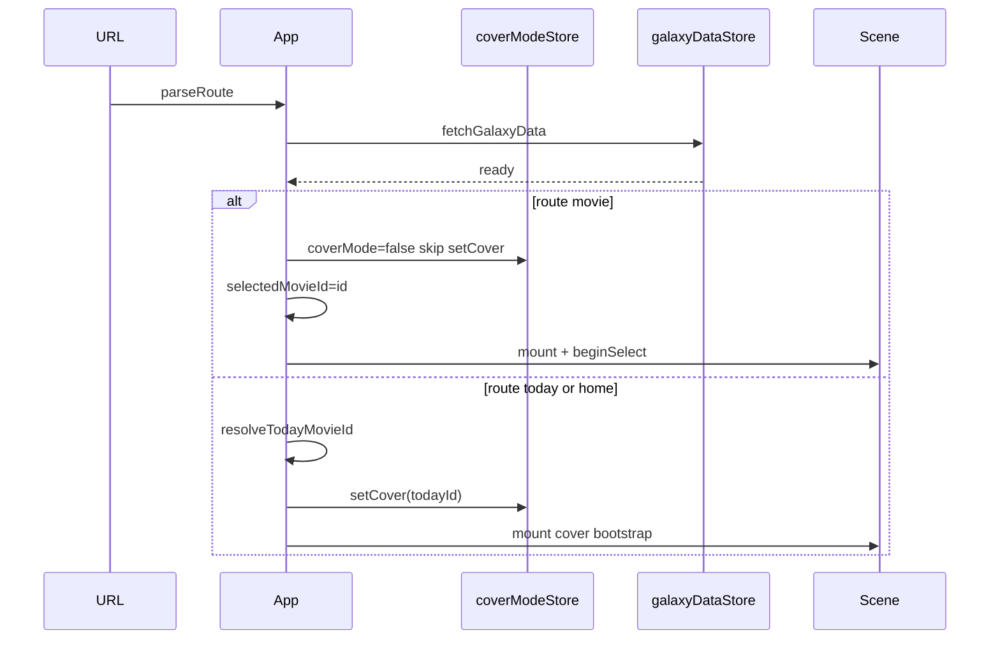

# Phase 29 — 发布门槛与技术判定（Spec SSOT）

> **历史判定记录，不是当前生产部署 SSOT。** Today/Cover 路由与 GitHub Pages 灰度备线已退役；当前站点部署仅 Cloudflare Pages + R2，Today 路由保持 404。现行契约见 [`docs/system/`](../system/) 与 Tech/Design/Data Pipeline。
>
> **状态**：P29.0–P29.6 已锁定；**§10（29.7）** 已输出 Phase 29 gate：**Phase 33 HDR production No-go**（P0 无 `supported`）；**Phase 30 Go**；生产仍为 WebGL2 sRGB。实施报告见 [`docs/reports/Phase 29.7 P29.7 Phase 29 Gate report 实施报告.md`](../reports/Phase%2029.7%20P29.7%20Phase%2029%20Gate%20report%20实施报告.md)。  
> **计划**：`.cursor/plans/phase_29_release_gates_technical_decision.plan.md`  
> **下游**：Phase 30（路由产品化）、Phase 32（SDR 可读性）、Phase 33（HDR 生产，**条件阶段**）、Phase 34（社交预览）。

---

## 1. 目标与范围

Phase 29 **不**交付完整深链产品化或 HDR 生产管线，而是判清两类发布门槛：

1. **HDR**：当前栈能否在目标环境产生**真实扩展亮度**（非「SDR 画得更亮」、非 Bloom 伪 HDR）。
2. **深链**：`/movie/:id`、`/today` 在静态托管下是否有**安全落地路径**（契约 + rewrite 预检）。

### 1.1 本 Phase 要做

- 建立 HDR 支持矩阵、capability probe 设计、最小 proof 方法与 SDR 降级策略（文档 + 可选探测代码见 29.2+）。
- 锁定 Phase 30 路由契约与静态部署 rewrite 方案（预检结论写入 §5、§6）。
- 输出 Phase 33 go/no-go 结论（§10 · 29.7 已汇总）。

### 1.2 本 Phase 不做

- 不实现完整 `/movie/:id`、`/today` 路由与 Drawer 分享迁移（Phase 30）。
- 不默认开启 Bloom；不把 SDR 提亮当作 HDR 验收（Phase 32 负责 SDR 可读性标定）。
- 不承诺每部电影独立 OG 卡片（Phase 34）。

---

## 2. 已锁定决策（P29.0）

| ID     | 决策                 | 说明                                                                                                                                                                                  |
| :----- | :------------------- | :------------------------------------------------------------------------------------------------------------------------------------------------------------------------------------ |
| **D1** | **HDR 定义**         | 「真实 HDR 输出」= 在 HDR 显示器 + 系统 HDR 开启 + 浏览器/画布链路支持时，**高光可超过 SDR 参考白**且可复现；**不等于** `uLMax` 调高、Bloom、或 emissive 在 SDR  framebuffer 内变亮。 |
| **D2** | **当前生产色彩语义** | `WebGLRenderer.outputColorSpace = THREE.SRGBColorSpace`（`scene.ts`）；全星系为 **SDR WebGL** 主路径。                                                                                |
| **D3** | **Bloom 与 HDR**     | `UnrealBloomPass` **生产默认关闭**（`postFxBloomEnabled = false`）；`window.__bloom` 仅调试。Bloom **不得**作为 HDR 验收或发布门槛。                                                  |
| **D4** | **Phase 33 门禁**    | 仅当 §29.3 proof 在 **D5 矩阵** 的目标组合上稳定满足 D1 时，才进入 Phase 33 HDR production；否则保留 capability 结论 + SDR-only（见 Phase 33 plan）。                                 |
| **D5** | **路由实现形态**     | Phase 30 **不**引入 React Router；采用**轻量手写** path parser + `history.pushState` / `popstate`（见 §5）。                                                                          |
| **D6** | **选中态 SSOT**      | 影片 focus 的 store 字段为 `galaxyInteractionStore.selectedMovieId`；Today/Cover 为 `coverModeStore`（`coverMode`、`todayMovieId`）。                                                 |
| **D7** | **Query 保留**       | path 更新时**必须保留**现有 query：`lang`、`theme`、`timeline`（及未来仅追加、不破坏的 query）；实现细节归 Phase 30。                                                                 |
| **D8** | **静态资源豁免**     | SPA fallback **不得** rewrite：`/data/*`、`/fonts/*`、Vite 构建 assets、favicon、manifest、icons、robots、sitemap 等（§6）。                                                          |
| **D9** | **Today SSOT**       | 当日影片 ID 以 `today.json`（manifest `today_url`）解析为准，`loadToday.ts` / `coverModeStore`；`/today` 深链语义见 §5.3。                                                            |

---

## 3. 现状基线（代码锚点）

| 领域         | 现状                                       | 锚点                                                                                       |
| :----------- | :----------------------------------------- | :----------------------------------------------------------------------------------------- |
| 渲染输出     | SDR sRGB；WebGL2 硬前置                    | `frontend/src/three/scene.ts`                                                              |
| Bloom        | 构造存在，生产 loop 默认 `renderer.render` | `scene.ts` · `postFxBloomEnabled` · `window.__bloom`                                       |
| 路由         | **无** path 路由；仅 query hooks           | `App.tsx` · `useLocaleFromQuery` · `useThemeFromQuery` · `useTimelineOrientationFromQuery` |
| 分享         | Today HUD 分享**站点根路径**               | `ShareMovieTodayButton.tsx`                                                                |
| Drawer       | **无**影片深链分享区                       | `Drawer.tsx`                                                                               |
| 静态 headers | `_headers` 设 cache，**无** SPA rewrite    | `frontend/public/_headers`                                                                 |
| 部署 rewrite | 仓库内**无** `vercel.json` / `_redirects`；**CF Pages 隐式 SPA**（无顶层 `404.html`） | §6                                                                                         |
| Base path    | `import.meta.env.BASE_URL`                 | `loadGalaxyData.ts` · `galaxyAssetUrls.ts`                                                 |

---

## 4. HDR 支持矩阵（§29.1 — P29.1 已锁定）

**负责人**：TODO 29.1 · `p29-hdr-matrix` · 实施报告见 [`docs/reports/Phase 29.1 P29.1 HDR 支持矩阵 实施报告.md`](../reports/Phase%2029.1%20P29.1%20HDR%20支持矩阵%20实施报告.md)

### 4.1 判定语义（D1 对齐）

| 判定               | 含义                                                                                                                 | 与 Phase 33 关系                                                          |
| :----------------- | :------------------------------------------------------------------------------------------------------------------- | :------------------------------------------------------------------------ |
| **`supported`**    | 平台链路**具备**交付真实扩展亮度的技术前提；须在 **§29.3 proof** 中逐组合验证像素级结论后，方可标为发布门槛 **通过** | 可纳入 **D4** 目标组合；proof 失败则降为 `experimental` 或 `fallback-sdr` |
| **`experimental`** | API/驱动存在但**不稳定**、需实验 flag、或**尚未**与 Three.js WebGL2 主路径集成；仅作 capability 记录与 lab proof     | **不**作为普通用户发布门槛                                                |
| **`fallback-sdr`** | **必须**走现有 SDR 主路径（D2：`SRGBColorSpace` + WebGL2）；非缺陷，为默认与降级语义                                 | Phase 33 **不**要求 HDR；与 §9 一致                                       |
| **`blocked`**      | 该组合在平台语义下**不可能**产生真实 HDR 输出（如 OS HDR 关、SDR 屏、或 API 无 extended tone mapping）               | 禁止标为 HDR 能力；probe 应明确 `recommendedMode: sdr`                    |

**硬排除（任何组合均不适用 D1）**：

- 仅调高 `uLMax` / emissive / Bloom（D3）而无 extended 画布输出。
- OS HDR **关** 或 SDR 显示器——即使浏览器报告「HDR 可用」也记 `blocked` 或 `fallback-sdr`。
- WebGL2 + `THREE.SRGBColorSpace` **单独**作为 HDR 路径——记 `fallback-sdr`（当前生产）。

### 4.2 渲染 API 分层（与现状基线）

| API                                     | 当前代码              | HDR 输出潜力（平台，2026-Q2）                                                                                     | 矩阵默认判定                                      |
| :-------------------------------------- | :-------------------- | :---------------------------------------------------------------------------------------------------------------- | :------------------------------------------------ |
| **WebGL2 + Three.js**                   | `scene.ts` 生产主路径 | 绘制缓冲与 swapchain 通常为 **SDR clamp**；W3C WebGL HDR tone mapping **未**在稳定版全面落地                      | **`fallback-sdr`**                                |
| **WebGPU `toneMapping.mode: extended`** | 未接入                | Chrome ≥129、Edge（Chromium）、Safari（WebKit 已合入，部分环境需 flag）在 **OS HDR on + HDR 屏** 下可解锁扩展范围 | **`experimental`** → proof 通过后升为 `supported` |
| **Canvas 2D HDR / `targetHDRHeadroom`** | 未使用                | 标准与实现仍在 Color on the Web CG；**无**稳定跨浏览器承诺                                                        | **`experimental`**（仅 lab，不进发布门槛）        |

### 4.3 组合矩阵（平台能力预分类）

下表为 **29.1 锁定的能力预分类**；**§29.3** 须在标有 ★ 的行上完成像素 proof 后方可将 `supported` 生效为 Phase 33 门禁。

|   #   | OS                        | Browser            | Rendering API                | Display     | 预分类                     | 说明                                                                                                     |
| :---: | :------------------------ | :----------------- | :--------------------------- | :---------- | :------------------------- | :------------------------------------------------------------------------------------------------------- |
|   1   | Win11 **HDR on**          | Chrome **stable**  | WebGPU `extended`            | HDR         | **`experimental`** ★       | Phase 33 **首选 proof** 组合；须 `navigator.gpu` + `configure({ toneMapping: { mode: "extended" } })`    |
|   2   | Win11 **HDR on**          | Edge **stable**    | WebGPU `extended`            | HDR         | **`experimental`** ★       | 与 #1 同 Chromium 栈；proof 可与 #1 抽样其一或双验                                                       |
|   3   | macOS **HDR on**          | Safari **stable**  | WebGPU `extended`            | XDR / HDR   | **`experimental`** ★       | WebKit 已合入 HDR canvas；部分版本/预览版需 **Canvas Color Types** 等 flag——proof 时须记录 build 与 flag |
|   4   | Win11 **HDR on**          | Chrome stable      | WebGL2 + `SRGBColorSpace`    | HDR         | **`fallback-sdr`**         | 当前生产栈；**不能**作为 HDR 发布路径                                                                    |
|   5   | macOS HDR on              | Safari stable      | WebGL2 + `SRGBColorSpace`    | XDR         | **`fallback-sdr`**         | 同 #4                                                                                                    |
|   6   | Win11 / macOS **HDR off** | 任意 stable        | 任意                         | HDR 屏      | **`blocked`**              | OS 未向合成器交付 HDR；浏览器无法单独突破                                                                |
|   7   | 任意                      | 任意 stable        | 任意                         | **SDR 屏**  | **`blocked`**              | 无扩展亮度物理通道；一律 SDR                                                                             |
|   8   | 任意                      | **Firefox** stable | WebGPU / WebGL2              | HDR + OS on | **`experimental`**         | WebGPU HDR 跟进中；**不**进首发发布门槛，仅 capability 记录                                              |
|   9   | 任意                      | Chrome stable      | WebGPU `extended`            | HDR         | **`experimental`**（flag） | 若 proof **仅**在 `#enable-unsafe-webgpu` 等 flag 下成立 → 永久 **`experimental`**，不进 D4              |
|  10   | 任意                      | 任意               | Canvas 2D HDR / headroom API | HDR         | **`experimental`**         | 与 Three 主路径无关；仅 §29.3 lab                                                                        |
|  11   | 任意                      | 任意               | WebGL2 + Bloom on            | 任意        | **`blocked`**              | D3：Bloom **不是** HDR；不得用于验收                                                                     |
|  12   | 任意                      | 任意               | SDR 提亮（`uLMax` 等）       | 任意        | **`blocked`**              | D1：非真实 HDR                                                                                           |

### 4.4 发布门槛组合（D4 / Phase 33 目标）

**须满足 §29.3 proof 的候选发布门槛**（三选二或全验，由 29.3 记录实测稳定性）：

| 优先级 | 组合 ID | 用途                                          |
| :----- | :------ | :-------------------------------------------- |
| **P0** | #1      | Windows 桌面主受众 + Chromium WebGPU extended |
| **P0** | #2      | 与 #1 同引擎；企业/Edge 用户抽样              |
| **P1** | #3      | Apple 桌面 / XDR 受众                         |

**不在发布门槛内、但必须支持的组合**（SDR 无回归，§29.4）：

- 所有 **`fallback-sdr`** 行（含 #4–#5 及当前生产默认）。
- **`blocked`** 行：行为 = 明确 SDR，**不得**黑屏或强开 Bloom。

### 4.5 仅实验、不进发布门槛

| 组合 / 能力                    | 处理                                                          |
| :----------------------------- | :------------------------------------------------------------ |
| #8 Firefox                     | 文档 + probe 记录；不承诺用户可见 HDR                         |
| #9 仅 flag 可用的 WebGPU       | 记入 §8 proof「失败/实验」；不进入 Phase 33                   |
| #10 Canvas 2D HDR              | lab / Storybook 可选；不接入默认 galaxy                       |
| #11 Bloom                      | 保持 `postFxBloomEnabled = false`；调试 `window.__bloom` only |
| 任何 **WebGL2-only**「伪 HDR」 | 禁止作为产品能力宣传                                          |

### 4.6 对 29.2 / 29.3 的输入

| 下游 TODO      | 本矩阵要求                                                                                                                               |
| :------------- | :--------------------------------------------------------------------------------------------------------------------------------------- |
| **29.2 probe** | 输出须能映射到 §4.3 行号：`osHdr`, `browser`, `apiPath`, `displayHdr`, `matrixRow`, `verdictPre`, `meetsTargetMatrix`（对照 §4.4 P0/P1） |
| **29.3 proof** | 在 ★ 行上对比 **SDR reference white** vs **HDR candidate**；若 candidate 与 reference 被同一 clamp → 该行 **不得** 升为 `supported`      |
| **29.7 gate**  | 若 P0 无一稳定 `supported` → **No-go Phase 33**，保留 probe + 本矩阵                                                                     |

---

## 5. 深链路由契约（§29.5 — P29.5 已锁定，Phase 30 实现）

**负责人**：TODO 29.5 · `p29-route-contract` · 实施报告见 [`docs/reports/Phase 29.5 P29.5 深链路由契约 实施报告.md`](../reports/Phase%2029.5%20P29.5%20深链路由契约%20实施报告.md)

Phase 29 **不**提交 `routes.ts` 或 App 路由代码；本节为 Phase 30（`p30-route-parser` … `p30-action-url-sync`）的 **SSOT**。

### 5.1 实现形态（D5）

| 项 | 约定 |
| :--- | :--- |
| **Router** | **不**引入 React Router |
| **模块** | `frontend/src/lib/routes.ts`（纯函数 `parseRoute` / `build*Path`）+ `frontend/src/lib/useRouteController.ts`（或 App 内 hook） |
| **History** | `history.pushState`（用户主动导航）、`history.replaceState`（纠错 / 与 store 对齐）、`popstate`（Back/Forward） |
| **Base path** | 所有 path 读写均经 `import.meta.env.BASE_URL` 剥离/前缀（与 `galaxyAssetUrls.ts` 一致） |

### 5.2 Path 契约

| Path | `RouteKind` | 语义 | `galaxyData` + index **ready** 后 store 目标 |
| :--- | :--- | :--- | :--- |
| `/`（仅 path，可带 query） | `home` | Cover / 宏观首页 | `coverMode=true`，`todayMovieId=resolveToday`；`selectedMovieId=null`；**不**跳过 cover boot |
| `/movie/:id` | `movie` | 单片深链 | `coverMode=false`；`selectedMovieId=id`（存在性校验后）；Drawer 随 focus 打开；Three `beginSelect` |
| `/today` | `today` | 今日影片入口 | `coverMode=true`，`todayMovieId=resolveToday`（**同** `today.json` SSOT，D9）；`selectedMovieId=null` |
| 其它 path | `unknown` | 未识别 | `replaceState` → `home`（**R1**） |

**`:id` 规则**：

- 类型：正整数 TMDB `Movie.id`（`Number.isInteger(id) && id > 0`）。
- 解析失败（非数字、≤0、溢出）：**R1** `unknown` → `replaceState('/')`。
- 合法但不在 `galaxyData.movies`：**R2** `replaceState('/')`，`selectedMovieId=null`，`console.warn('[route] movie not in galaxy', { id })`；**不**白屏、**不**开 Drawer。

**`/today` 与 cover boot（R3）**：

- 深链 `/today`：**不**改变 `resolveTodayMovieId` 逻辑；与直达 `/` 的 today 解析**相同**。
- 若 URL 为 `/movie/:id`：**跳过**默认「resolve today → setCover」boot，改为 **R4** 直接 `setCover skipped` + focus（见 §5.5）。

### 5.3 Query 契约（D7）

| Query | 参数名 | 合法值 | 读写方 |
| :--- | :--- | :--- | :--- |
| UI 语言 | `lang` | `en` \| `zh` \| `zh-Hant` \| `ja` \| `es` \| `fr` \| `ar` | `localeStore.setLocale` 已 `replaceState` 保留；path 变更时 **copy 全量 search** |
| HUD 主题 | `theme` | `light` \| `dark` | `useThemeFromQuery`；path 变更时保留 |
| 时间轴朝向 | `timeline` | `horizontal` \| `vertical` | `useTimelineOrientationFromQuery`；path 变更时保留 |

**保留规则（R5）**：

- `build*Path` / route controller 更新 path 时：以 `new URL(window.location.href)` 为底，**仅改 `pathname`**，**不** `searchParams.delete` 除非显式废弃某参数。
- **允许附带**未知 query（调试、UTM）；Phase 30 **不得**因 path 同步剥离 `lang`/`theme`/`timeline`。
- `localeStore` 改 `lang` 时继续 **replaceState** 当前 path + 新 query（与 path 路由 **共用** 同一 URL 对象）。

### 5.4 URL ↔ Store 同步边界

**SSOT 字段（D6）**：

| Store | 字段 | 路由相关语义 |
| :--- | :--- | :--- |
| `galaxyInteractionStore` | `selectedMovieId` | 单片 focus + Drawer + Perlin；**唯一** movie path 写回源 |
| `galaxyInteractionStore` | `searchMode` / `selectionIds` | person/genre select；**不**单独占 path；深链 `/movie/:id` **不清** select（若已存在则保留，Design §4.7） |
| `coverModeStore` | `coverMode` | `true` ⇔ home/today cover 壳层 |
| `coverModeStore` | `todayMovieId` | Cover 展示用；`exitCoverIntoFocus` 会清空 |
| `coverModeStore` | `exitCoverPreserveOrbit` | cover→focus 一次性标志；**不写 URL** |

**方向 A — URL → state（冷启动 / `popstate`）**：

| 触发 | 前置 | 动作 |
| :--- | :--- | :--- |
| 首次 `load` | `status==='ready'` && `data` && index terminal | 读 `parseRoute(location)` → 应用 §5.2 表 |
| `popstate` | 同上 | 同解析；`isPopstate=true` **禁止** 再 `pushState` |
| 数据未 ready | — | 缓存 `pendingRoute`；ready 后 **一次性** apply（防 boot 覆盖，**R4**） |

**方向 B — state → URL（用户 / 程序）**：

| # | 用户动作 | 当前 store 变化 | URL 动作 | History |
| :-: | :--- | :--- | :--- | :--- |
| B1 | Three 点击 / 搜索选中单片 focus | `selectedMovieId=id` | `/movie/:id` | **push** |
| B2 | Today cover → Enter / `exitCoverIntoFocus` | cover off + `selectedMovieId=todayId` | `/movie/:todayId` | **push**（**R6**：不得留在 `/today`） |
| B3 | Drawer 关闭（X / Sheet） | `selectedMovieId=null` | `/` | **replace** |
| B4 | App ESC §4.6 第 3 级（清 focus） | `selectedMovieId=null` | `/` | **replace** |
| B5 | `FocusExitButton` | 同 B4 | `/` | **replace** |
| B6 | 搜索 X 清 focus（§4.6 对齐） | 同 B4 | `/` | **replace** |
| B7 | person/genre select 仅、无 focus | 无 `selectedMovieId` | **不改** path | — |
| B8 | `clearSearch` / ESC 第 4 级 | select 清空 | **不改** path | — |
| B9 | 程序纠错（非法 id） | 见 §5.2 R2 | `/` | **replace** |

**循环守卫（R7）**：route controller 内 `syncingRef` / `lastAppliedPath`；URL→store 与 store→URL 同 tick **至多一轮**。

### 5.5 App boot 与 scene 交互（预检结论）



| 风险 | 现状（`App.tsx`） | Phase 30 要求 |
| :--- | :--- | :--- |
| `/movie/:id` 被 cover boot 覆盖 | `resolveToday` 总在 index ready 后 `setCover` | **R4**：`pendingRoute.kind==='movie'` 时 **不** 调用 `setCover` |
| scene mount 时 cover | `scene.ts` 读 `coverMode` 做 bootstrap | movie 深链须 `coverMode=false` **再** mount |
| Drawer 无 URL | 仅 `selectedMovieId` | B1–B6 收敛到 route controller |
| 分享根路径 | `ShareMovieTodayButton` → `/` | Phase 30.5 迁至 Drawer `/movie/:id` |

### 5.6 ESC / Back / Forward（Design Spec §4.6 对齐）

**ESC 与 path（Cover 阶段不变）**：

| 级 | Design §4.6 | URL path |
| :-: | :--- | :--- |
| — | Cover 下 ESC **吞掉**（`App.tsx` 现实现） | **不变**（`/` 或 `/today`） |
| 1 | 搜索 blur | 不变 |
| 2 | Drawer 关闭 | **B3** → `/` **replace** |
| 3 | 清 `selectedMovieId` | **B4** → `/` **replace** |
| 4 | `clearSearch` | 不变 |

**Back / Forward**：

- 浏览器后退到 `/movie/:id`：恢复 focus + Drawer（**popstate** → URL→state，**R7** 无 push）。
- 后退到 `/today`：恢复 cover（`setCover(todayId)`，清 focus）。
- 前进：对称。
- ESC **replace** 到 `/` **不**压入「空 focus 的 `/movie/:id`」条目，避免 Back 回到已关闭的 drawer 态（**R8**）。

### 5.7 Today SSOT（D9）

- 数据源：`today.json`（`loadToday.ts` · `resolveTodayMovieId`）；`/today` path **不**嵌入日期或 id。
- `/today` 与 `/` 在 cover 态 **等价**；差异为 **分享语义** 与 OG（Phase 34）。
- `exitCoverIntoFocus` 后 URL **必须** B2 迁移至 `/movie/:todayId`。

### 5.8 Phase 30 测试矩阵（引用）

| # | 场景 | 期望 path | 期望 store |
| :-: | :--- | :--- | :--- |
| T1 | 刷新 `/movie/550`（存在） | 保持 | focus + drawer |
| T2 | 刷新 `/movie/999999999` | → `/` replace | 无 focus |
| T3 | 刷新 `/today` | 保持 | cover + todayId |
| T4 | `/today` → Enter focus | `/movie/:todayId` push | cover off, focus on |
| T5 | focus 后 ESC | `/` replace | selected null |
| T6 | `?lang=zh&theme=light` + B1 | query 保留 | — |
| T7 | `BASE_URL=/repo/` 子路径 | prefix 正确 | data URL 仍加载 |
| T8 | Back 从 `/` 到 `/movie/id` | popstate 恢复 focus | 无二次 push |

---

## 6. 静态部署 rewrite 预检（§29.6 — P29.6 已锁定）

**负责人**：TODO 29.6 · `p29-static-rewrite` · 实施报告见 [`docs/reports/Phase 29.6 P29.6 静态部署 rewrite 预检 实施报告.md`](../reports/Phase%2029.6%20P29.6%20静态部署%20rewrite%20预检%20实施报告.md)

Phase 29 **不**提交 rewrite 配置文件；本节为 Phase 30.7（`p30-static-rewrite`）的 **SSOT**。

### 6.1 仓库与平台现状（预检清单）

| 检查项 | 结论 | 证据 |
| :--- | :--- | :--- |
| `vercel.json` | **不存在** | 仓库根与 `frontend/` 均无 |
| `_redirects` | **不存在** | `frontend/public/` 无；构建后 `dist/` 无 |
| 顶层 `404.html` | **不存在** | `frontend/public/` 与 `dist/` 均无 |
| `frontend/public/_headers` | **存在**；仅 Cache / Content-Type | `/fonts/*`、`/data/galaxy_assets_manifest.json`、`/data/today.json`、`/data/og-today.png` |
| `frontend/functions/_middleware.js` | **存在**；**仅** `the-movie-cosmos.pages.dev` → `themoviecosmos.com` **301** | **不**参与 SPA fallback |
| 主部署 | **Cloudflare Pages** Direct Upload（`nightly_vote_refresh.yml` / `monthly_refit.yml` · `wrangler pages deploy dist`） | Tech Spec §5.2 |
| 备线 | **GitHub Pages**（`deploy-pages.yml` · 未设 `VITE_BASE_PATH` → `base: '/'`） | 灰度备线 |
| `dist` 静态树（本地 build 抽样） | `index.html`、`_headers`、`assets/`、`data/`、`fonts/`、favicon/manifest/icons | 与 D8 豁免路径一致 |

### 6.2 各平台深链刷新行为（预分类）

| 平台 | 无额外配置时 `/movie/550` 刷新 | `/data/today.json` | 备注 |
| :--- | :--- | :--- | :--- |
| **Cloudflare Pages**（当前生产） | **200 + `index.html`**（隐式 SPA：无顶层 `404.html` 时 [官方默认](https://developers.cloudflare.com/pages/configuration/serving-pages/#single-page-application-spa-rendering)） | **200 + JSON**（`dist/data/today.json` 实体文件优先） | 生产**已具备**深链刷新能力；30.7 建议仍加**显式** `_redirects` 作契约文档 |
| **GitHub Pages**（备线） | **404**（无 `404.html` 技巧） | **200**（文件存在时） | 30.7 **须**在 build 后复制 `index.html` → `404.html` |
| **`vite preview`**（本地） | **404**（sirv 默认无 SPA fallback） | **200** | **不能**作为深链刷新验收环境；用 CF 预览 / 生产或 `wrangler pages dev` |
| **Vercel**（未启用） | **404**（无 `vercel.json`） | 视部署产物而定 | 若未来启用，见 §6.5 |

**P29.6 风险修订（相对 P29.0）**：生产主域 **CF Pages 隐式 SPA 已覆盖** `/movie/:id`、`/today` 刷新；真正缺口在 **GitHub Pages 备线**、**显式契约文档**、以及 **子路径 `VITE_BASE_PATH` 部署**（当前 CI 未使用）。

### 6.3 Rewrite 原则（**D8** — Phase 30.7 实施）

1. **Fallback 目标**：无实体文件的 app path → `index.html`（HTTP **200**，非 301，避免 SEO/缓存歧义）。
   - **必须覆盖**：`/movie/*`、`/today`、未知前端 path（与 §5.1 合法 path 集合对齐）。
   - **不得覆盖**：已存在的静态文件（平台须 **先匹配磁盘文件**，再 fallback）。
2. **静态豁免（D8）** — 必须返回真实字节，**禁止** fallback 为 HTML：
   - `/data/*`（manifest、`today.json`；生产大 gzip 多在 R2，但同源小文件仍在 bundle）
   - `/fonts/*`（`_headers` 已设 `font/woff`；误 fallback 会导致 OTS「invalid sfntVersion」，见 `vite.config.ts` Butler 插件注释）
   - Vite **`/assets/*`**（content-hashed JS/CSS）
   - 根级：`favicon*`、`site.webmanifest`、`icons.svg`、`apple-touch-icon.png`、`robots.txt`、`sitemap.xml`（若存在）
3. **Query**：rewrite **只改 pathname**；`?lang=` / `?theme=` / `?timeline=` 由 CDN/浏览器原样保留（与 §5 R5 一致）。
4. **History API**：fallback 仅服务 **整页刷新 / 外链打开**；应用内 `pushState` / `popstate` 不依赖 CDN。

### 6.4 `import.meta.env.BASE_URL` 与 path routing

| 项 | 约定 |
| :--- | :--- |
| **构建** | `vite.config.ts`：`VITE_BASE_PATH` 非空时 `base` 为 `/subpath/`（尾斜杠规范化） |
| **数据 URL** | `loadGalaxyData.ts`、`galaxyAssetUrls.ts`、`loadSearchIndex.ts` 经 `withBase('data/…')` — **与 path 深链正交** |
| **Phase 30 parser** | `parseRoute` / `buildPath` 的 pathname **必须** strip/add `BASE_URL` 前缀（§5.8 **T7**） |
| **当前 CI** | CF Pages + GHP workflow **均未**注入 `VITE_BASE_PATH` → 生产为 **`base: '/'`** |
| **子路径部署** | 若未来 GHP project site：`base=/repo-name/` 时 fallback 目标为 `/repo-name/index.html`；CF `_redirects` 规则须带相同前缀 |

**结论**：`BASE_URL` **不**与 `/data/*` fetch 冲突；冲突点仅在 **手写 path** 未处理子路径前缀。

### 6.5 Phase 30.7 推荐配置（择一主 + 备线）

#### A. Cloudflare Pages（**主路径 — 推荐显式 + 隐式双保险**）

在 `frontend/public/_redirects`（构建复制到 `dist/_redirects`）：

```txt
# Phase 30 SPA fallback (D8: static files on disk are served first)
/movie/*  /index.html  200
/today    /index.html  200
```

- **不必**为 `/data/*`、`/assets/*`、`/fonts/*` 写排除规则（实体文件优先）。
- **`_middleware.js`** 保持仅域名 301；**不**用 Functions 模拟 fallback（避免与 `_redirects` 重复）。
- 子路径部署时改为：`/repo-name/movie/*  /repo-name/index.html  200` 等。

#### B. GitHub Pages（**备线 — 必须**）

Build 后增加一步（可在 `deploy-pages.yml` 或 `package.json` postbuild）：

```bash
cp frontend/dist/index.html frontend/dist/404.html
```

- 使缺失 path 返回 **404 状态 + SPA shell**（GHP 惯例）。
- **注意**：不存在的 `/data/foo.json` 也会落到 `404.html`（HTML body）— 与生产 CF 行为类似；客户端 fetch 须检查 `Content-Type` / `res.ok`（现有代码已 `res.ok` 判断）。

#### C. Vercel（**未启用 — 模板**）

根目录 `vercel.json`（静态优先，再 rewrite）：

```json
{
  "rewrites": [{ "source": "/(.*)", "destination": "/index.html" }]
}
```

Vercel 对 `public/` / `dist` 中已存在文件 **不** 应用 catch-all。

### 6.6 Phase 30.8 刷新验收矩阵（引用）

| # | 操作 | 期望 HTTP | 期望 body |
| :-: | :--- | :--- | :--- |
| R1 | 刷新 `https://themoviecosmos.com/movie/550` | 200 | `index.html`（SPA） |
| R2 | 刷新 `…/today` | 200 | `index.html` |
| R3 | GET `…/data/today.json` | 200 | `application/json` |
| R4 | GET `…/data/galaxy_assets_manifest.json` | 200 | JSON |
| R5 | GET `…/fonts/butler/Butler_Regular.woff`（或实际文件名） | 200 | `font/woff` |
| R6 | GET `…/assets/index-*.js`（构建哈希） | 200 | `application/javascript` |
| R7 | 刷新 `…/movie/550?lang=zh&theme=light` | 200 | `index.html`；query 保留 |
| R8 | GHP 备线 R1–R2（30.7 后） | 404 或 200 | SPA shell（`404.html` 技巧） |

应用层行为（focus、Drawer、Back）见 §5.8 **T1–T8**；本矩阵仅覆盖 **CDN/静态层**。

### 6.7 与 Phase 30 plan 的衔接

| Phase 30 TODO | 本节前移输入 |
| :--- | :--- |
| **30.1** | 确认 §6.5 A+B 可执行 |
| **30.7** | 落地 `_redirects` + GHP `404.html`；**不**改 `_middleware.js` 职责 |
| **30.8** | 执行 §6.6 + §5.8；**禁止**仅用 `vite preview` 断言 R1–R2 |

---

## 7. HDR capability probe（§29.2 — P29.2 已锁定）

**负责人**：TODO 29.2 · `p29-hdr-probe-design` · 实施报告见 [`docs/reports/Phase 29.2 P29.2 HDR capability probe 实施报告.md`](../reports/Phase%2029.2%20P29.2%20HDR%20capability%20probe%20实施报告.md)

### 7.1 模块与挂载点

| 项 | 约定 |
| :--- | :--- |
| **模块** | `frontend/src/lib/hdrCapabilities.ts`（纯探测 + 矩阵映射；不修改 renderer 色彩语义） |
| **挂载** | `createGalaxyScene` 在 WebGL2 硬校验通过后、`createGalaxyDualMeshes` 之前调用 `createHdrCapabilitiesDebug(renderer)` |
| **日志** | 启动时 `console.log('[hdrCapabilities]', report)`；WebGPU extended 异步探测完成后**再 log 一次** |
| **调试** | `window.__hdrCapabilities`：`report`、`log()`、`refreshWebGpu()` |

### 7.2 报告字段（`HdrCapabilitiesReport`）

| 字段 | 来源 / 语义 |
| :--- | :--- |
| `webgl2` | `renderer.capabilities.isWebGL2`（生产硬前置） |
| `outputColorSpace` | Three `renderer.outputColorSpace` 标签（当前恒为 `srgb`） |
| `dynamicRangeHigh` | `matchMedia('(dynamic-range: high)')` |
| `colorGamut` | `screen.colorGamut`（无则 `unknown`） |
| `canvasHdrSupported` | `dynamicRangeHigh` **或** 宽色域（非 `srgb`）— **显示器能力提示**，非 OS HDR 开关 |
| `webgpuAvailable` | `'gpu' in navigator` |
| `webgpuExtendedToneMapping` | 离屏 canvas `configure({ toneMapping: { mode: 'extended' } })`；初值 `pending` / 无 API 为 `unsupported` |
| `browser` | UA → `chrome` \| `edge` \| `safari` \| `firefox` \| `other` |
| `os` | UA → `windows` \| `macos` \| … |
| `osHdr` | **恒 `unknown`**（Web 平台不可可靠读取；人工验收时补记） |
| `displayHdr` | `dynamicRangeHigh` → `hdr`，否则 `sdr` |
| `apiPath` | 生产路径恒 `webgl2-srgb`；若 extended 探测成功，矩阵映射用 `webgpu-extended` |
| `matrixRow` | `resolveMatrixRow()` → §4.3 行号（1–12）或 `null` |
| `verdictPre` | `deriveVerdictPre()` → §4.1 预分类 |
| `meetsTargetMatrix` | `matrixRow ∈ {1,2,3}` **且** `webgpuExtendedToneMapping === true` |
| `recommendedMode` | 生产恒 `sdr`；P0/P1 候选且 extended 成功 → `hdr-capable`；未来 extended 主路径 → `hdr-active` |

### 7.3 矩阵映射规则（摘要）

- **SDR 屏**（`displayHdr === 'sdr'`）→ 行 **#7**，`verdictPre: blocked`，`recommendedMode: sdr`。
- **WebGL2 + sRGB**（当前生产）→ 行 **#4 / #5**，`fallback-sdr`。
- **WebGPU extended 成功** + HDR 屏 + Win Chrome/Edge / macOS Safari → 行 **#1–#3**，`experimental`，`meetsTargetMatrix: true`。
- **Bloom 开**（仅调试）→ 行 **#11**，`blocked`（D3）。

单元测试：`frontend/src/lib/hdrCapabilities.spec.ts`（纯函数矩阵映射）。

### 7.4 限制与下游

| 限制 | 说明 |
| :--- | :--- |
| **非 proof** | probe **不能**证明像素超过 SDR 参考白；§29.3 须独立受控 patch |
| **OS HDR** | 浏览器不暴露；矩阵行 #6（OS HDR off）须人工记录，probe 无法自动区分 |
| **生产输出** | Phase 29 **不**切换 `outputColorSpace` 或 WebGPU 主渲染器 |

§29.3 调试入口：`window.__hdrProbe`（已实现）；可复用 `__hdrCapabilities.refreshWebGpu()` 做能力复测。

---

## 8. 最小 HDR proof（§29.3 — P29.3 已锁定）

**负责人**：TODO 29.3 · `p29-hdr-proof` · 实施报告见 [`docs/reports/Phase 29.3 P29.3 最小 HDR proof 实施报告.md`](../reports/Phase%2029.3%20P29.3%20最小%20HDR%20proof%20实施报告.md)

### 8.1 对比方法（D1 对齐）

| 补丁 | 线性 RGB（scRGB 风格） | 语义 |
| :--- | :--- | :--- |
| **左半屏 — SDR reference white** | `(1.0, 1.0, 1.0)` | 扩展空间中的参考白；在 HDR 链路上约为 SDR 100 nit 锚点 |
| **右半屏 — HDR candidate** | `(4.0, 4.0, 4.0)` | 高于参考白的候选高光；**若**真实 HDR 输出，应可见或可读回高于左侧 |

**受控载体**：离屏/叠加 WebGPU canvas（`toneMapping.mode: "extended"` vs `"standard"`），**不**修改 `galaxyMeshes` / 默认星系 shader。

### 8.2 运行时入口

| 入口 | 说明 |
| :--- | :--- |
| **`window.__hdrProbe`** | `show()` / `hide()` / `runComparison()` / `renderMode('extended' \| 'standard')` / `log()` |
| **Storybook** | `Dev/HDR proof lab (P29.3)` — `HdrProofLab.stories.tsx` |
| **模块** | `frontend/src/lib/hdrProof.ts` |

`runComparison()` 流程：先渲染 **extended** 再 **standard**，采样左右补丁中心像素 → `interpretHdrProofComparison()` → `HdrProofReport`（含 `verdict`、`meetsD1Proof`）。

### 8.3 判定（自动 + 人工）

| `verdict` | 含义 | `meetsD1Proof` |
| :--- | :--- | :--- |
| `hdr-output-likely` | extended 下 right/left 比值 > 1.15，且 standard 下比值 < 1.12 | `true` |
| `sdr-clamped` | extended 与 standard 均无分离 | `false` |
| `extended-unavailable` | WebGPU extended configure 失败 | `false` |
| `inconclusive` | 读回模糊 | `false`（须 **目视** HDR 屏确认） |

**通过（D1）**：目标矩阵 ★ 行（§4.3 #1–#3）+ OS HDR on + HDR 屏下，candidate **可见**亮于 reference，且非 Bloom/`uLMax` 伪提亮。

**失败**：仅实验 flag、读回与目视均无分离 → 该行 **不得** 升为 `supported`；Phase 33 **No-go**（由 29.7 汇总）。

### 8.4 证据清单（29.7 gate 引用）

- `console.log('[hdrProof]', report)` 全文
- `__hdrCapabilities.report` 与矩阵行号
- 同组合下 extended / standard 截图各 1 张
- 人工字段：OS HDR on/off、显示器型号、浏览器版本与实验 flag

### 8.5 P29.3 验收机抽样（#1，已记录）

| 字段 | 值 |
| :--- | :--- |
| 组合 | Win11 HDR on + Chrome 148 + HDR 主屏 → **matrixRow #1** |
| API | `webgpuExtendedToneMapping=true` |
| 自动 proof | `verdict=sdr-clamped`，`extRatio=stdRatio=1`，`meetsD1Proof=false` |
| 目视 patch | extended/standard、窗口/全屏均无左右亮度差 |
| 对照 | 同机 YouTube HDR 视频可目视高光 → **视频 HDR 路径 OK**，**WebGPU canvas extended 显示 proof 未通过** |
| 矩阵 | #1 保持 **`experimental`**，不得升为 `supported` |

---

## 9. SDR fallback 策略（§29.4 — P29.4 已锁定）

**负责人**：TODO 29.4 · `p29-sdr-fallback` · 实施报告见 [`docs/reports/Phase 29.4 P29.4 SDR fallback 策略 实施报告.md`](../reports/Phase%2029.4%20P29.4%20SDR%20fallback%20策略%20实施报告.md)

### 9.1 生产不变量（D2 / D3）

| 不变量 | 值 | 锚点 |
| :--- | :--- | :--- |
| 星系渲染路径 | **WebGL2** 直接 `renderer.render(scene, camera)` | `scene.ts` render loop |
| 输出色彩空间 | **`THREE.SRGBColorSpace`**（标签 `srgb`） | `SDR_FALLBACK_OUTPUT_COLOR_SPACE` · `sdrFallback.ts` |
| Bloom | **`postFxBloomEnabled = false`**；仅 `window.__bloom.enable()` 调试 | `scene.ts` |
| HDR proof | **独立** WebGPU 叠加层；默认 **隐藏**（`__hdrProbe.hide()`） | `hdrProof.ts` |
| 视觉 uniform | Phase 29 **不改** `galaxyMeshes` / `galaxyUniformDefaults` | Phase 32 |

开发构建在启动时 `assertSdrProductionRenderer()`；违反则 **throw**（生产仅 `console.warn`）。

### 9.2 条件 → 行为（矩阵对齐）

| 条件（`hdrCapabilities`） | `fallbackReason` | 生产行为 |
| :--- | :--- | :--- |
| 任意（默认） | `production-default` | SDR 主路径；`recommendedMode: sdr` |
| `verdictPre: blocked`（#6–#7、#11–#12 等） | `hdr-blocked-matrix` | 同上；**禁止**自动 Bloom / `uLMax`「伪 HDR」 |
| `verdictPre: experimental` 且非 P0/P1 | `hdr-experimental-not-shipped` | 同上；仅 lab / probe 记录 |
| `meetsTargetMatrix` 或 `recommendedMode: hdr-capable` | `hdr-capable-awaiting-phase33` | **仍** SDR 主路径，直至 Phase 33 **go** + D1 proof |
| `!webgl2` | `webgl2-unavailable` | 启动 **失败**（现有硬前置，非 HDR 回归） |

**Phase 29 明确不做**：因 `hdr-capable` 或 WebGPU extended configure 成功而切换 `outputColorSpace`、接入 WebGPU 星系渲染器、或默认开 Bloom。

### 9.3 运行时与调试

| 入口 | 说明 |
| :--- | :--- |
| `console.log('[sdrFallback]', policy)` | 场景初始化 + WebGPU 异步 probe 完成后各一次 |
| `window.__sdrFallback` | `policy` / `log()` / `refresh()`（复用最新 `__hdrCapabilities.report`） |
| 模块 | `frontend/src/lib/sdrFallback.ts` |

### 9.4 回归验收矩阵（29.4）

| 场景 | 期望 |
| :--- | :--- |
| SDR 屏 / `displayHdr: sdr` | 星系正常；`fallbackReason: hdr-blocked-matrix` |
| HDR 屏 + OS HDR on + extended probe 成功 | 星系 **仍** SDR；`hdr-capable-awaiting-phase33` |
| `__hdrProbe.show()` 后 hide | 主 WebGL canvas **无** 色偏/黑屏/残留叠加 |
| 未调用 `__bloom.enable()` | 无 Bloom；帧路径为 `renderer.render` |
| 刷新页 | 上述不变量保持 |

---

## 10. Phase 29 Gate report（§29.7 — P29.7 已锁定）

**负责人**：TODO 29.7 · `p29-gate-report` · 实施报告见 [`docs/reports/Phase 29.7 P29.7 Phase 29 Gate report 实施报告.md`](../reports/Phase%2029.7%20P29.7%20Phase%2029%20Gate%20report%20实施报告.md)

### 10.1 总判定

| 项 | 结论 |
| :--- | :--- |
| **Phase 29 判定任务** | **Complete** — 29.0–29.6 交付物齐全 |
| **Phase 33 HDR production（33.5 星系接入）** | **No-go** |
| **Phase 33 收窄路径（probe + SDR fallback + 文档）** | **Go** |
| **Phase 30 深链产品化** | **Go**（§5 + §6 前置已满足） |
| **当前生产渲染** | **不变** — WebGL2 + `SRGBColorSpace`；Bloom 默认关 |

### 10.2 Phase 33 HDR production — No-go

**依据（D4 / §4.6 / §8.3）**：

- P0 **#1**（Win11 HDR on · Chrome 148 · WebGPU extended · HDR 主屏）：`webgpuExtendedToneMapping=true`，`verdict=sdr-clamped`，`meetsD1Proof=false`；`__hdrProbe` 目视 extended/standard 无亮度差；对照 YouTube HDR 同机可见 → **视频 HDR OK，WebGPU canvas extended 未呈现 D1 headroom**。
- P0 **#2**（Edge）：未单独 proof；与 #1 同 Chromium 栈，gate **不**假设优于 #1。
- P1 **#3**（macOS Safari）：**本轮未实测**；在补 proof 前 **不得** 升为 `supported` 或解冻 33.5。

**矩阵终态**：§4.3 ★ 行均为 **`experimental`**；无 **`supported`** 行。

### 10.3 probe 与技术结论保留（No-go 后）

| 机制 | 说明 |
| :--- | :--- |
| `window.__hdrCapabilities` | 运行时矩阵行、WebGPU extended 探测、二次 `console.log` |
| `window.__hdrProbe` | D1 受控 proof；默认隐藏，不污染主 canvas |
| `window.__sdrFallback` | 生产 SDR 策略与 `fallbackReason` |
| Storybook `HdrProofLab` | 非生产验收 |
| 本文档 §4–§9 | SSOT |
| `docs/temp/HDR 双栈路线与 Phase 29-33 讨论纪要.md` | spike / 双栈讨论上下文 |

**禁止**：以 configure 成功、Bloom 或 `uLMax` 作为「已交付 HDR」宣传。

### 10.4 Phase 30 前置 — Go

| 前置 | 状态 |
| :--- | :--- |
| §5 路由契约（path / query / URL↔store / boot / ESC） | **已锁定** |
| §6 静态 rewrite（CF 隐式 SPA + 30.7 `_redirects` / GHP `404.html`） | **方案已锁定**；配置 **待 30.7** |
| 与 Phase 33 依赖 | **无** |

### 10.5 风险分流

| 目标 Phase / 队列 | 内容 |
| :--- | :--- |
| **Phase 30** | 深链实现、分享 URL、30.7–30.8 验收 |
| **Phase 32** | SDR 可读性 / 运动（与 HDR gate 并行） |
| **Phase 33（收窄）** | 33.1–33.4、33.7；**冻结 33.5** |
| **Phase 34** | OG / 社交预览 |
| **Backlog** | `phase_33b_webgpu_hdr_spike`（Three WebGPU + extended 与主场景隔离）；Firefox #8；macOS #3 补测 |

**Go / No-go 结论（29.7）**：**Phase 33 HDR production — No-go**；**Phase 30 — Go**；**生产 HDR — 不承诺**；capability + proof **保留**。

---

## 11. 交付物清单

| 交付物                      | 章节 | 状态                            |
| :-------------------------- | :--- | :------------------------------ |
| HDR support matrix          | §4   | **P29.1 已锁定**                |
| HDR probe 设计              | §7   | **P29.2 已锁定**（含运行时模块） |
| HDR proof 记录              | §8   | **P29.3 已锁定**（含 `__hdrProbe` + Storybook lab） |
| SDR fallback 说明           | §9   | **P29.4 已锁定**（含 `__sdrFallback`） |
| Phase 30 路由契约           | §5   | **P29.5 已锁定**                |
| Static hosting rewrite 方案 | §6   | **P29.6 已锁定**（配置待 30.7 落地） |
| Phase 33 go/no-go           | §10  | **P29.7 已锁定**（HDR production No-go） |
