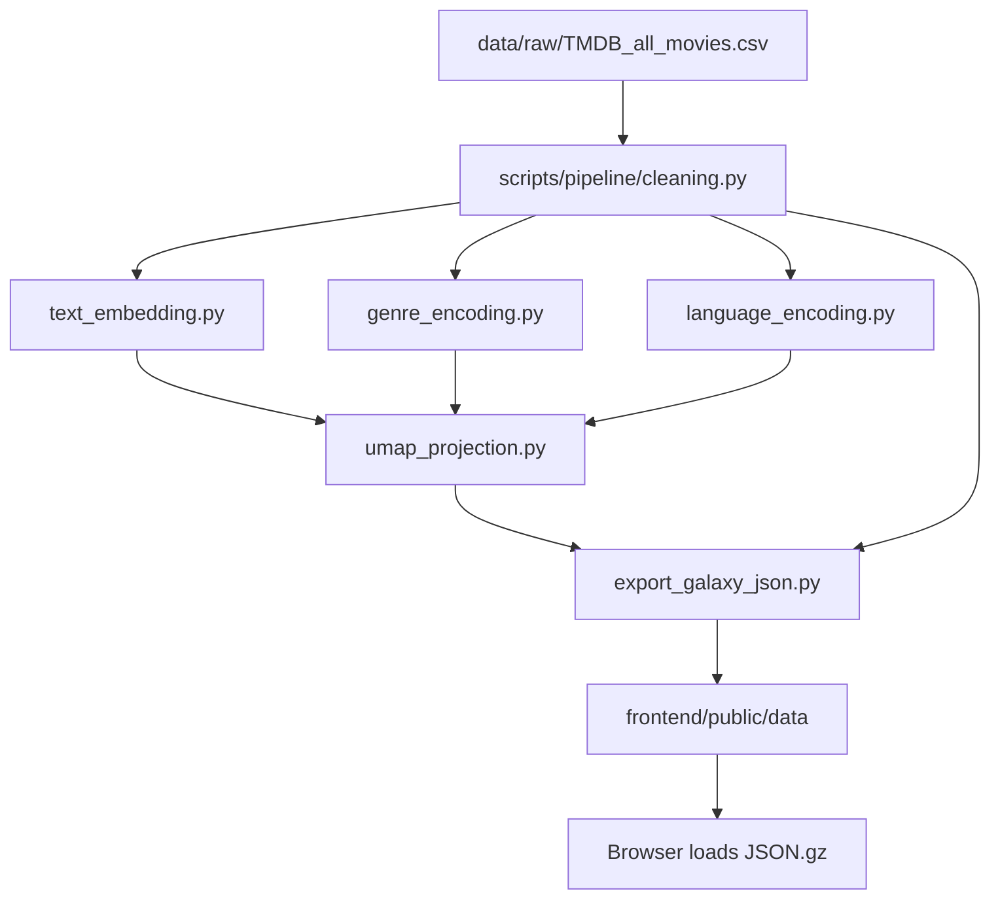
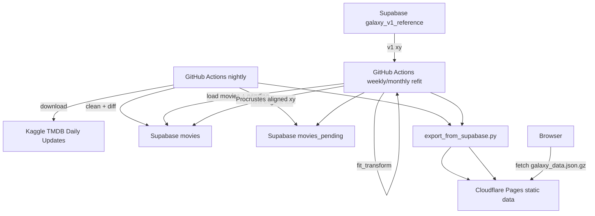

# TMDB 电影宇宙 - Data Pipeline SSOT

> 本文档是项目**数据流单一事实源（SSOT）**。凡涉及数据源、清洗、特征工程、UMAP、Z 轴、genre palette、导出、自动化更新、部署流的规则，以本文为准。  
> 渲染状态机、HUD/UX、shader uniform、相机交互等消费侧规则，仍分别以 `TMDB 电影宇宙 Tech Spec.md`、`TMDB 电影宇宙 Design Spec.md`、`星球状态机 spec.md`、`视觉参数总表.md` 为准。

## 1. 目标与边界

本项目将 Kaggle 每日更新的 TMDB 电影数据转化为一个可静态部署的 2.5D 电影宇宙：

- **X/Y**：由文本语义、流派顺位权重、原始语言 one-hot 融合后，经 UMAP/DensMAP 预计算得到。
- **Z**：由 `release_date` 转为小数年份，保留原始年份尺度，不参与 UMAP。
- **视觉派生字段**：`vote_count` 生成 size，`vote_average` 生成 emissive / shader L 输入，`genres[0]` 生成 `genre_hue` / `genre_color`。
- **前端契约**：前端继续一次性加载静态 `galaxy_data.json.gz` 和可选 `galaxy_search_index.json.gz`，不直接查询数据库。

核心原则：

- 算法层只接受描述电影内容与文化语义的核心特征：`overview + tagline`、`genres`、`original_language`。
- 时间、热度、评分、票房、人员、海报等字段不进入 UMAP，只作为 Z 轴、视觉映射、HUD、搜索或归档字段。
- 当前 Phase 18+ 目标是把"本地手工管线"升级为"Supabase 作 source of truth + GitHub Actions 自动化 + Cloudflare Pages 静态托管"，但保持前端数据加载契约不变。

## 2. 当前 Production 参数

当前线上 `galaxy_data` 版本以 `frontend/public/data/galaxy_data.json` 的 `meta` 为准：

```json
{
  "embedding_model": "paraphrase-multilingual-MiniLM-L12-v2",
  "umap_params": {
    "n_neighbors": 300,
    "min_dist": 0.4,
    "metric": "cosine",
    "random_state": 42,
    "densmap": true
  },
  "genre_weight_ratio": 0.6180339887498948,
  "feature_weights": {
    "text": 1.0,
    "genre": 1.0,
    "lang": 1.0
  }
}
```

说明：

- 当前 production 使用 `paraphrase-multilingual-MiniLM-L12-v2`，即 **384 维**文本 embedding。
- `densmap=true` 时，`scripts/feature_engineering/umap_projection.py` 会使用 CPU `umap-learn` 路径；cuML 不支持 DensMAP。
- `random_state=42` 为硬约束。更换 embedding 模型、UMAP 参数、特征融合权重、genre 权重策略或 genre palette 版本，均视为新宇宙数据版本。

## 3. 数据生命周期

### 3.1 Phase 0-17：本地手工全量管线

当前已实现的主路径：



统一入口为 `scripts/run_pipeline.py`：

- Phase 1：CSV 清洗、去重、过滤，输出 `data/output/cleaned.csv`。
- Phase 2.1：文本 embedding，输出 `data/output/text_embeddings.npy`。
- Phase 2.2：genre 编码，输出 `data/output/genre_vectors.npy`。
- Phase 2.3：language 编码，输出 `data/output/language_vectors.npy`。
- Phase 2.4：特征融合 + UMAP/DensMAP，输出 `data/output/umap_xy.npy`。
- Phase 2.5：导出 `galaxy_data.json`、`galaxy_data.json.gz`、`galaxy_search_index.json.gz`。

### 3.2 Phase 18+：自动化目标流

已确认的 Phase 18 数据流决策：

- **Supabase 角色**：source of truth。前端不直接查询 Supabase，仍加载静态 JSON.gz。
- **UMAP 模型策略**：不持久化 `.pkl`。当前 `umap_model.pkl` 体积约 884MB，且受 numba/umap pickle ABI 影响不可稳定复用。周期性更新直接全量 `fit_transform`。
- **更新节奏**：
  - 每日：刷新已有电影的 `vote_count` / `vote_average` / `popularity`，并重导静态 JSON。
  - 每周或每月：执行全量 `fit_transform`，新片并入星图，再用 Procrustes 对齐到 v1 reference，保持长期坐标稳定。
- **前端动画**：不做 remap 插值动画。坐标稳定性由数据层 Procrustes 负责。
- **Genre palette**：Phase 18.0 冻结固定 `genre -> hue` 表，避免 genre 集合变化导致全图变色。

目标流：



## 4. 数据源与清洗规则

### 4.1 数据源

- 主数据源：[Kaggle - TMDB Movies Daily Updates](https://www.kaggle.com/datasets/alanvourch/tmdb-movies-daily-updates)
- 本地原始文件：`data/raw/TMDB_all_movies.csv`
- 对话与文档中不得直接读取完整 raw CSV；需要查看 schema 时使用 `data/subsample/` 或报告。

### 4.2 去重

进入任何特征工程之前必须去重：

- **主键去重**：合并相同 `id`（TMDB ID）。
- **外部主键去重**：合并相同 `imdb_id`，防止同一电影重复进入宇宙。

### 4.3 强制剔除规则

命中以下任一规则的电影不得进入 UMAP 或前端渲染：

- `genres` 为空。
- `vote_count == 0` 或为空。
- `vote_average == 0` 或为空。
- `release_date` 为空。
- `overview` 为空且无法用标题回退。

`overview` 回退策略：

- 若 `overview` 为空但 `title` 存在，则用 `title` 作为文本输入。
- 若 `original_title` 与 `title` 不同，可拼接两者增强语义。
- 若 `title` 也为空，则剔除。

### 4.4 动态 vote_count 阈值

使用动态阈值剔除各年代中缺乏代表性的长尾数据：

- 年度分位数：`quantile=0.95`
- 折算系数：`alpha=0.15`
- 滑动平均窗口：`rolling_window=6`
- 全年代绝对底线：`abs_min=1`

可执行参数以 `scripts/run_pipeline.py` 与 `scripts/pipeline/cleaning.py` 为准。动态阈值的目标是适应不同年代的热度膨胀，避免早期电影和现代电影套用同一绝对 vote_count 标准。

### 4.5 当前未启用的备选过滤

以下规则当前不启用，仅作为未来可选开关：

- 成人内容过滤：`adult == True`
- 短片过滤：`runtime <= 40`
- 双零财务过滤：`budget == 0 && revenue == 0`
- 极低热度过滤：`popularity <= 0.01`
- 无海报过滤：`poster_path == null`

`YYYY-01-01` 不剔除，而是走确定性 Temporal Jitter。

## 5. 特征工程

### 5.1 文本 Embedding

输入文本：

- 若 `tagline` 非空：

```text
Tagline: {tagline}
Overview: {overview}
```

- 若 `tagline` 为空：

```text
Overview: {overview}
```

约定：

- 保留所有语言 overview，必须使用多语言 sentence-transformers 模型。
- 当前 production 模型：`sentence-transformers/paraphrase-multilingual-MiniLM-L12-v2`，384 维。
- 质量升级候选：`sentence-transformers/paraphrase-multilingual-mpnet-base-v2`，768 维。启用时必须 bump 宇宙数据版本并重新全量 fit。
- 文本从尾部截断到默认 3000 字符。
- embedding 必须 L2 normalize。

### 5.2 Genre 顺位权重编码

一部电影可有多个 genre，按 TMDB 给定顺序视作顺位：

\[
w_k = q^{k-1},\quad q = 1/\varphi \approx 0.6180339887
\]

其中 `k=1` 的主 genre 权重为 1，后续 genre 以黄金比例倒数递减。`genre_weight_ratio` 必须写入 `meta`。

### 5.3 Original Language One-hot

`original_language` 进入 UMAP，作为文化锚点。语言集合与向量维度由当前数据动态计算，不写死。

### 5.4 多模态融合

文本、genre、language 三组特征分别 L2 normalize 后，再按维度做 `1/sqrt(d)` 缩放，并乘以可调权重：

```python
combined = np.concatenate([
    text_vec  * (1 / sqrt(d_text))  * w_text,
    genre_vec * (1 / sqrt(d_genre)) * w_genre,
    lang_vec  * (1 / sqrt(d_lang))  * w_lang,
], axis=1)
```

当前 production 权重：

```json
{"text": 1.0, "genre": 1.0, "lang": 1.0}
```

修改任一权重必须 bump 宇宙数据版本。

### 5.5 UMAP / DensMAP

当前 production：

- `n_neighbors=300`
- `min_dist=0.4`
- `metric=cosine`
- `random_state=42`
- `densmap=true`
- backend：CPU `umap-learn`

约束：

- `random_state=42` 固定。
- 更换 backend、UMAP 参数、embedding 模型、依赖大版本或 feature weights，均须记录在 `meta.umap_params` 和变更记录中。
- Phase 18+ 不再依赖 `umap_model.pkl` 做 `.transform()`；周期性更新直接全量 `fit_transform`。

## 6. Z 轴与视觉派生字段

### 6.1 Z 轴：Decimal Year

`release_date` 转为小数年份：

\[
z = year + \frac{dayOfYear - 1}{daysInYear}
\]

约束：

- Z 保留原始小数年份尺度，不归一化。
- Z 不进入 UMAP。
- 前端相机、时间轴、可视窗口直接消费此尺度。

### 6.2 Temporal Jitter

对 `YYYY-01-01` 占位日期使用确定性 jitter：

- 随机种子：TMDB `id`
- 范围：`[0.0, 0.9999)`
- 目标：打散占位日期堆叠，同时保证同一电影跨运行 Z 坐标稳定。

### 6.3 Size

`vote_count` 不进入 UMAP，只用于视觉尺度：

```python
size = linear_map(log10(vote_count + 1), size_min, size_max)
```

当前导出默认：

- `size_min=2.0`
- `size_max=25.0`

### 6.4 Emissive / Rating

`vote_average` 不进入 UMAP。导出层保留 `emissive` 字段：

```python
emissive = linear_map(vote_average, emissive_min, emissive_max)
```

当前宏观 shader 主路径实际消费 `vote_average / 10`，经前端 P10.1 rating→L 曲线映射到 OKLab Lightness。

## 7. Genre Palette 与 Hue

### 7.1 当前语义

每条电影导出：

- `genre_hue`：主 genre 的 hue，弧度，范围 `[0, 2π)`。
- `genre_color`：主 genre 对应 sRGB 归一化 RGB，兼容 HUD 和回退。

`meta.genre_palette` 导出 `genre -> sRGB hex`，供 HUD badge、tooltip、搜索等 DOM 层使用。

### 7.2 Phase 18.0 冻结策略

旧规则基于"当前数据中出现的 genre 集合"排序并等分色环。该规则有隐患：如果某次数据多/少一个 genre，所有 hue 都会整体偏移。

Phase 18.0 起改为：

- 使用 TMDB 官方 19 genre 的固定列表（按 TMDB genre id 或 v1 兼容顺序固定）。
- 导出时 assert 数据中所有 genre 都存在于 frozen table。
- `meta` 增加 `genre_palette_version: "v1"`。
- 重导出后应与当前 production `meta.genre_palette` 保持视觉兼容；如无法逐 key 兼容，必须显式 bump palette version 并做视觉回归。

## 8. 字段分层

### 8.1 进入 UMAP 的字段

| 字段 | 处理 | 作用 |
| :-- | :-- | :-- |
| `overview` + `tagline` | 多语言 embedding | 文本语义 |
| `genres` | 顺位加权向量 | 流派拓扑 |
| `original_language` | one-hot | 文化锚点 |

### 8.2 不进入 UMAP，但进入坐标/视觉的字段

| 字段 | 处理 | 作用 |
| :-- | :-- | :-- |
| `release_date` | decimal year + jitter | Z 轴 |
| `vote_count` | `log10(vote_count + 1)` | size |
| `vote_average` | raw / normalized | emissive, OKLab L |
| `genres[0]` | frozen palette lookup | hue / color |

### 8.3 仅 HUD / 搜索 / 逻辑字段

包括但不限于：

- 标题：`title`、`original_title`、`title_normalized`
- 档案：`overview`、`tagline`、`runtime`、`budget`、`revenue`
- 外部评分：`imdb_rating`、`imdb_votes`
- 地理与工业属性：`production_countries`、`production_companies`、`spoken_languages`
- 人员：`cast`、`director`、`writers`、`producers`、`director_of_photography`、`music_composer`
- 资源：`poster_url`
- 逻辑：`id`、`imdb_id`

这些字段不得直接进入 UMAP，避免维度爆炸、共线性放大或数据缺失造成拓扑污染。

## 9. 导出契约

### 9.1 主文件

主产物：

- `galaxy_data.json`
- `galaxy_data.json.gz`

顶层结构：

```json
{
  "meta": {},
  "movies": []
}
```

`meta` 至少包含：

- `version`
- `generated_at`
- `count`
- `embedding_model`
- `umap_params`
- `genre_weight_ratio`
- `genre_palette`
- `genre_palette_version`（Phase 18.0+）
- `has_genre_hue`
- `has_search_index`
- `feature_weights`
- `z_range`
- `xy_range`

`movies[i]` 至少包含：

- GPU 字段：`x`、`y`、`z`、`size`、`emissive`、`genre_hue`、`genre_color`
- HUD 字段：标题、日期、genre、评分、简介、人员、海报、财务等
- 逻辑字段：`id`、`imdb_id`

具体 TypeScript 契约以 `frontend/src/types/galaxy.ts` 为准；具体导出实现以 `scripts/export/export_galaxy_json.py` 为准。

### 9.2 搜索索引

配套产物：

- `galaxy_search_index.json.gz`

用途：

- 人名搜索：`people`
- 流派搜索：`genres`
- 电影名搜索辅助：主文件中的 `title_normalized`

版本必须与 `galaxy_data.meta.version` 对齐。若 `meta.has_search_index === true`，前端应能加载该文件。

## 10. Phase 18 Supabase Schema

Phase 18 目标 Supabase 表：

### 10.1 `movies`

当前生效的电影宇宙数据。包含：

- 电影展示字段
- 当前 `x/y/z`
- 当前 `vote_count` / `vote_average` / `popularity`
- 人员、海报、搜索辅助字段
- `last_vote_update`
- `last_xy_refit`

### 10.2 `galaxy_v1_reference`

永久 reference 坐标：

- `movie_id`
- `x_v1`
- `y_v1`
- `z_v1`

约束：

- 初始导入时等于当前 production 坐标。
- 常规脚本不得 UPDATE / DELETE。
- 后续每次全量 refit 均对齐到这份 v1 reference。

### 10.3 `movies_pending`

通过清洗门槛但尚未纳入全量 UMAP 的新电影候补池。

夜间任务将新片写入 pending；周度/月度 refit 将 pending 合入 `movies`。

### 10.4 `vote_snapshots`

可选历史表，按月记录：

- `movie_id`
- `snapshot_month`
- `vote_count`
- `vote_average`

未来可用于"评分/投票演化"可视化。

## 11. 自动化任务

### 11.1 Nightly Vote Refresh

频率：每日，建议 UTC 20:00（北京时间 04:00）。

职责：

1. 下载 Kaggle daily update。
2. 执行清洗，得到当前完整 cleaned df。
3. 与 Supabase `movies` diff。
4. 对已有 id 更新 `vote_count`、`vote_average`、`popularity`。
5. 对新通过门槛的 id 计算 feature vectors，写入 `movies_pending`。
6. 重导 `galaxy_data.json.gz` 与 `galaxy_search_index.json.gz`。
7. 部署到 Cloudflare Pages。

每日任务不重算 UMAP 坐标。

### 11.2 Weekly / Monthly Full Refit

频率：由 Phase 18.1 CPU benchmark 决定，默认优先每周，若耗时或配额压力过高则改月度。

职责：

1. 从 Supabase 拉取 `movies` + `movies_pending`。
2. 复用/重算特征矩阵。
3. 使用当前 production 参数全量 `fit_transform`。
4. 用 `galaxy_v1_reference` 做 Procrustes 对齐。
5. 写回 `movies.x/y`。
6. 将 pending 新片合入 movies，清空 pending。
7. 重导并部署静态 JSON。

### 11.3 Procrustes 对齐

周期性 refit 后，UMAP 输出可能出现任意旋转、反射、平移与尺度漂移。为保持用户长期空间记忆，所有常规 refit 必须对齐到 v1 reference：

1. 取新旧共同 id。
2. 中心化新坐标与 v1 坐标。
3. 求最优正交变换与尺度。
4. 应用到本次全部点，包括新电影。

该过程不是前端动画；它是数据层稳定化步骤。

## 12. 部署

### 12.1 当前部署

当前静态部署可使用 GitHub Pages / Vercel / Netlify。前端加载：

```text
BASE_URL + "data/galaxy_data.json.gz"
BASE_URL + "data/galaxy_search_index.json.gz"
```

加载逻辑支持：

- HTTP 层透明 gzip
- 原始 gzip bytes + `DecompressionStream`

### 12.2 Phase 18 目标部署

目标：

- Cloudflare Pages 托管前端与静态数据。
- GitHub Actions cron 生成产物后触发 Cloudflare Pages 部署。
- GitHub Pages 保留 1-2 周作为灰度备线。

国内访问优化不属于 Phase 18 出口；如需要，后续再评估 ICP 备案与国内 OSS/COS 镜像。

## 13. 版本化与验收

### 13.1 必须写入 meta 的版本相关信息

- `version`
- `generated_at`
- `embedding_model`
- `umap_params`
- `genre_weight_ratio`
- `feature_weights`
- `genre_palette_version`
- `has_genre_hue`
- `has_search_index`

### 13.2 必须 bump 宇宙数据版本的变更

- 更换 embedding 模型或其关键依赖。
- 修改文本拼接 / 截断 / normalize 规则。
- 修改 genre 权重策略或 `genre_weight_ratio`。
- 修改 language / genre 编码策略。
- 修改 UMAP 参数、backend、`random_state`。
- 修改 feature weights。
- 修改 genre palette version。
- 重置 `galaxy_v1_reference`。

### 13.3 管线断言

管线必须在关键步骤快速失败：

- 清洗后行数在预期范围内。
- 特征矩阵行数一致。
- UMAP 输出 shape 为 `(n, 2)` 且无 NaN / Inf。
- `xy.shape[0] == len(cleaned_df)`。
- 所有导出 `x/y/z/size/emissive` finite。
- `meta.count == len(movies)`。
- 所有 `genre_hue` 在 `[0, 2π)`。
- 所有数据 genre 均存在于 frozen genre palette。
- 搜索索引版本与主 JSON 版本一致。

## 14. 相关文件

- Pipeline 入口：`scripts/run_pipeline.py`
- 清洗：`scripts/pipeline/cleaning.py`
- 文本 embedding：`scripts/feature_engineering/text_embedding.py`
- Genre 编码：`scripts/feature_engineering/genre_encoding.py`
- Language 编码：`scripts/feature_engineering/language_encoding.py`
- UMAP：`scripts/feature_engineering/umap_projection.py`
- 导出：`scripts/export/export_galaxy_json.py`
- 搜索索引：`scripts/export/export_search_index.py`
- JSON 校验：`scripts/validate_galaxy_json.py`
- 前端 gzip 加载：`frontend/src/data/loadGalaxyGzip.ts`
- 前端数据类型：`frontend/src/types/galaxy.ts`

