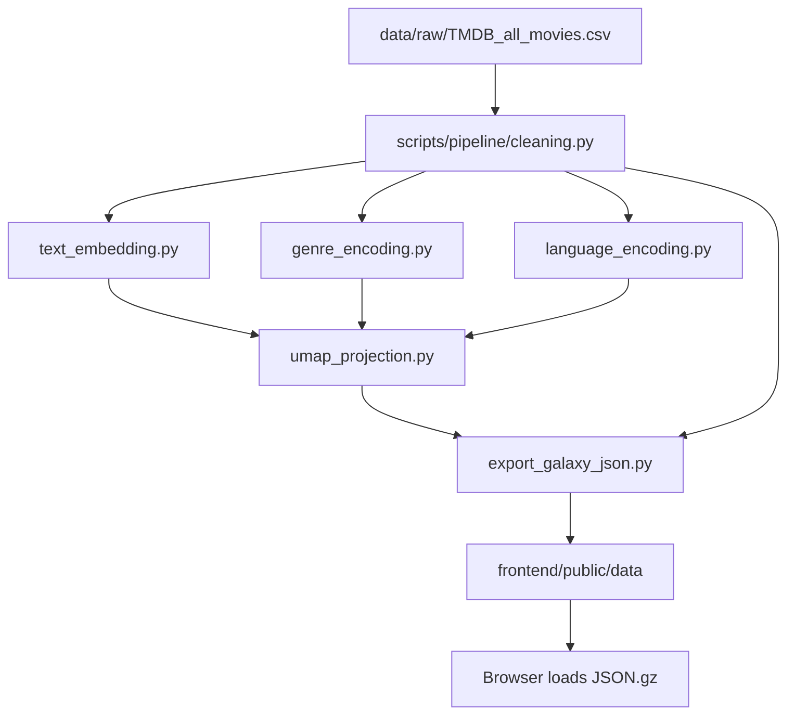
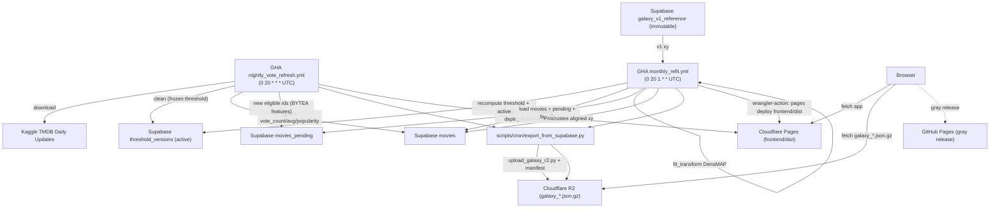

# TMDB 电影宇宙 - Data Pipeline SSOT

> 本文档是项目**数据流单一事实源（SSOT）**。凡涉及数据源、清洗、特征工程、UMAP、Z 轴、genre palette、导出、自动化更新、部署流的规则，以本文为准。  
> 渲染状态机、HUD/UX、shader uniform、相机交互等消费侧规则，仍分别以 `TMDB 电影宇宙 Tech Spec.md`、`TMDB 电影宇宙 Design Spec.md`、`星球状态机 spec.md`、`视觉参数总表.md` 为准。

## 1. 目标与边界

本项目将 Kaggle 每日更新的 TMDB 电影数据转化为一个可静态部署的 2.5D 电影宇宙：

- **X/Y**：由文本语义、流派顺位权重、原始语言 one-hot 融合后，经 UMAP/DensMAP 预计算得到。
- **Z**：由 `release_date` 转为小数年份，保留原始年份尺度，不参与 UMAP。
- **视觉派生字段**：`vote_count` 生成 size，`vote_average` 生成 emissive / shader L 输入，`genres[0]` 生成 `genre_hue` / `genre_color`。
- **前端契约**：前端继续一次性加载静态 `galaxy_data.json.gz` 和可选 `galaxy_search_index.json.gz`，不直接查询数据库。

核心原则：

- 算法层只接受描述电影内容与文化语义的核心特征：`overview + tagline`、`genres`、`original_language`。
- 时间、热度、评分、票房、人员、海报等字段不进入 UMAP，只作为 Z 轴、视觉映射、HUD、搜索或归档字段。
- 当前 Phase 18+ 目标是把"本地手工管线"升级为"Supabase 作 source of truth + GitHub Actions 自动化 + Cloudflare Pages 静态托管"，但保持前端数据加载契约不变。


## 2. 当前 Production 参数

当前线上 `galaxy_data` 的版本与 UMAP / embedding 等 **meta** 以 **生产环境实际加载的主包**为准：浏览器经 `galaxy_assets_manifest.json`（或 `VITE_GALAXY_DATA_GZIP_URL` 等覆盖）从 **Cloudflare R2** 拉取的 `galaxy_data.json.gz` 解压后的 `meta`。本地若存在 `frontend/public/data/galaxy_data.json`（未压缩副本），仅便于开发/对照，**不保证**与线上 R2 对象字节级一致，亦**不作为**仓库需跟踪的生产 SSOT。

```json
{
  "embedding_model": "paraphrase-multilingual-MiniLM-L12-v2",
  "umap_params": {
    "n_neighbors": 300,
    "min_dist": 0.4,
    "metric": "cosine",
    "random_state": 42,
    "densmap": true
  },
  "genre_weight_ratio": 0.6180339887498948,
  "feature_weights": {
    "text": 1.0,
    "genre": 1.0,
    "lang": 1.0
  }
}
```

说明：

- 当前 production 使用 `paraphrase-multilingual-MiniLM-L12-v2`，即 **384 维**文本 embedding。
- `densmap=true` 时，`scripts/feature_engineering/umap_projection.py` 会使用 CPU `umap-learn` 路径；cuML 不支持 DensMAP。
- `random_state=42` 为硬约束。更换 embedding 模型、UMAP 参数、特征融合权重、genre 权重策略或 genre palette 版本，均视为新宇宙数据版本。


## 3. 数据生命周期


### 3.1 Phase 0-17：本地手工全量管线

当前已实现的主路径：




统一入口为 `scripts/run_pipeline.py`：

- Phase 1：CSV 清洗、去重、过滤，输出 `data/output/cleaned.csv`。
- Phase 2.1：文本 embedding，输出 `data/output/text_embeddings.npy`。
- Phase 2.2：genre 编码，输出 `data/output/genre_vectors.npy`。
- Phase 2.3：language 编码，输出 `data/output/language_vectors.npy`。
- Phase 2.4：特征融合 + UMAP/DensMAP，输出 `data/output/umap_xy.npy`。
- Phase 2.5：导出 `galaxy_data.json`、`galaxy_data.json.gz`、`galaxy_search_index.json.gz`。其中 `movies[].cast` 默认写入 **全量**（与 `cleaned.csv` 逗号拆分一致；`export_galaxy_json.py` 默认 `--cast-max 0` 表示不截断；正整数 `N` 则每人最多保留前 N 个名字，供缩包试验）。**不参与 UMAP**；前端 Drawer **按数组顺序全量展示**（Phase 25.4 体积/性能评估见 `docs/reports/Phase 25.4 P25.4 全量 cast 主包影响评估 实施报告.md`）。


### 3.2 Phase 18 出口：自动化部署形态（实际落地）

已确认并实施的 Phase 18 数据流决策：

- **Supabase 角色**：source of truth（`movies` / `movies_pending` / `galaxy_v1_reference` / `vote_snapshots` / `threshold_versions`）。前端不直接查询 Supabase，仍加载静态 JSON.gz。
- **Supabase preflight**：nightly / monthly 在安装 Python 依赖之后、Kaggle 下载或 UMAP 前运行只读 `check_supabase_health.py`。它依次校验配置、URL、DNS、TLS/PostgREST 与唯一 active `threshold_versions`，日志只包含脱敏主机标识、错误分类、状态码与门槛年份范围。
- **维度漂移 SSOT**：monthly 只以动态门槛后的 final membership 触发阻断；pre-threshold 长尾语言/genre 仅记录观测，不能单独阻断。计算出的同一 `thresholds_json` 同时用于 membership 过滤和 active `threshold_versions` 持久化。
- **UMAP 模型策略**：不持久化 `.pkl`（旧版 `umap_model.pkl` ~884MB，且受 numba/umap pickle ABI 影响不可稳定复用）。月度直接全量 `fit_transform`（CPU `umap-learn`，DensMAP）。
- **更新节奏**（最终决策，对照计划「daily light refresh + monthly full refit」）：
  - **每日（P18.4 nightly）**：沿用上一周期 frozen `threshold_versions`，刷新已入库电影的 `vote_count` / `vote_average` / `popularity`，新过线片入 `movies_pending`，重导静态 JSON。
  - **每月（P18.5 monthly + P18.5b 软闸）**：重新计算 dynamic threshold 并 active，全量 `fit_transform`，Procrustes 对齐 `galaxy_v1_reference`，合并 pending → `movies`，重导静态 JSON。
  - **weekly**：仅 `workflow_dispatch`，**不**作为默认 schedule。
- **前端动画**：不做 remap 插值动画。坐标稳定性由数据层 Procrustes 负责。
- **Genre palette**：Phase 18.0 冻结固定 `genre -> hue` 表（19 TMDB 官方 genre），`meta.genre_palette_version` 记录版本。
- **静态托管**（详见 §12）：**Cloudflare Pages** 托管 `frontend/dist`；**Cloudflare R2** 托管 `galaxy_data.json.gz` 等大对象（绕 Pages 25MiB 单文件硬限）；**GitHub Pages** 灰度备线由 `deploy-pages.yml` 在 `main` push 时同步。

实际数据流：



### 3.3 Phase 38：OG Index KV 增量发布

OG metadata 索引是独立发布层，不属于 nightly/monthly 的计算脚本：两条 workflow 在 export 成功后、常规 R2 galaxy 上传前调用同一 `scripts/cron/sync_og_index_kv.py --scope incremental` 步骤。OG Worker 继续读取 `movie:{id}`、`today`、`meta:G`，键契约不变。

- 影片差异只比较规范化投影：`title`、`release_date`、`genres`、`poster_url`。评分、票数、热度、坐标或其他 galaxy 字段变化不触发 `movie:*` 写入。
- R2 checkpoint 是 `ops/og-index/state-v1.json.gz`：schema `1`、projection `og-index-v1` 的 gzip JSON，`Cache-Control: no-store`，不进入前端 manifest，也不由 Worker 读取。缺失、损坏、未知 schema/projection、数量或 key/hash 不一致均 fail closed，scheduled 绝不自动全量回退。
- 正常提交顺序固定为：movie PUT → movie DELETE → changed `today` → last `meta:G` → changed/deleted key read-back → snapshot commit。任一步失败都不推进 checkpoint；后续重试按旧 snapshot 幂等恢复。
- 默认配额为 `OG_INDEX_MAX_PUTS=900` 与 `OG_INDEX_MAX_DELETES=900`。PUT 包含 `today`、`meta:G` 控制键；门槛在第一笔网络写入前检查，超限输出 current/previous/put/delete/unchanged/batch/sample 摘要。
- snapshot 首次缺失时，仅 `workflow_dispatch` 的 `bootstrap_og_index` 可执行一次远端只读审计并创建 checkpoint；scheduled 不自动 bootstrap 或 full fallback。灾难全量恢复须同时明确 `--scope full --allow-full-recovery`，并在提交前验证最终远端 movie keyset。

## 4. 数据源与清洗规则


### 4.1 数据源

- 主数据源：[Kaggle - TMDB Movies Daily Updates](https://www.kaggle.com/datasets/alanvourch/tmdb-movies-daily-updates)
- 本地原始文件：`data/raw/TMDB_all_movies.csv`
- 对话与文档中不得直接读取完整 raw CSV；需要查看 schema 时使用 `data/subsample/` 或报告。


### 4.2 去重

进入任何特征工程之前必须去重：

- **主键去重**：合并相同 `id`（TMDB ID）。
- **外部主键去重**：合并相同 `imdb_id`，防止同一电影重复进入宇宙。


### 4.3 强制剔除规则

命中以下任一规则的电影不得进入 UMAP 或前端渲染：

- `genres` 为空。
- `vote_count == 0` 或为空。
- `vote_average == 0` 或为空。
- `release_date` 为空。
- `overview` 为空且无法用标题回退。

`overview` 回退策略：

- 若 `overview` 为空但 `title` 存在，则用 `title` 作为文本输入。
- 若 `original_title` 与 `title` 不同，可拼接两者增强语义。
- 若 `title` 也为空，则剔除。


### 4.4 动态 vote_count 阈值

使用动态阈值剔除各年代中缺乏代表性的长尾数据：

- 年度分位数：`quantile=0.95`
- 折算系数：`alpha=0.15`
- 滑动平均窗口：`rolling_window=6`
- 全年代绝对底线：`abs_min=1`

可执行参数以 `scripts/run_pipeline.py` 与 `scripts/pipeline/cleaning.py` 为准。动态阈值的目标是适应不同年代的热度膨胀，避免早期电影和现代电影套用同一绝对 vote_count 标准。

### 4.5 当前未启用的备选过滤

以下规则当前不启用，仅作为未来可选开关：

- 成人内容过滤：`adult == True`
- 短片过滤：`runtime <= 40`
- 双零财务过滤：`budget == 0 && revenue == 0`
- 极低热度过滤：`popularity <= 0.01`
- 无海报过滤：`poster_path == null`

`YYYY-01-01` 不剔除，而是走确定性 Temporal Jitter。

## 5. 特征工程


### 5.1 文本 Embedding

输入文本：

- 若 `tagline` 非空：

```text
Tagline: {tagline}
Overview: {overview}
```

- 若 `tagline` 为空：

```text
Overview: {overview}
```

约定：

- 保留所有语言 overview，必须使用多语言 sentence-transformers 模型。
- 当前 production 模型：`sentence-transformers/paraphrase-multilingual-MiniLM-L12-v2`，384 维。
- 质量升级候选：`sentence-transformers/paraphrase-multilingual-mpnet-base-v2`，768 维。启用时必须 bump 宇宙数据版本并重新全量 fit。
- 文本从尾部截断到默认 3000 字符。
- embedding 必须 L2 normalize。


### 5.2 Genre 顺位权重编码

一部电影可有多个 genre，按 TMDB 给定顺序视作顺位：


w_k = q^{k-1},\quad q = 1/\varphi \approx 0.6180339887


其中 `k=1` 的主 genre 权重为 1，后续 genre 以黄金比例倒数递减。`genre_weight_ratio` 必须写入 `meta`。

### 5.3 Original Language One-hot

`original_language` 进入 UMAP，作为文化锚点。语言集合与向量维度由当前数据动态计算，不写死。

### 5.4 多模态融合

文本、genre、language 三组特征分别 L2 normalize 后，再按维度做 `1/sqrt(d)` 缩放，并乘以可调权重：

```python
combined = np.concatenate([
    text_vec  * (1 / sqrt(d_text))  * w_text,
    genre_vec * (1 / sqrt(d_genre)) * w_genre,
    lang_vec  * (1 / sqrt(d_lang))  * w_lang,
], axis=1)
```

当前 production 权重：

```json
{"text": 1.0, "genre": 1.0, "lang": 1.0}
```

修改任一权重必须 bump 宇宙数据版本。

### 5.5 UMAP / DensMAP

当前 production：

- `n_neighbors=300`
- `min_dist=0.4`
- `metric=cosine`
- `random_state=42`
- `densmap=true`
- backend：CPU `umap-learn`

约束：

- `random_state=42` 固定。
- 更换 backend、UMAP 参数、embedding 模型、依赖大版本或 feature weights，均须记录在 `meta.umap_params` 和变更记录中。
- Phase 18+ 不再依赖 `umap_model.pkl` 做 `.transform()`；周期性更新直接全量 `fit_transform`。


## 6. Z 轴与视觉派生字段


### 6.1 Z 轴：Decimal Year

`release_date` 转为小数年份：


z = year + \frac{dayOfYear - 1}{daysInYear}


约束：

- Z 保留原始小数年份尺度，不归一化。
- Z 不进入 UMAP。
- 前端相机、时间轴、可视窗口直接消费此尺度。


### 6.2 Temporal Jitter

对 `YYYY-01-01` 占位日期使用确定性 jitter：

- 随机种子：TMDB `id`
- 范围：`[0.0, 0.9999)`
- 目标：打散占位日期堆叠，同时保证同一电影跨运行 Z 坐标稳定。


### 6.3 Size

`vote_count` 不进入 UMAP，只用于视觉尺度：

```python
size = linear_map(log10(vote_count + 1), size_min, size_max)
```

当前导出默认：

- `size_min=2.0`
- `size_max=25.0`


### 6.4 Emissive / Rating

`vote_average` 不进入 UMAP。导出层保留 `emissive` 字段：

```python
emissive = linear_map(vote_average, emissive_min, emissive_max)
```

当前宏观 shader 主路径实际消费 `vote_average / 10`，经前端 P10.1 rating→L 曲线映射到 OKLab Lightness。

## 7. Genre Palette 与 Hue


### 7.1 当前语义

每条电影导出：

- `genre_hue`：主 genre 的 hue，弧度，范围 `[0, 2π)`。
- `genre_color`：主 genre 对应 sRGB 归一化 RGB，兼容 HUD 和回退。

`meta.genre_palette` 导出 `genre -> sRGB hex`，供 HUD badge、tooltip、搜索等 DOM 层使用。

### 7.2 Phase 18.0 冻结策略

旧规则基于"当前数据中出现的 genre 集合"排序并等分色环。该规则有隐患：如果某次数据多/少一个 genre，所有 hue 都会整体偏移。

Phase 18.0 起改为：

- 使用 TMDB 官方 19 genre 的固定列表（按 TMDB genre id 或 v1 兼容顺序固定）。
- 导出时 assert 数据中所有 genre 都存在于 frozen table。
- `meta` 增加 `genre_palette_version: "v1"`。
- 重导出后应与当前 production `meta.genre_palette` 保持视觉兼容；如无法逐 key 兼容，必须显式 bump palette version 并做视觉回归。


## 8. 字段分层


### 8.1 进入 UMAP 的字段


| 字段                   | 处理             | 作用     |
| ---------------------- | ---------------- | -------- |
| `overview` + `tagline` | 多语言 embedding | 文本语义 |
| `genres`               | 顺位加权向量     | 流派拓扑 |
| `original_language`    | one-hot          | 文化锚点 |


### 8.2 不进入 UMAP，但进入坐标/视觉的字段


| 字段           | 处理                    | 作用              |
| -------------- | ----------------------- | ----------------- |
| `release_date` | decimal year + jitter   | Z 轴              |
| `vote_count`   | `log10(vote_count + 1)` | size              |
| `vote_average` | raw / normalized        | emissive, OKLab L |
| `genres[0]`    | frozen palette lookup   | hue / color       |


### 8.3 仅 HUD / 搜索 / 逻辑字段

包括但不限于：

- 标题：`title`、`original_title`、`title_normalized`
- 档案：`overview`、`tagline`、`runtime`、`budget`、`revenue`
- 外部评分：`imdb_rating`、`imdb_votes`
- 地理与工业属性：`production_countries`、`production_companies`、`spoken_languages`
- 人员：`cast`、`director`、`writers`、`producers`、`director_of_photography`、`music_composer`
- 资源：`poster_url`（导出基址 `https://image.tmdb.org/t/p/w780` + `poster_path`）
- 逻辑：`id`、`imdb_id`

这些字段不得直接进入 UMAP，避免维度爆炸、共线性放大或数据缺失造成拓扑污染。

## 9. 导出契约


### 9.1 主文件

主产物：

- `galaxy_data.json`
- `galaxy_data.json.gz`

顶层结构：

```json
{
  "meta": {},
  "movies": []
}
```

`meta` 至少包含：

- `version`
- `generated_at`
- `count`
- `embedding_model`
- `umap_params`
- `genre_weight_ratio`
- `genre_palette`
- `genre_palette_version`（Phase 18.0+）
- `has_genre_hue`
- `has_search_index`
- `search_normalize_version`（Phase 21.1+；当前管线写 `"v2"`）
- `feature_weights`
- `z_range`
- `xy_range`

`movies[i]` 至少包含：

- GPU 字段：`x`、`y`、`z`、`size`、`emissive`、`genre_hue`、`genre_color`
- HUD 字段：标题、日期、genre、评分、简介、人员、海报、财务等
- 逻辑字段：`id`、`imdb_id`

具体 TypeScript 契约以 `frontend/src/types/galaxy.ts` 为准；具体导出实现以 `scripts/export/export_galaxy_json.py` 为准。

### 9.2 搜索索引

配套产物：

- `galaxy_search_index.json.gz`

用途：

- 人名搜索：`people`
- 流派搜索：`genres`
- 电影名搜索辅助：主文件中的 `title_normalized`

版本必须与 `galaxy_data.meta.version` 对齐。若 `meta.has_search_index === true`，前端应能加载该文件。

### 9.3 搜索归一化（Phase 21.1）

`title_normalized` 与 `galaxy_search_index.people[*]` 的 normalized key 由同一函数 `scripts/export/export_search_index.py::normalize_for_search_v2` 写入：

```python
def normalize_for_search_v2(text: str) -> str:
    s = unicodedata.normalize("NFKC", str(text).strip())
    s = "".join(c for c in s if unicodedata.category(c) != "Mn")
    return s.casefold()
```

特性：

- 保留中日韩、西里尔、阿拉伯、谚文、天城等非拉丁脚本（旧 v1 NFKD + ASCII fold 会丢失这些字符）。
- 拉丁仍 `casefold`；`ß → ss`；预组合重音字符（如 `é`）保持，组合形式（如 `e + U+0301`）的 Mn 标记被剥离。
- 前端镜像 `frontend/src/utils/searchScore.ts::normalizeForSearch`：`text.normalize('NFKC').replace(/\p{M}/gu, '').toLowerCase()`，与 Python 端语义近似（JS `\p{M}` 略宽于 Python `Mn`，但实际标题场景差异可忽略）。

调用点（产线 Python 路径全部使用 v2）：

- `scripts/export/export_search_index.py`：`_merge_person` 用 v2 归并人名 key。
- `scripts/export/export_galaxy_json.py::_title_normalized_field`：写 `movies[i].title_normalized`。
- `scripts/cron/nightly_vote_refresh.py`：每日刷新 / 新过线片入 `movies_pending` 时计算 `title_normalized`。
- `scripts/supabase/initial_import.py`：一次性导入 Supabase 的 `title_normalized`。

`meta.search_normalize_version` 必须写为 `"v2"`。**旧 v1 函数** `normalize_for_search`（NFKD + `encode("ascii", "ignore") + casefold`）保留在同一文件中作为 legacy 引用，**不再被产线调用点使用**；如需对比或回滚可临时切换，但必须 bump 数据版本号。

前端兼容策略：`loadGalaxyData.parseAndValidate` 在 `meta.search_normalize_version !== "v2"` 时**不阻断加载**，仅 `console.warn` 提示 CJK / 非拉丁标题搜索可能不完整；在 `frontend/src/types/galaxy.ts` 的 `Meta` 接口中字段是 `search_normalize_version?: string`（旧包缺字段时 `undefined` 走相同 warning 分支）。

## 10. Phase 18 Supabase Schema

Phase 18 目标 Supabase 表：

### 10.1 `movies`

当前生效的电影宇宙数据。包含：

- 电影展示字段
- 当前 `x/y/z`
- 当前 `vote_count` / `vote_average` / `popularity`
- 人员、海报、搜索辅助字段
- `last_vote_update`
- `last_xy_refit`


### 10.2 `galaxy_v1_reference`

永久 reference 坐标：

- `movie_id`
- `x_v1`
- `y_v1`
- `z_v1`

约束：

- 初始导入时等于当前 production 坐标。
- 常规脚本不得 UPDATE / DELETE。
- 后续每次全量 refit 均对齐到这份 v1 reference。


### 10.3 `movies_pending`

通过清洗门槛但尚未纳入全量 UMAP 的新电影候补池。

夜间任务将新片写入 pending；周度/月度 refit 将 pending 合入 `movies`。

### 10.4 `vote_snapshots`

可选历史表，按月记录：

- `movie_id`
- `snapshot_month`
- `vote_count`
- `vote_average`

未来可用于"评分/投票演化"可视化。

## 11. 自动化任务


### 11.1 Nightly Vote Refresh（P18.4）

- **Workflow**：`[.github/workflows/nightly_vote_refresh.yml](../../.github/workflows/nightly_vote_refresh.yml)`（schedule: `0 20 * * `* UTC + `workflow_dispatch`，runner `ubuntu-24.04`，`timeout-minutes: 90`）。
- **入口脚本**：`[scripts/cron/nightly_vote_refresh.py](../../scripts/cron/nightly_vote_refresh.py)` → `[scripts/cron/export_from_supabase.py](../../scripts/cron/export_from_supabase.py)`。
- **冻结门槛**：每日只读 `threshold_versions.is_active = true` 行的 `thresholds_json`，**不重算**动态门槛；门槛版本更新只在 P18.5 月度任务中发生。

职责（与脚本实现一致）：

1. 下载 Kaggle daily update（`kaggle datasets download alanvourch/tmdb-movies-daily-updates`，CLI 多路回退）。
2. `run_cleaning_pipeline(..., frozen_year_thresholds=...)` 得到当日 cleaned df。
3. 运行维度漂移守卫 `assert_no_dim_drift`（校验 `genre_palette_version` + `lang_palette_version`）；默认 fail CI，可通过 `DIM_DRIFT_FORCE_SKIP=true` 临时放行并留痕。
4. 与 Supabase `movies` diff：
  - **现有 id**：批量 upsert 整行（保留 `x/y/z`），刷新 `vote_count` / `vote_average` / `popularity`。
  - **新过线 id**：CPU MiniLM embedding + `rank_weighted_genre_matrix` + `one_hot_language_matrix_with_fallback`，BYTEA 以 `\\x` hex 文本写入 `movies_pending`。
  - **当日未出现的在库片**：仅记 `below_threshold_observed`，**不删除**——是否剔除由月度 membership 决定。
5. **每月 1 日**额外批量 upsert `vote_snapshots`。
6. 调子进程 `export_from_supabase.py` 重导 `galaxy_data.json` / `.gz` / `galaxy_search_index.json.gz`（meta.version 形如 `YYYY.MM.DD.daily.<seq>`）。
7. **P18.6b + P20.4**：将 `galaxy_data.json.gz` / `galaxy_search_index.json.gz` 上传到 **Cloudflare R2**，写出 `galaxy_assets_manifest.json`，并在 `R2_GALAXY_PRUNE_AFTER_UPLOAD=1` 时从 `frontend/public/data/` 删除大 gzip（避免 Pages 25MiB 限制）。版本化 gzip 对象头写入 `Cache-Control: public, max-age=31536000, immutable`。
8. **P18.6 + P20.1**：构建 `frontend/dist` 并通过 `cloudflare/wrangler-action@v3` 执行 `pages deploy` 发布到 **Cloudflare Pages**；GitHub Pages workflow（`[.github/workflows/deploy-pages.yml](../../.github/workflows/deploy-pages.yml)`）保留为灰度备线。
9. **P23.1**：导出完成后调用 `[scripts/cron/pick_movie_today.py](../../scripts/cron/pick_movie_today.py)`（**UTC 日期** + `hash` 确定性在全部 `movie_id` 中选片，`min_vote_count` 默认 **0**）写入 `frontend/public/data/today.json`，并由 `[scripts/cron/upload_galaxy_r2.py](../../scripts/cron/upload_galaxy_r2.py)` 同步上传 R2；manifest 增加可选字段 `today_url`（绝对 URL + `?v=` 与 `data_version` 对齐）。
10. **P23.5**：调用 `[scripts/cron/render_og_today.py](../../scripts/cron/render_og_today.py)`（**Pillow**）合成 `frontend/public/data/og-today.png`（**1200×630** PNG，英文排版）；上传 R2 固定 key；海报拉取失败时可保留上一日文件（脚本内策略见实施报告）。
11. **依赖**：OG 渲染需 `Pillow`（已列入 `[requirements.cpu.txt](../../requirements.cpu.txt)`）；标题字体使用仓库内 `assets/fonts/`（如 Inter，随脚本打包）。

每日任务不重算 UMAP 坐标，不更新 `threshold_versions`。

#### 11.1a `today.json` 字段契约（P23.1）

与 `galaxy_data.json` **同版本发布**；`movie_id` 必须存在于当次导出的 `movies[]`。

```json
{
  "date": "2026-05-08",
  "movie_id": 12345,
  "selected_at": "2026-05-08T20:00:00Z",
  "selection_strategy": "deterministic_by_utc_date",
  "min_vote_count": 0
}
```


#### 11.1b `og-today.png`（P23.5）

- **尺寸**：**1200×630**（Open Graph / Twitter `summary_large_image`）。  
- **发布**：`frontend/public/data/og-today.png` + R2；`frontend/index.html` 内 `og:image` **/** `twitter:image` 使用**生产站点绝对 URL**（当前主域 **themoviecosmos.com**）。  
- **缓存**：`frontend/public/_headers` 对 `/data/og-today.png` 与 `/data/today.json` 使用 `max-age=300, must-revalidate`（短 TTL 便于隔日换片后爬虫更新）。


### 11.2 Monthly Full Refit（P18.5 + P18.5b）

- **Workflow**：`[.github/workflows/monthly_refit.yml](../../.github/workflows/monthly_refit.yml)`（schedule: `0 20 1 * `* UTC + `workflow_dispatch(anchor_mode=soft|hard|skip)`，runner `ubuntu-24.04`，`timeout-minutes: 210`）。
- **入口脚本**：`[scripts/cron/monthly_refit.py](../../scripts/cron/monthly_refit.py)`。
- **频率**：每月一次。weekly 仅 `workflow_dispatch`（**不**作为默认 schedule），与计划「日刷新 + 月度 refit」最终决策一致。

职责：

1. 拉取 Kaggle 最新 raw → 重算动态门槛（`compute_year_to_vote_threshold`），写入新行并 active `threshold_versions`（注：当前实现写入时机在 UMAP 之前；锚点 hard fail 时可能产生「门槛已切、坐标未更新」的中间态，运维需知情）。
2. 加载 **embedding 四件套**（`cleaned.csv` / `text_embeddings.npy` / `genre_vectors.npy` / `language_vectors.npy`），来源优先级：`GALAXY_EMBED_BUNDLE_URL` zip → Actions cache → 仓库内副本；新过线但缓存缺失的 id 走 `movies_pending` BYTEA 还原或当场重编码。
3. `fuse_modalities` + `_fit_umap_learn(densmap=True, n_neighbors=300, min_dist=0.4, metric=cosine, random_state=42)` 全量 `fit_transform`。
4. 调用 `align_to_reference`（`[scripts/feature_engineering/procrustes_align.py](../../scripts/feature_engineering/procrustes_align.py)`）对齐到 `galaxy_v1_reference`（永久不变）。
5. **P18.5b 锚点闸**（环境变量 `MONTHLY_ANCHOR_MODE`，CI 默认 `soft`）：
  - `soft`（默认）：`mean_anchor_l2 > --anchor-rmse-abort (0.25)` 仅 WARN；只有 `mean > MONTHLY_ANCHOR_SOFT_FAIL_MAX`（默认 50）或非有限值才 fail。
  - `hard`：超 `--anchor-rmse-abort` 即 fail。
  - `skip`：不因锚点残差 fail（仅排障使用）。
  - 结构性错误（`n_anchors < 2` / NaN / Inf / export validate 失败 / 四件套缺失）始终 fail。
6. 把对齐后 (x, y) upsert 回 `movies`；当月已合并的 pending 行 DELETE。
7. 调 `export_from_supabase.py` 导出 `meta.version = YYYY.MM.DD.monthly.<seq>` 与 `meta.threshold_version`。
8. **P18.5b artifact**：写出根目录 `monthly_refit_meta.json` 并随 `galaxy-export-monthly-<run_id>` 一并 `actions/upload-artifact`；字段含 `anchor_mean_l2`/`anchor_max_l2`/`n_anchors`/`n_fit`/`cleaned_rows`/`cache_bundle_rows`/`membership_count`/`threshold_version`/`raw_source`/`bundle_fingerprint`/`anchor_mode` 等。日志同时按 `monthly_refit_kv` 单行键值打印，便于 `grep`。
9. **P18.6 / P18.6b** 末端步骤与 nightly 一致：上传 R2 → 构建并 Direct Upload Pages。


### 11.3 Phase 20 维度漂移剧本（fail CI + 紧急通道）

- **探测入口**：`scripts/feature_engineering/dim_drift_detector.py` 的 `assert_no_dim_drift(cleaned_df, force_skip=...)`。
- **探测位置**：nightly 与 monthly 都在 `run_cleaning_pipeline` 之后、写库/UMAP 前调用，确保每日即可发现新语言/genre，不等待月度。
- **默认行为**：一旦存在 `unknown_languages` 或 `unknown_genres`，直接 fail CI（fail-loud）；不允许静默落入 `__unknown__` 导致拓扑漂移。
- **紧急通道**：workflow_dispatch 可设置 `force_skip_dim_check=true`（映射环境变量 `DIM_DRIFT_FORCE_SKIP=true`），任务继续执行但把漂移详情写入 report / `monthly_refit_meta.json` 留痕。
- **长期修复**：确认新增维度是业务预期后，走版本升级流程：扩充 frozen vocab/palette（`lang_palette_version` / `genre_palette_version` bump），并在需要时安排全量 re-embed + 月度 refit 发布新宇宙版本。


### 11.4 Procrustes 对齐

月度 refit 后，UMAP 输出可能出现任意旋转、反射、平移与尺度漂移。为保持用户长期空间记忆，所有常规 refit 必须对齐到 `galaxy_v1_reference`：

1. 取新旧共同 id（`common_mask`，要求 `n_common >= 2`）。
2. 中心化新坐标 `A` 与 v1 坐标 `B`。
3. `scipy.linalg.orthogonal_procrustes` 求 `R`（允许反射）；用闭式标量 `c = ⟨A R, B⟩_F / ‖A R‖_F²` 求均匀缩放。
4. 应用 `aligned = c · (new_xy − A_mean) @ R + B_mean` 到全部点（含尚无 v1 条目的新片）。

该过程不是前端动画；它是数据层稳定化步骤。

### 11.5 锚点观测期与 P95 收紧

P18.5b 上线初期采用「软闸 + 强日志 + artifact」策略，原因是 GHA 使用 Kaggle **日更 raw**、四件套 zip 来自**本机较早快照**时不可能字节级恒等，全量 refit 后 `mean_anchor_l2` 常显著大于 0.25。

- **观测期**：累积数月 `monthly_refit_meta.json` 与 `monthly_refit_kv` 日志，统计 P95 / max；不强制每月 mean L2 < 0.25 作为门禁。
- **收紧路径**：观测足够样本后，在新一轮 PR 中明确 P95 阈值 → 把 `MONTHLY_ANCHOR_MODE` 默认改回 `hard`、调整 `--anchor-rmse-abort`，或保留 `soft` 但下调 `MONTHLY_ANCHOR_SOFT_FAIL_MAX`。
- **临时 unblock**：`workflow_dispatch` 可选 `anchor_mode = skip`，仅用于排障。


### 11.6 Runner 资源与 Fallback

- 当前 GHA 实测：`ubuntu-24.04` public runner（4 CPU / 16GB RAM / 14GB SSD）下 monthly UMAP 墙钟约 10–12 分钟，全 job 在 `timeout-minutes: 210` 内。
- 若未来公共 runner 资源压力变大或 OOM：降级为**季度/半年度本地机器** full refit，仅由 `workflow_dispatch` 跑「接收产物 + 部署」的轻量 job；daily nightly 自动化保留。


## 12. 部署


### 12.1 当前部署架构（Phase 18 出口）

```text
[Browser]
   ├── 前端 bundle  ←  Cloudflare Pages（生产主域 themoviecosmos.com；*.pages.dev 可 301 到主域）
   └── galaxy_data.json.gz / galaxy_search_index.json.gz / today.json / og-today.png
                    ←  Cloudflare R2（公开读 + CORS；大 gzip 为主）
                       ↑
                       └─ GitHub Actions（nightly / monthly）写入

[GitHub Pages]（灰度备线，仍由 push-to-main workflow 部署）
```

- **Pages 职责**：托管 `frontend/dist`（前端 React+Three.js 应用壳）。**Direct Upload via** `cloudflare/wrangler-action@v3`（GitHub Actions nightly / monthly 或等价生产 workflow）作为**唯一**生产发布主链路；Cloudflare 控制台「连接 Git 仓库」触发的 Pages **自动构建不作为生产入口**（应 **Disconnect** 或禁用生产分支自动部署），避免未执行 monorepo 构建与 R2 前置步骤时，把仓库内路径下的超大 `*.json.gz` 误纳入 **Pages 输出目录校验**（触发 25MiB 硬限报错）。详见根目录 `README.md`「CI 与静态部署」与 [P24.1 实施报告](../reports/Phase%2024.1%20P24.1%20Cloudflare%20R2%20发布链路清理%20实施报告.md)。
- **R2 职责**：托管所有 **超过 Cloudflare Pages 单文件 25MiB 上限** 的静态对象（当前主要是 `galaxy_data.json.gz`，约 31MB）。**P24.1**：`galaxy_data.json.gz`、`galaxy_search_index.json.gz` **不纳入 Git**；由 CI 生成后上传 R2，必要时 prune 本地 `frontend/public/data/` 下大 gzip，再构建 `dist`。Bucket 配置公开读（`r2.dev` 子域或自定义域），CORS 允许 Pages 站点源 `GET` / `HEAD`。**P23.6**：CORS **AllowedOrigins** 须同时包含自定义域与 `https://the-movie-cosmos.pages.dev` 备线（详见 README §6 与 P23.6 运维清单）。
- **前端 URL 解析**（`[frontend/src/lib/galaxyAssetUrls.ts](../../frontend/src/lib/galaxyAssetUrls.ts)` 优先级）：
  1. 构建期 `VITE_GALAXY_DATA_GZIP_URL` / `VITE_GALAXY_SEARCH_INDEX_GZIP_URL`
  2. 运行时 `?dataset=` 实验参数
  3. `data/galaxy_assets_manifest.json`（由 `[scripts/cron/upload_galaxy_r2.py](../../scripts/cron/upload_galaxy_r2.py)` 在每次 cron 写入，包含 `galaxy_data_gzip_url` / `galaxy_search_index_gzip_url` / `today_url`**（可选）** / `data_version`）
  4. 默认同源 `BASE_URL + data/*.json.gz`（仅当 R2 secrets 全部缺失时才会到达此回退路径）
- **GitHub Pages**：`[.github/workflows/deploy-pages.yml](../../.github/workflows/deploy-pages.yml)` 仍在 push 到 `main` 时部署到 GitHub Pages，作为灰度备线 1–2 周内可用；不依赖 R2，浏览器在该路径上仍走同源 gzip。
- **数据加载技术**（不变）：HTTP 层透明 gzip 或原始 gzip bytes + `DecompressionStream`，由 `frontend/src/data/loadGalaxyGzip.ts` 处理。
- **Vite** `base`：仓库默认 `process.env.VITE_BASE_PATH ?? '/'`（适配 Pages 根路径与自定义域）；GitHub Pages 子路径部署时由 `[.github/workflows/deploy-pages.yml](../../.github/workflows/deploy-pages.yml)` 注入对应 `VITE_BASE_PATH` 即可。


### 12.2 P20 缓存语义（R2 + Pages manifest）


| 资源                                       | 发布位置         | Cache-Control                                        |
| ------------------------------------------ | ---------------- | ---------------------------------------------------- |
| `galaxy/{seq}/galaxy_data.json.gz`         | Cloudflare R2    | `public, max-age=31536000, immutable`                |
| `galaxy/{seq}/galaxy_search_index.json.gz` | Cloudflare R2    | `public, max-age=31536000, immutable`                |
| `data/galaxy_assets_manifest.json`         | Cloudflare Pages | `public, max-age=60, must-revalidate`                |
| `data/today.json`（P23.1）                 | Pages + R2       | `public, max-age=300, must-revalidate`（`_headers`） |
| `data/og-today.png`（P23.5）               | Pages + R2       | `public, max-age=300, must-revalidate`（`_headers`） |


说明：gzip 主包使用版本化 key + **immutable**；manifest / today / OG 维持短 TTL 以便日更切换与社交预览刷新。

### 12.3 Secrets 与运维分工


| 用途                  | Secret                                                                                         | 备注                                                                                                                          |
| --------------------- | ---------------------------------------------------------------------------------------------- | ----------------------------------------------------------------------------------------------------------------------------- |
| Supabase 写库 / 读取  | `SUPABASE_URL`、`SUPABASE_SERVICE_ROLE_KEY`                                                    | nightly + monthly 共用；`service_role` 绕过 RLS（参考 P18.3 `REVOKE UPDATE,DELETE ON galaxy_v1_reference FROM service_role`） |
| Kaggle daily update   | `KAGGLE_USERNAME`、`KAGGLE_KEY`                                                                | nightly + monthly 共用                                                                                                        |
| 月度 embedding bundle | `GALAXY_EMBED_BUNDLE_URL`                                                                      | 单行 http(s) zip 直链；`monthly_refit.yml` trim/CRLF 清洗后再 `curl`                                                          |
| Cloudflare Pages 部署 | `CLOUDFLARE_API_TOKEN`、`CLOUDFLARE_ACCOUNT_ID`、`CLOUDFLARE_PAGES_PROJECT_NAME`               | API Token 仅需 **Account → Cloudflare Pages → Edit**                                                                          |
| Cloudflare R2 上传    | `R2_ACCOUNT_ID`、`R2_ACCESS_KEY_ID`、`R2_SECRET_ACCESS_KEY`、`R2_BUCKET`、`R2_PUBLIC_BASE_URL` | 5 个变量缺一即 R2 step 安全 skip（不阻塞 nightly/monthly）                                                                    |


### 12.4 P18 范围外

- **国内访问 / 备案 / 大陆 CDN 镜像**：不在 Phase 18 出口；规划为 Phase 19+。
- **R2 「按版本 key」上传与长缓存 immutable** 策略：当前为 `galaxy/galaxy_data.json.gz` 固定 key + manifest `?v=data_version` query；可选增强见 [P18.6b 操作手册](../guides/P18.6b%20Cloudflare%20R2%20上线操作手册.md) §10。
- `cloudflare/pages-action@v1.5.0` 的历史弃用风险已在 **P20.1** 关闭：当前主链路已迁至 `cloudflare/wrangler-action@v3` + Node 24。


## 13. 版本化与验收


### 13.1 必须写入 meta 的版本相关信息

- `version`
- `generated_at`
- `embedding_model`
- `umap_params`
- `genre_weight_ratio`
- `feature_weights`
- `genre_palette_version`
- `has_genre_hue`
- `has_search_index`


### 13.2 必须 bump 宇宙数据版本的变更

- 更换 embedding 模型或其关键依赖。
- 修改文本拼接 / 截断 / normalize 规则。
- 修改 genre 权重策略或 `genre_weight_ratio`。
- 修改 language / genre 编码策略。
- 修改 UMAP 参数、backend、`random_state`。
- 修改 feature weights。
- 修改 genre palette version。
- 重置 `galaxy_v1_reference`。
- 修改 `search_normalize_version` 或 `normalize_for_search_v2` 算法（含等价 JS 镜像 `normalizeForSearch`）：会改变 `title_normalized` 与 `galaxy_search_index.people[*]` 的 key 二进制；主包 + 索引 + 前端必须同版本一并发布。


### 13.3 管线断言

管线必须在关键步骤快速失败：

- 清洗后行数在预期范围内。
- 特征矩阵行数一致。
- UMAP 输出 shape 为 `(n, 2)` 且无 NaN / Inf。
- `xy.shape[0] == len(cleaned_df)`。
- 所有导出 `x/y/z/size/emissive` finite。
- `meta.count == len(movies)`。
- 所有 `genre_hue` 在 `[0, 2π)`。
- 所有数据 genre 均存在于 frozen genre palette。
- 搜索索引版本与主 JSON 版本一致。


## 14. 相关文件

- Pipeline 入口：`scripts/run_pipeline.py`
- 清洗：`scripts/pipeline/cleaning.py`
- 文本 embedding：`scripts/feature_engineering/text_embedding.py`
- Genre 编码：`scripts/feature_engineering/genre_encoding.py`
- Language 编码：`scripts/feature_engineering/language_encoding.py`
- UMAP：`scripts/feature_engineering/umap_projection.py`
- 导出：`scripts/export/export_galaxy_json.py`
- 搜索索引：`scripts/export/export_search_index.py`
- JSON 校验：`scripts/validate_galaxy_json.py`
- 前端 gzip 加载：`frontend/src/data/loadGalaxyGzip.ts`
- 前端数据类型：`frontend/src/types/galaxy.ts`

