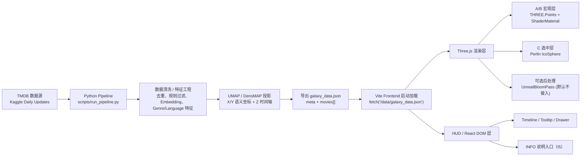

# 架构总览（数据管线 → 渲染 → HUD）

本页用于对外快速解释 `Chronicle v3` 的核心链路：数据如何生成、如何进入 3D 画布，以及如何映射到用户可见交互。

## 端到端流程图

## 分层说明

- Python 侧负责生成稳定可复现的坐标与属性（`random_state=42`，`meta` 记录关键超参）。
- 前端一次性加载 `galaxy_data.json`，并拆为 GPU Buffer（渲染字段）与 DOM 文案（HUD 字段）。
- Three.js 负责沉浸式 3D 漫游，HUD 负责文本信息与交互引导。
- 数据来源、署名与许可口径统一在 `docs/project_docs/DATA.md`。

## 相关文档

- 技术实现：`docs/project_docs/TMDB 电影宇宙 Tech Spec.md`
- 视觉与交互：`docs/project_docs/TMDB 电影宇宙 Design Spec.md`
- 数据来源与归属：`docs/project_docs/DATA.md`
- JSON 对外契约：`docs/project_docs/galaxy_data_schema.md`
