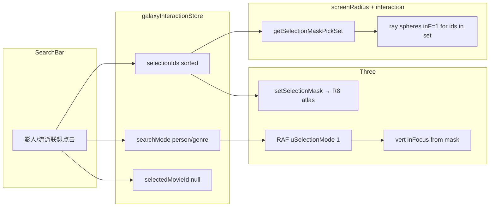

# Phase 12.6 · P12.6 人名 / genre 搜索 → 多 active + viswindow 解耦 — 实施报告

> 对应 [Phase 12 计划](../../.cursor/plans/phase_12_search_and_select_6c9bfa94.plan.md) 中 **P12.6**（`p126-people-genre-active`）：在 **P12.5 selectionMask** 基础设施之上，将 **影人 / 流派** 联想命中结果写入 **`selectionIds` + `searchMode`**，由 **GPU mask** 驱动多实例 active；**时间轴 vis-window 不再参与**这些实例的 `inFocus` 推导；**CPU 射线拾取**与 shader 对齐，保证搜索态下星球可 **hover / click**。  
> **SSOT**：[`TMDB 电影宇宙 Tech Spec.md`](../project_docs/TMDB%20电影宇宙%20Tech%20Spec.md) §4.5（viswindow 解耦）、[`星球状态机 spec.md`](../project_docs/星球状态机%20spec.md) §3.6。  
> **日期**：2026-04-29。

---

## 1. 目标与最终决策

| 议题 | 决策 |
|------|------|
| 数据来源（影人） | 联想点击后，**`movie_ids` 唯一来源**为 **`searchIndex.people[normalizedKey].movie_ids`**（与 P12.1 倒排索引一致）；前端 **不对 60K 影片反扫** 建集合。 |
| 数据来源（流派） | 联想点击后，**`movie_ids` 唯一来源**为 **`searchIndex.genres[name].movie_ids`**（管线已聚合 **任意顺位 genre** + 去重）；前端 **禁止** 用 `useMemo` 扫全量 `movies` 重建流派集合。 |
| `selectionIds` 顺序 | 对 `movie_ids` 按 **`release_date` 升序** 排序后写入 store（与计划「稳定顺序、便于 P12.7 连线」一致；由 `SearchBar` 内 **`sortIdsByRelease`** 完成）。 |
| Store 写入（影人 / 流派） | **`searchMode: 'person' \| 'genre'`**、**`selectionIds: number[]`**、**`selectedMovieId: null`**（进入多片 select 会话，不自动进入单片刻 focus）。**`constellationEnabled`** 不在此次点击中改写（默认 `true`，仅 P12.7 / Leva 暴露）。 |
| 输入框展示文案 | 影人：**`entry.full`**；流派：**``${genreName} (${g.count})``**，其中 **`count` 必须取自索引对象 `g.count`**（与联想排序一致），**不得**仅依赖联想行的 `s.count`。 |
| **`uSelectionMode` 写入权** | **仅由 `scene.ts` 渲染循环 RAF** 根据 **`searchMode`** 设置：**`person` / `genre` → 1**，否则 **0**。**`setSelectionMask` 只写 R8 纹理与 `uSelectionCount`，不再写 `uSelectionMode`**，避免与 store 会话状态不同步。 |
| Vis-window 与 mask 的语义 | **`uSelectionMode == 1`** 时，idle/active 顶点着色器内 **`inFocus` 完全由 mask 采样决定**，**不先算时间轴条带再覆盖**（实现上采用 **if/else 分支**：mode=1 只走 mask UV；mode=0 只走 `uZCurrent`/`uZVisWindow` 条带）。**`zCurrent` / `zVisWindow` 仍每帧更新**（Timeline UI 与 store 状态保留），但 **条带不再驱动这些实例的 active/idle 分界**。 |
| **Z 方向颜色衰减** | **`vDistFalloff` 等仍可使用 `aZ` 与 `zHi`**（与计划「条带 `inFocus_band`」解耦所指一致）；若需全 Z 域无衰减可另开 Phase，**本 Phase 未改 fragment 衰减策略**。 |
| **CPU 拾取与 shader 同构（关键补丁）** | 原 **`pickClosestActiveMovieAlongRay` / `computeActiveWorldRadius`** 仅用 **`movieZInFocusFactor`（时间轴条带）**，导致 **mask 点亮但条带外的片** 在 CPU 上 `inF≈0`，**无法 hover/click**。**最终**：当 **`getSelectionMaskPickSet(searchMode, selectionIds)`** 非空时，**仅遍历 `selectionIds` 集合内 id**，对这些候选使用 **`inF = 1`** 的世界球半径做射线求交；集合外实例 **不参与 active 壳层拾取**（与「非选中片在 active mesh 上尺度为 0」一致）。 |
| 拾取层缓存 | **`attachGalaxyActiveMeshInteraction`** 内 **`subscribe` `searchMode` + `selectionIds`**，维护 **`Set<number>`** 引用，避免每帧 `new Set`。 |
| Perlin 选中球半径 | **`resolveSelectionWorldRadius`** 调用处（**`beginSelect` / `syncSelectionPlanetWorldScale`**）传入同一 **`getSelectionMaskPickSet(...)`**，避免在搜索态 focus 条带外影片时 **`rActive` 塌为 0** 的错误回退。 |
| 可验证性 | 影人/流派确认后 **`console.log`** 样本（`selectionLen` 等）；**`uSelectionMode` 变化**时 **`[Scene]`** 日志（节流为变化时打印）。 |
| Git 工作流 | 在分支 **`feature/p12-6-people-genre-active`** 上提交（见 §6）。 |

---

## 2. 交付物清单

| 类型 | 路径 | 说明 |
|------|------|------|
| HUD 联想 → select 会话 | [`frontend/src/components/SearchBar.tsx`](../../frontend/src/components/SearchBar.tsx) | 影人/流派 **`applySuggestion`**：`movie_ids` 来自索引；store 字段如上；**`g.count`** 用于流派标签 |
| 掩码纹理写入（无 mode） | [`frontend/src/three/selectionMask.ts`](../../frontend/src/three/selectionMask.ts) | **`setSelectionMask`** 仅更新 DataTexture + **`uSelectionCount`**；注释标明 **`uSelectionMode` 由 scene RAF 驱动** |
| 场景 RAF + mask 订阅 | [`frontend/src/three/scene.ts`](../../frontend/src/three/scene.ts) | **`selectionIds` 变化 → setSelectionMask**；**每帧 `uSelectionMode`** 由 **`searchMode`** 决定；**`resolveSelectionWorldRadius(..., maskPick)`** |
| Idle 顶点 | [`frontend/src/three/shaders/galaxyIdle.vert.glsl`](../../frontend/src/three/shaders/galaxyIdle.vert.glsl) | **`uSelectionMode == 1`** 时 **仅 mask 分支** 写 `inFocus` |
| Active 顶点 | [`frontend/src/three/shaders/galaxyActive.vert.glsl`](../../frontend/src/three/shaders/galaxyActive.vert.glsl) | 与 idle **同构** |
| CPU 半径 / 拾取 | [`frontend/src/three/screenRadius.ts`](../../frontend/src/three/screenRadius.ts) | **`getSelectionMaskPickSet`**；**`computeActiveWorldRadius`** / **`pickClosestActiveMovieAlongRay`** / **`computeActiveMeshScreenRadiusCss`** 支持 **`selectionMaskPickSet`** |
| 交互 | [`frontend/src/three/interaction.ts`](../../frontend/src/three/interaction.ts) | 缓存 **mask Set**；所有 **`pickClosestActiveMovieAlongRay`** 与 hover **CSS 半径** 传入该 Set |

---

## 3. 数据流（摘要）

---

## 4. 验收对照（计划口径）

| 验收项 | 结果 |
|--------|------|
| 搜导演 / 影人 → 多颗 active，其余 idle | **达成**（mask + shader 分支） |
| 搜流派 → 大量 active | **达成**（`genres[name].movie_ids`） |
| 时间轴拖动不改变「谁算 active」 | **达成**（mode=1 时条带不参与 `inFocus`） |
| 清空搜索 → mask 清零、回到时间轴语义 | **达成**（`clearSearch` + `setSelectionMask(null)` + `uSelectionMode` 回 0） |
| 搜索点亮的星可 hover / 点击 focus | **达成**（CPU 拾取与 mask 同构补丁） |
| `npm test`、`npm run build`（`frontend`） | **通过** |

---

## 5. 已知边界与后续 Phase

| 项目 | 说明 |
|------|------|
| P12.7 星座连线 | **未在本报告范围**；`selectionIds` 顺序已按发行日升序，便于连线。 |
| P12.8 ESC 栈 | **未在本报告范围**；与 `clearSearch` 的优先级在 Design Spec §4.6。 |
| `uSelectionMode == 2`（mix） | **仍预留**，未接线。 |

---

## 6. Git 分支与提交（实施记录）

| 说明 | 值 |
|------|-----|
| 分支名 | `feature/p12-6-people-genre-active` |
| `6d4a071` | `feat(P12.6): person/genre search drives mask mode + vis-window decouple` — RAF **`uSelectionMode`**、`setSelectionMask` 职责收缩、idle/active **分支化**条带与 mask、SearchBar **流派 count** 与日志。 |
| `07f4c03` | `fix(P12): search mask-active stars pickable — CPU ray matches shader inFocus` — **`getSelectionMaskPickSet`**、**`screenRadius`** / **`interaction`** / **`scene`** **`resolveSelectionWorldRadius`** 对齐。 |

合并策略由仓库维护者决定（PR / 直接 merge）。

---

## 7. 参考文档

- [Phase 12 计划 — P12.6 节](../../.cursor/plans/phase_12_search_and_select_6c9bfa94.plan.md)
- [Phase 12.5 selectionMask 渲染通路 实施报告](./Phase%2012.5%20P12.5%20selectionMask%20渲染通路%20实施报告.md)
- [TMDB 电影宇宙 Tech Spec.md §4.5](../project_docs/TMDB%20电影宇宙%20Tech%20Spec.md)
- [星球状态机 spec.md §3.6](../project_docs/星球状态机%20spec.md)
