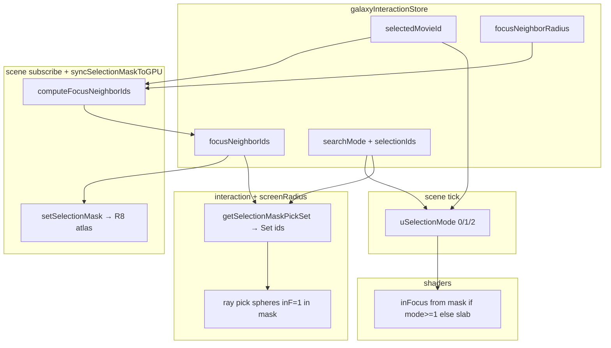

# Phase 13.2（P13.2）— 焦点邻域球 active mask — 实施报告

> **范围**：P13.2「focus 态用球形邻域替代时间条带 vis-window 作为 active 子集」：`uSelectionMode = 2`、CPU `computeFocusNeighborIds`、store 缓存、`scene` mask 写入与 RAF mode、CPU 拾取与 shader 同构；**不含** P13.3 轨道相机、P13.4 Timeline snap、P13.5 HUD 图例。  
> **计划来源**：`.cursor/plans/phase_13_focus_experience_ab016b85.plan.md`（「P13.2 焦点邻域球 active mask」节）及其中 **D1** 决策表。  
> **日期**：2026-04-30。

---

## 1. 目标与验收口径（计划对齐）

| 计划要求 | 最终处理 |
|----------|----------|
| 新建 `focusNeighborMask.ts`，`computeFocusNeighborIds` O(n) | **已实现** |
| store：`focusNeighborRadius`（默认 5）、`focusNeighborIds`；`clearSearch` 不碰 focus 邻域 | **已实现** |
| `beginSelect` 计算邻域并写入 store；订阅半径变化重算 | **已实现**（mask 订阅内对 `selectedMovieId` / `focusNeighborRadius` 变化重算邻域） |
| RAF：`uSelectionMode` = `selectedMovieId !== null ? 2 : person|genre ? 1 : 0` | **已实现** |
| mask atlas：mode=2 写 `focusNeighborIds`；mode=1 写 `selectionIds`；mode=0 清零 | **已实现**（`syncSelectionMaskToGPU`） |
| Shader：mode 1/2 行为一致，区别仅在 CPU 写 mask | **`galaxyIdle` / `galaxyActive`：`uSelectionMode >= 1` 走 mask 分支** |
| `getSelectionMaskPickSet`：film focus 优先返回邻域 id 集合 | **已实现**（四参签名） |
| D1：focus × person/genre 时 **邻域 mask 替换 search mask** | **渲染与拾取路径均按 `selectedMovieId !== null` 优先邻域**；退出 focus 后 `selectedMovieId === null` 自动回到 search mask（见 §2.3） |
| 人工验收：邻域内可 hover / 点击切换 focus；退出后恢复条带 | **需人工**；验收中发现的 **Drawer 拦截 canvas** 与 **CPU mask 同构** 问题已按 §3.6–§3.8 补强（见 §6） |

---

## 2. 最终决策汇总

### 2.1 语义与 uniform

1. **`uSelectionMode` 取值**  
   - **0**：idle / 仅时间轴 — `inFocus` 由 `uZCurrent` + `uZVisWindow` 条带推导。  
   - **1**：person / genre 多选 — `inFocus` 仅由 `uSelectionMask` 采样。  
   - **2**：film focus 邻域球 — **与 mode=1 在 shader 内等价**（同样走 mask 分支），区别是 **CPU 写入 mask 的数据源**为 `focusNeighborIds`，而非 `selectionIds`。

2. **邻域定义**  
   以焦点影片世界坐标 `(x,y,z)` 为球心、`focusNeighborRadius` 为半径 **R**，欧氏距离 `≤ R` 的全部 `Movie.id` 写入 `focusNeighborIds`（与计划一致）。

3. **`focusNeighborRadius` 初值**  
   默认 **5 world units**（与计划 D3 / 视觉参数总表草案一致；最终扫参收口留给 **P13.6**）。

4. **`focusNeighborIds` 缓存策略**  
   - 在 **`selectedMovieId` 或 `focusNeighborRadius` 变化** 时 **O(n) 重算**一次（非每 RAF）。  
   - `syncSelectionMaskToGPU` 内保留 **兜底**：若已选片但 `focusNeighborIds` 仍为空，则现场计算并写回 store，避免订阅顺序导致的 **一帧空 mask**。

### 2.2 Store 与 `clearSearch`

5. **`clearSearch()`**  
   **不**清空 `focusNeighborRadius` / `focusNeighborIds`（focus 与 search 会话独立；与计划一致）。

6. **退出 film focus**  
   `selectedMovieId === null` 时 **`focusNeighborIds` 置 `null`**（与计划「退出 focus → 邻域 mask 清空」一致）；随后 `uSelectionMode` 由 RAF 回到 **0 或 1**。

### 2.3 D1（focus × search mask）

7. **GPU mask 与 `uSelectionMode`**  
   当 **`selectedMovieId !== null`** 时：**始终** `uSelectionMode = 2` 且 mask 纹理写 **`focusNeighborIds`**，**不再**在 focus 期间用 `selectionIds` 驱动 inFocus（**替换** person/genre search mask）。

8. **退出 focus 后**  
   `selectedMovieId === null` 且仍处于 `searchMode === 'person' | 'genre'` 时，mask 回到 **`selectionIds`**，`uSelectionMode` 回到 **1**（计划 D1「退出后恢复 search mask」）。

### 2.4 CPU 拾取与 shader 同构（P13.2 验收关键）

9. **`getSelectionMaskPickSet` 优先级**  
   `selectedMovieId !== null` 且 `focusNeighborIds?.length > 0` → **返回 `new Set(focusNeighborIds)`**；否则再走 person/genre → `selectionIds`；否则 `null`（条带语义）。

10. **`computeActiveWorldRadius`（mask 存在时）**  
    当传入 **非空 `selectionMaskPickSet`** 时：**仅在 `set.has(id)` 时 `inF = 1`，否则 `inF = 0`**（**禁止**再回退到 `movieZInFocusFactor`，否则与 `uSelectionMode >= 1` 的 GPU 行为不一致，导致 **mask 内星在 CPU 上半径为 0 → 无法 hover**）。

11. **`pickClosestActiveMovieAlongRay`**  
    在 mask 模式下 **`requireSlabInteraction` 仍使用 `inF > 0.5` 门控**；对 mask 内实例 `inF === 1`，与 P12.6 一致。

12. **`interaction.ts` 读取 pick set**  
    hover / click / `focusPlanetBeatsActiveAlongRay` 内 **每次**调用 `maskPickFromState()`（从 store 取最新 `focusNeighborIds`），避免 nested `setState` 下 **缓存 Set 滞后**。

13. **focus 下「空点击」**  
    当 `picked === null` 且 **`selectedMovieId !== null`** 时：**不写** `selectedMovieId: null`（避免误触退出 focus；与 P13.3「点空白不退出」方向一致，提前收敛交互体验）。

### 2.5 Drawer 与 canvas 指针（验收阻塞项）

14. **`MovieDetailDrawerHud` 使用 Base UI `Sheet`（Dialog Root）**  
    默认行为下 **outside press 会触发 `onOpenChange(false)`**，且 **modal 会限制外部指针交互**，表现为：focus 打开 Drawer 时 **canvas 无法稳定 hover**，点击邻域星会先 **关闭 Drawer / 清空 `selectedMovieId`**，hover UI **在退出后才「残留」显现**。

15. **最终产品决策（P13.2 交互解阻）**  
    对电影详情 Drawer：**`<Sheet modal={false} disablePointerDismissal>`**  
    - **允许**在 Drawer 打开时与 **WebGL canvas** 继续 pointer 交互（邻域探索）。  
    - **禁止**「点遮罩外即关闭」；关闭仍依赖 **Sheet 内关闭按钮**、**ESC**（及后续 P13.6 搜索 X 等显式路径）。

---

## 3. 交付物清单（文件级）

| 类型 | 路径 | 说明 |
|------|------|------|
| 邻域计算 | [`frontend/src/three/focusNeighborMask.ts`](../../frontend/src/three/focusNeighborMask.ts) | `computeFocusNeighborIds`；`assert` + `console.log`（长度 / R） |
| Store | [`frontend/src/store/galaxyInteractionStore.ts`](../../frontend/src/store/galaxyInteractionStore.ts) | `focusNeighborRadius`、`focusNeighborIds` 默认值 |
| Mask 同步 + RAF mode | [`frontend/src/three/scene.ts`](../../frontend/src/three/scene.ts) | `syncSelectionMaskToGPU`；mask 订阅内邻域重算；`uSelectionMode` 三态；`beginSelect` 写邻域；退出 focus 清 `focusNeighborIds`；constellation 订阅字段扩展 |
| CPU 拾取 | [`frontend/src/three/screenRadius.ts`](../../frontend/src/three/screenRadius.ts) | `getSelectionMaskPickSet` 四参；`computeActiveWorldRadius` mask 外 `inF=0` |
| 交互 | [`frontend/src/three/interaction.ts`](../../frontend/src/three/interaction.ts) | 每次 ray pick 读 store；focus 空击不写 `null`；dispose 清 `focusNeighborIds` |
| Shader | [`frontend/src/three/shaders/galaxyIdle.vert.glsl`](../../frontend/src/three/shaders/galaxyIdle.vert.glsl)、[`galaxyActive.vert.glsl`](../../frontend/src/three/shaders/galaxyActive.vert.glsl) | `uSelectionMode >= 1` |
| 注释 | [`frontend/src/three/galaxyMeshes.ts`](../../frontend/src/three/galaxyMeshes.ts) | `uSelectionMode` 语义注释更新 |
| Drawer | [`frontend/src/components/Drawer.tsx`](../../frontend/src/components/Drawer.tsx) | `modal={false}` + `disablePointerDismissal`（§2.5） |

---

## 4. 数据流（摘要）

---

## 5. 执行操作清单（工程）

1. **Git 分支**：`feat/p13-2-focus-neighbor-mask`（计划要求新开分支）。  
2. **主干功能提交**：`4f1204f` — `feat(P13.2): focus spherical neighbor mask (uSelectionMode=2)`（邻域计算、store、scene、shader、`screenRadius` 签名扩展等）。  
3. **验收补强（当前工作树，建议在主干提交之上再打一记 commit）**  
   - `Drawer.tsx`：`modal={false}` + `disablePointerDismissal`  
   - `interaction.ts` / `screenRadius.ts`：§2.4 所述拾取同构与空击保护  
4. **本地验证**：`frontend` 下 `npm run build`（`tsc -b && vite build`）通过。  
5. **人工验收**：进入 focus → Drawer 仍开 → **R 内**邻域星 **hover 出 ring/tooltip**；点击 **切换** `selectedMovieId` 到新片；**ESC / Drawer 关闭** 退出 focus 后条带语义恢复（§1 表最后一行）。

---

## 6. 已知边界与后续 Phase

| 项目 | 说明 |
|------|------|
| **P13.3 轨道相机** | 未实施；Drawer 改为非模态后，**页面其余区域**可与 canvas 同时交互，需关注后续 **焦点管理 / 无障碍** 是否与轨道拖拽冲突（若出现再收敛）。 |
| **P13.3「点空白不退出」** | 已在 `interaction` 对 **空 pick + 仍 focus** 做 **不写 `null`** 的保护；完整删除旧逻辑以计划 §P13.3 为准。 |
| **P13.6 搜索 X** | 未在本子 Phase 要求内；计划要求与 ESC 对齐清 `selectedMovieId`。 |
| **性能数字 ~5ms** | 计划建议写入 **P13.7** 出口与 Phase 8 基线；本报告未附实测采样。 |

---

## 7. 参考路径

- 计划：`.cursor/plans/phase_13_focus_experience_ab016b85.plan.md`  
- 关联前置：`docs/reports/Phase 13.1 P13.1 过渡曲线驱动器 实施报告.md`  
- 关联拾取基线：`docs/reports/Phase 12.6 P12.6 人名与流派多 active 与 viswindow 解耦 实施报告.md`

---

## 8. Git 记录（便于审计）

| 说明 | SHA / 分支 |
|------|------------|
| P13.2 邻域 mask 主干提交 | `4f1204f`（`feat/p13-2-focus-neighbor-mask`） |
| 本实施报告（文档） | 见分支 `feat/p13-2-focus-neighbor-mask` 上 `docs/reports/Phase 13.2 P13.2 焦点邻域球 active mask 实施报告.md` 的提交记录（`git log -- docs/reports/...`） |
| 验收修复（Drawer + 拾取同构） | **建议**在 `4f1204f` 之后单独提交；若尚未提交，变更位于工作树（`Drawer.tsx`、`interaction.ts`、`screenRadius.ts`） |
