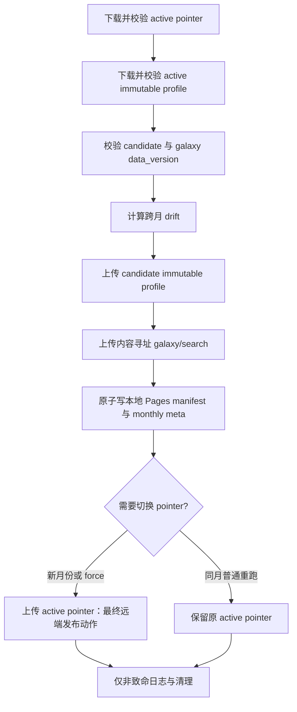

# Phase 42.4 · Monthly Rating Emission Release Workflows 实施报告

## 结论

p42.4 已完成并通过技术验收。monthly workflow 现在发布不可变 candidate profile 与内容寻址 galaxy/search 资源，在本地 Pages manifest 和月度元数据准备完成后，才把 active pointer 作为最后一次可能失败的远端发布动作。nightly workflow 只验证并复用现有 active profile，不生成、不上传且不切换 profile。

实现提交：`0fa5776 feat(p42.4): publish monthly emission profile releases`。

## 发布状态机

月度 activation decision 有三种结果：

- `activated`：candidate period 晚于当前 active period，切换到 candidate。
- `frozen-same-period`：同月普通重跑仅保留 candidate 与 drift 证据，manifest 继续引用原 active profile。
- `activated-force`：显式 force activation；必须同时提供非空原因和 actor，元数据记录 old/new profile、原因、操作者与时间。

首次 bootstrap 只允许手动 workflow 显式传入 `allow_profile_bootstrap`。只有 typed `RemoteObjectNotFound` 可进入 bootstrap；权限、网络或其他下载错误均失败关闭。

## 事务与失败保护

- candidate 必须通过完整 profile 校验，且 `source_data_version` 必须等于 `galaxy_data.json.meta.version`，之后才允许上传。
- 远端已有 active pointer 时，发布器同时下载其不可变 profile，逐项验证 identity/hash/provenance，再据此计算真实跨月 drift。旧 artifact 缺失或不匹配会停止发布。
- candidate profile、galaxy gzip 和 search gzip 都使用不可变对象 key。galaxy/search release ID 由两份文件的 SHA-256 内容摘要与 data version 生成，不使用文件大小。
- 本地 Pages manifest 与 `monthly_refit_meta.json` 在 pointer 切换前完成原子写入。任一 prewrite 失败时不上传 pointer，并恢复或移除本次准备的 manifest。
- pointer 上传失败时，远端继续保留旧 active pointer；本地 success manifest 恢复为发布前状态，失败元数据引用 prior active profile。
- pointer 上传成功后，`pointer_committed` 阻止后续普通异常触发回滚或伪造失败。成功日志、scratch cleanup 与本地 prune 都是 best-effort；`KeyboardInterrupt` 和 `SystemExit` 不被吞掉。
- failure metadata 写入也是 best-effort，不能覆盖原始发布错误。
- workflow 发布步骤失败时，后续 frontend build 和 Pages deploy 不会执行；`actions/upload-artifact` 使用 `if: always()` 保留诊断产物。

## Monthly / Nightly workflow 边界

- `.github/workflows/monthly_refit.yml`
  - 从 `data/output/monthly_profiles/` 唯一选择本次 candidate。
  - 只有 `workflow_dispatch` 可以授权 bootstrap 或 force activation；scheduled 路径不能获得这些能力。
  - force activation 由发布器再次要求 reason/actor，不能仅靠布尔开关绕过审计。
- `.github/workflows/nightly_vote_refresh.yml`
  - 仅运行 `upload_galaxy_r2.py --mode nightly`。
  - 必须读取并验证 remote active pointer 及其 immutable profile。
  - 只上传新的 galaxy/search 资源并生成携带原 profile identity/hash/period 的 manifest，不写 profile object 或 active pointer。
- 两个 workflow 共用 `galaxy-r2-pages-release` concurrency group，且 `cancel-in-progress: false`，避免每月 1 日同一时刻并发写发布状态。

## Manifest、pointer 与 URL contract

active pointer 的 Python/TypeScript 合同严格限定为八个字段：

- `profile_id`
- `period`
- `model_version`
- `curve_sha256`
- `source_data_version`
- `source_movie_count`
- `status`
- `activated_at`

Pages manifest 在旧 galaxy URL/data version 字段之外，增加 `focus_emission_profile` 与 `focus_emission_profile_url`。旧 manifest 省略 profile 字段时仍可被解析；一旦声明 profile，则 pointer 与 URL 必须同时合法且 identity 一致。

profile URL 只接受绝对 HTTP(S) URL，禁止 userinfo、query 和 fragment，路径必须以 `/focus-emission-profiles/<profile_id>.json` 结尾。生产 manifest 声明了非法 profile 时快速失败，不降级为 legacy profile。

## 验证

- `python -m pytest scripts/tests/test_emission_profile_release.py scripts/tests/test_upload_galaxy_r2.py scripts/tests/test_og_pipeline_phase34.py`
  - 22 个测试通过。
  - 覆盖 monthly/nightly、同月冻结、force audit、typed bootstrap、旧 artifact 缺失/错配、source version 错配、candidate/galaxy/pointer 上传失败、本地 prewrite 失败、pointer 后非致命异常、manifest 恢复和内容寻址 release ID。
- `npm test -w frontend -- src/lib/galaxyAssetUrls.test.ts src/lib/focusEmissionProfileLoader.spec.ts`
  - 2 个测试文件、15 个测试通过。
- `npm run lint`
  - 通过。
- `npm run build`
  - frontend `tsc -b`、Vite build、dist size check 与 SPA fallback verification 均完成，退出码 0。
  - 本地 public data 中既有的 `galaxy_data.json` / `.gz` 超过 Cloudflare Pages 25 MiB，构建输出保留提示；生产 workflow 在 build 前通过 R2 prune 移除这些大文件。
- Python `yaml.safe_load` 解析 monthly/nightly workflow
  - 2 个文件通过。
- `git diff --check`
  - 通过。

## 边界

本 TODO 未执行真实 R2 上传、Cloudflare Pages 部署、完整 monthly refit 或生产数据重建。跨端全量回归、月中冻结 fixture 与统一可观测证据属于 p42.5；首次真实月度切换和人工 Go/No-Go 属于 p42.6。