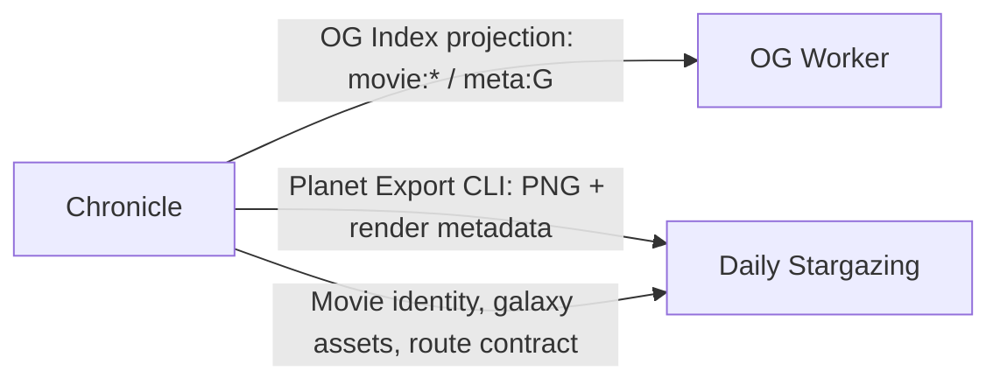

# The Movie Cosmos repository map

## Purpose

This document is the product-level map for the three repositories. It records ownership and integration boundaries; it does not replace any repository's implementation documentation.

## Repositories

| Repository | Primary responsibility | Deployment unit | Product-level ownership |
| --- | --- | --- | --- |
| [chronicle_v3_3d_galaxy](https://github.com/XYBuilds/chronicle_v3_3d_galaxy) | Main site, 3D galaxy, movie identity, data pipeline, galaxy export, planet-export producer, OG projection producer | Frontend hosted through Pages/R2 and scheduled GitHub Actions pipeline | Movie identity, galaxy roster, producer-side contracts, product coordination |
| [themoviecosmos-og-worker](https://github.com/XYBuilds/themoviecosmos-og-worker) | Movie OG PNG rendering, HTML metadata injection, cache and fallback behavior, KV consumption | Independent Cloudflare Worker | Worker runtime and consumer-side deployment behavior |
| [themoviecosmos-daily-stargazing](https://github.com/XYBuilds/themoviecosmos-daily-stargazing) | News ingestion, Persona pseudo-overviews, English retrieval, Chinese editorial review, publication bundle generation | Independent Python project and publication workflow | Resonance/editorial/publication domain |

## Known integration edges

The `today` OG path is historical/retired in the current Chronicle documentation and must not be treated as an active contract without a runtime check. The `movie:{id}` projection and `meta:G` generation metadata remain the active contract candidates; their exact consumer behavior is indexed in `contract-index.md`.

## Ownership rules

1. A product-level Initiative is owned by the repository whose domain decision changes.
2. Chronicle is the default coordination owner for work that changes product identity or a producer contract.
3. Each affected repository owns its implementation Issue, branch, tests, PR, deployment, and rollback of its own unit.
4. A cross-repository change is complete only after the parent Initiative's integration acceptance passes.
5. Do not copy another repository's `CONTEXT.md`, ADRs, Plans, or Reports. Link to the owning repository instead.

## Historical arrangement

Chronicle and the OG Worker historically shared Chronicle's Plan and Report archive while remaining separate Git repositories. This is retained as history only. New work uses a parent Initiative plus repository-local child Issues.