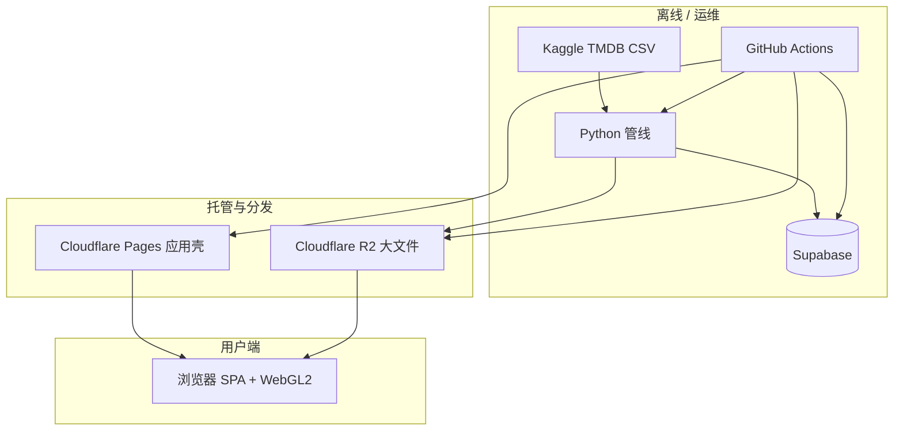
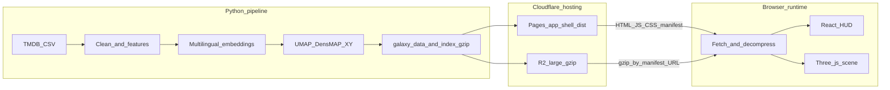

# The Movie Cosmos — 项目架构全景

> **文档性质**：临时说明稿（`docs/temp/`），汇总仓库在「现代互联网产品」常见分层下的组成与边界。  
> **权威规格**仍以 [`docs/project_docs/`](../project_docs/) 与根目录 [`README.md`](../../README.md) 为准。  
> **最后整理**：2026-05-17

---

## 概述

**The Movie Cosmos**（仓库名 `chronicle_v3_3d_galaxy`）把约 6 万部 TMDB 影片渲染为可漫游的 2.5D 粒子星系。其核心架构特征是：

- **没有面向终端用户的运行时 API 服务**；
- **「后端」主要指离线 Python 数据管线与运维自动化**；
- **浏览器端为纯静态 SPA**，启动时一次性拉取预计算的 gzip 数据包。

在线体验：[themoviecosmos.com](https://themoviecosmos.com/)

---

## 1. 前端包括哪些？

前端集中在 [`frontend/`](../../frontend/)，技术栈与职责如下。

| 层次 | 技术 / 目录 | 职责 |
|------|-------------|------|
| **构建与运行时** | Vite 8、React 19、TypeScript | 单页应用（SPA），无 SSR |
| **3D 渲染** | 原生 **Three.js**（ deliberately 不用 R3F） | [`frontend/src/three/`](../../frontend/src/three/)：双 `InstancedMesh`（idle/active）、focus Perlin 球、自定义 GLSL、`scene.ts` 渲染循环、拾取/相机/状态机 |
| **HUD / UI** | React DOM 覆盖在 canvas 上 | [`hud/`](../../frontend/src/hud/)、[`components/`](../../frontend/src/components/)：Loading、封面、搜索栏、时间轴、Tooltip、档案抽屉、全屏、语言切换、分享、反馈按钮等 |
| **状态** | **Zustand** | [`store/`](../../frontend/src/store/)：星系数据、交互（选中/hover/z 轴/轨道相机）、搜索索引、封面模式、语言 |
| **数据加载（浏览器内）** | `data/`、`lib/galaxyAssetUrls.ts` | 拉取并解压 `galaxy_data.json.gz`、`galaxy_search_index.json.gz`、`today.json`（URL 来自 manifest 或 `VITE_*`） |
| **搜索** | 客户端索引 | 预构建的搜索 JSON，在内存里打分，**不**调后端搜索 API |
| **i18n** | `lib/locales/*.json` + `strings.ts` | 8 种语言 HUD 文案；`en.json` 为结构 SSOT |
| **样式** | Tailwind CSS 4、Base UI、CVA | 组件与 HUD 样式 |
| **质量工具** | Vitest、ESLint、Storybook | 单测、组件/HUD 故事、Three 实验台 |
| **静态资源** | `frontend/public/` | manifest、可选本地 gzip 等 |

[`App.tsx`](../../frontend/src/App.tsx) 将上述串联：先加载数据 → 解析「今日电影」（The Movie Today）→ `mountGalaxyScene` 挂载 WebGL，同时渲染 HUD。

### 前端承载的产品能力

- 宏观漫游、时间轴、Space + 滚轮局部推近（dolly-to-cursor）
- Hover / Click、focus 态与 Perlin 球、邻域切换
- 搜索（片名 / 人物 / 流派）与 ESC 焦点栈
- 多语言、主题与时间轴方向等 URL query
- 可选 Tally 反馈、分享今日电影、Cloudflare Web Analytics（构建注入）

详见 [Tech Spec](../project_docs/TMDB%20电影宇宙%20Tech%20Spec.md)、[Design Spec](../project_docs/TMDB%20电影宇宙%20Design%20Spec.md)。

---

## 2. 「后端」包括哪些？

需区分 **用户访问时的运行时** 与 **数据 / 运维侧**。

### 2.1 运行时：几乎没有传统后端

- **没有** Node/Express、FastAPI、GraphQL 等常驻 API 服务。
- 前端 **不** 在运行时查询 Supabase；[PRD](../project_docs/TMDB%20电影宇宙%20PRD.md) 明确：前端只消费静态 `galaxy_data.json.gz` / 搜索索引（Phase 18+ 仍保持该契约）。

用户浏览器仅向 **静态托管 + 对象存储** 请求文件（以及 TMDB 海报 CDN、Tally / Cloudflare 等第三方脚本）。

### 2.2 数据处理层（文档中的「后端/数据处理层」）

主要在 [`scripts/`](../../scripts/)：

| 模块 | 作用 |
|------|------|
| [`run_pipeline.py`](../../scripts/run_pipeline.py) | 全量管线入口 |
| [`pipeline/cleaning.py`](../../scripts/pipeline/cleaning.py) | TMDB CSV 清洗、门槛过滤 |
| [`feature_engineering/`](../../scripts/feature_engineering/) | 多语言句向量、流派/语言特征、UMAP（`random_state=42`）、Procrustes 对齐等 |
| [`export/`](../../scripts/export/) | 导出 `galaxy_data`、搜索索引（gzip） |
| [`cron/`](../../scripts/cron/) | 夜间投票刷新、月度 refit、从 Supabase 导出、上传 R2、生成 today / OG 图等 |
| [`supabase/initial_import.py`](../../scripts/supabase/initial_import.py) | 一次性 / 批量写入数据库 |
| [`experiments/`](../../scripts/experiments/)、[`tests/`](../../scripts/tests/) | 基准与校验 |

输入：Kaggle 等来源的 TMDB CSV；输出：约 6 万部的坐标与属性 JSON + 搜索索引。

详见 [Data Pipeline](../project_docs/TMDB%20电影宇宙%20Data%20Pipeline.md)。

### 2.3 数据存储与自动化（运维「后端」）

| 组件 | 角色 |
|------|------|
| **Supabase（Postgres）** | Phase 18+ 的 **source of truth**（`movies`、pending、投票快照、v1 参考坐标等）；由 **GitHub Actions + Python** 读写，非浏览器 API |
| **GitHub Actions** | [`.github/workflows/`](../../.github/workflows/)：`nightly_vote_refresh`、`monthly_refit`、`deploy-pages`、benchmark 等 |
| **Cloudflare Pages** | 托管 `frontend/dist`（HTML/JS/CSS、小体积 manifest） |
| **Cloudflare R2** | 托管超大 gzip（绕过 Pages 单文件约 25 MiB 限制） |
| **可选 Cloudflare Web Analytics** | 构建时注入 beacon（`VITE_CF_BEACON_TOKEN`），聚合 RUM |

在本项目中，若用口语「前后端分离」，**「后端」≈ Python 批处理 + Supabase + CI**，而非 **在线 API 层**。

---

## 3. 除前后端外，还涵盖哪些部分？

### 已覆盖或部分覆盖的维度

| 维度 | 本项目中的体现 |
|------|----------------|
| **数据工程 / ML** | Embedding、特征融合、UMAP、Procrustes、门槛与月度 refit |
| **静态资源 CDN** | Pages + R2 + `galaxy_assets_manifest.json` |
| **CI/CD** | GitHub Actions 构建、部署、定时任务 |
| **可观测性（轻量）** | 可选 Cloudflare Analytics；开发期 assert / `console.log`（见仓库 ai-workflow 规则） |
| **设计与规范** | `docs/project_docs/`（PRD、Tech/Design Spec、状态机、视觉参数总表） |
| **组件文档** | Storybook（`frontend`） |
| **国际化** | `frontend/src/lib/locales/*.json` |
| **增长 / 社区（轻量）** | Tally 反馈、Discord（环境变量或 Tally 感谢页）、分享今日电影、OG 图脚本（`scripts/cron/render_og_today.py`） |
| **合规与品牌** | [`NOTICE`](../../NOTICE)、TMDB 署名、README 隐私说明 |
| **字体与视觉资产** | [`assets/fonts/`](../../assets/fonts/) |

整体形态是典型的 **Jamstack / 静态优先 + 重离线计算**：算力在 Python 与 CI 中完成，边缘仅分发静态产物。

### 生产数据流（简图）

> 实际 CI 顺序：先推大 gzip 到 R2 → Vite 构建（manifest 写入 R2 URL）→ `wrangler pages deploy` 上传 `dist`。详见 [README §面向开发者](../../README.md)。

---

## 4. 哪些部分没有使用 / 基本不涉及？

与常见「全栈 SaaS」对比，**刻意不做或尚未实现** 的包括：

| 类别 | 状态 |
|------|------|
| **用户账号 / 登录 / Session** | 无；README 写明无登录、无终端用户画像库 |
| **运行时 REST / GraphQL / BFF** | 无 |
| **前端直连数据库** | 无（Supabase 仅运维侧） |
| **SSR / Next.js / 全栈 React 框架** | 无，纯 CSR SPA |
| **WebSocket / 实时协作** | 无 |
| **服务端渲染个性化** | 无 |
| **移动端原生 App** | 无（响应式 Web + WebGL2 硬要求） |
| **应用内支付 / 订阅** | Donate 在 Phase 28 路线中，属外链/Info，非应用内支付系统 |
| **UGC、评论、收藏云同步** | 无 |
| **邮件 / 推送 / 站内消息** | 无 |
| **CMS 内容后台** | 无；文案在 locale JSON，影片数据在管线 |
| **Redis / Elasticsearch / 微服务网格** | 无；搜索为预构建客户端索引 |
| **Kubernetes / 自建 VM 应用服务器** | 生产不依赖；算力在 Actions / 本机 Python |
| **React Three Fiber 等 3D 封装** | 明确不用，原生 Three.js |
| **PRD 未来项** | 多维 **Filter**、**Spotlight** 高亮等 — 当前未实现 |
| **Cloudflare Workers 作为业务 API** | 部署以 Pages/R2 为主；Worker 在文档中多指勿与 Pages 项目混淆 |

---

## 5. 一句话总结

| 分层 | 内容 |
|------|------|
| **前端** | Vite + React HUD + Three.js 星系 + 浏览器内加载静态 JSON/gzip |
| **后端（项目用语）** | Python 离线管线 + Supabase（数据真相源）+ GitHub Actions + Cloudflare Pages/R2 |
| **没有** | 在线 API、登录、服务端会话、实时通道 |
| **额外有** | 数据科学管线、自动化运维、i18n、设计/实施文档、轻量分析与反馈入口 |

---

## 6. 延伸阅读（权威文档）

| 主题 | 路径 |
|------|------|
| 产品需求 | [`docs/project_docs/TMDB 电影宇宙 PRD.md`](../project_docs/TMDB%20电影宇宙%20PRD.md) |
| 技术实现 | [`docs/project_docs/TMDB 电影宇宙 Tech Spec.md`](../project_docs/TMDB%20电影宇宙%20Tech%20Spec.md) |
| 交互与视觉 | [`docs/project_docs/TMDB 电影宇宙 Design Spec.md`](../project_docs/TMDB%20电影宇宙%20Design%20Spec.md) |
| 数据管线 | [`docs/project_docs/TMDB 电影宇宙 Data Pipeline.md`](../project_docs/TMDB%20电影宇宙%20Data%20Pipeline.md) |
| 特征 → 渲染映射 | [`docs/project_docs/TMDB 数据特征工程与 3D 映射总表.md`](../project_docs/TMDB%20数据特征工程与%203D%20映射总表.md) |
| 仓库说明（用户 + 开发者） | [`README.md`](../../README.md) |
